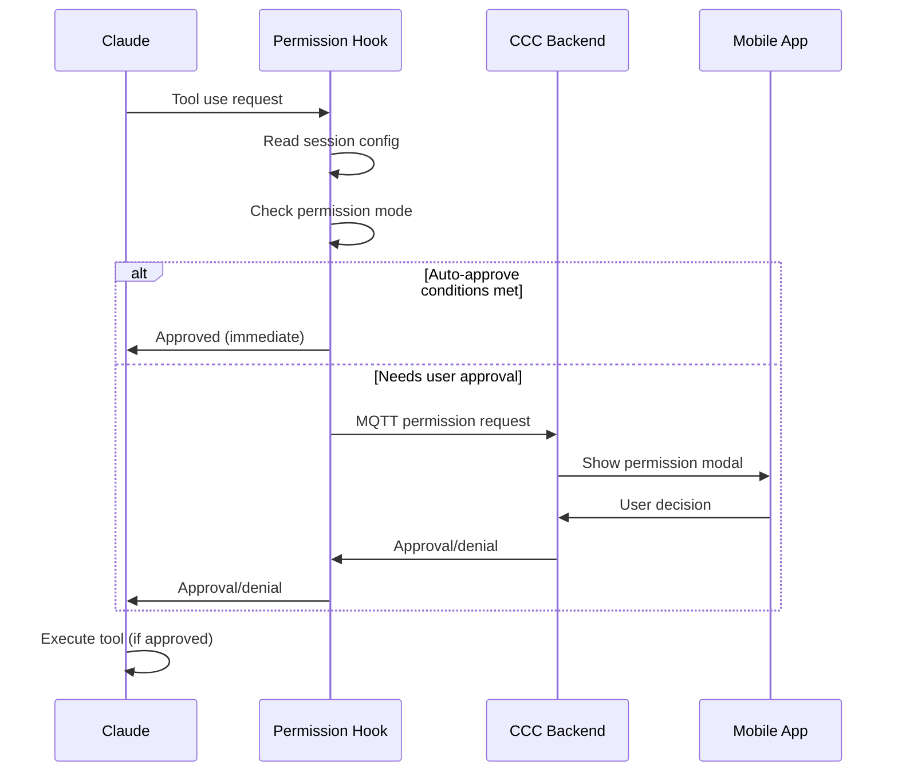

## Overview

CCC's permission system is powered by **Claude Code hooks**—scripts that intercept tool use requests before they execute. While CCC provides a default permission hook, you can create custom hooks to implement advanced workflows, custom validation, or integration with external systems.

<Info>
**Use Cases**: Policy enforcement, approval workflows, logging, external API integration, custom security rules, and more.
</Info>

---

## Hook System Overview

Claude Code supports several hook types. CCC uses **PreToolUse** hooks to intercept tool requests.

### How Hooks Work



### Hook Lifecycle

<Steps>
  <Step title="Tool use initiated">
    Claude attempts to use a tool (Edit, Bash, Read, etc.)
  </Step>

  <Step title="Hook invoked">
    Claude Code calls the registered PreToolUse hook script
  </Step>

  <Step title="Hook receives input">
    Hook gets JSON via stdin with tool details:
    ```json
    {
      "tool_name": "Edit",
      "tool_input": {
        "file_path": "/path/to/file.ts",
        "old_string": "...",
        "new_string": "..."
      },
      "session_id": "01j9h7v9q29zqt0wcyacpme3yb",
      "cwd": "/home/user/project"
    }
    ```
  </Step>

  <Step title="Hook processes request">
    Hook logic determines approval:
    - Check permission mode
    - Check allowed tools list
    - Validate parameters
    - Request user approval via MQTT
  </Step>

  <Step title="Hook returns decision">
    Hook outputs JSON via stdout:
    ```json
    {
      "hookSpecificOutput": {
        "hookEventName": "PreToolUse",
        "permissionDecision": "allow",
        "permissionDecisionReason": "User approved"
      }
    }
    ```
  </Step>

  <Step title="Claude receives response">
    Tool executes if approved, or Claude handles denial gracefully
  </Step>
</Steps>

---

## permissions_hook.js Walkthrough

Let's examine CCC's default permission hook to understand how it works.

### File Location

```
your-project/.claude/hooks/permissions_hook.js
```

### Core Structure

```javascript
#!/usr/bin/env node

// 1. Imports
const mqtt = require('mqtt');
const fs = require('fs');
const path = require('path');
require('dotenv').config({ path: path.join(__dirname, '.env') });

// 2. Configuration
const MQTT_CONFIG = {
  host: process.env.MQTT_HOST || 'localhost',
  port: parseInt(process.env.MQTT_PORT || '8883', 10),
  username: process.env.MQTT_USERNAME,
  password: process.env.MQTT_PASSWORD,
  clientId: `claude-hook-${Math.random().toString(16).substring(2, 10)}`,
  qos: 1
};

// 3. Main function
async function main() {
  // Read hook input from stdin
  const hookInput = await readStdin();

  // Get project ID from session mapping
  const projectId = getProjectIdFromSession(hookInput.session_id);

  // Get permission mode
  const permissionMode = getPermissionModeForSession(hookInput.session_id);

  // Auto-approval logic
  if (permissionMode === 'bypassPermissions') {
    outputDecision('allow', 'Bypass mode enabled');
    process.exit(0);
  }

  if (permissionMode === 'acceptEdits' && isEditTool(hookInput.tool_name)) {
    outputDecision('allow', 'Accept edits mode');
    process.exit(0);
  }

  // Check allowed tools list
  if (checkAllowedTools(hookInput.tool_name, hookInput.tool_input)) {
    outputDecision('allow', 'In allowed list');
    process.exit(0);
  }

  // Request permission via MQTT
  const result = await requestPermission(hookInput, projectId);
  outputDecision(result.decision, result.reason);
}

main();
```

### Key Functions

<AccordionGroup>
  <Accordion title="readStdin()" icon="terminal">
    Reads JSON input from Claude Code via stdin.

    ```javascript
    function readStdin() {
      return new Promise((resolve, reject) => {
        let data = '';

        process.stdin.on('data', (chunk) => {
          data += chunk;
        });

        process.stdin.on('end', () => {
          try {
            const parsed = JSON.parse(data);
            resolve(parsed);
          } catch (error) {
            reject(new Error(`Failed to parse JSON: ${error.message}`));
          }
        });
      });
    }
    ```

    **Input format:**
    ```json
    {
      "tool_name": "Bash",
      "tool_input": {
        "command": "npm install"
      },
      "session_id": "01j9h7v9q29zqt0wcyacpme3yb",
      "cwd": "/home/user/project"
    }
    ```
  </Accordion>

  <Accordion title="outputDecision(decision, reason)" icon="check">
    Sends approval/denial back to Claude Code via stdout.

    ```javascript
    function outputDecision(decision, reason = '') {
      const output = {
        hookSpecificOutput: {
          hookEventName: 'PreToolUse',
          permissionDecision: decision,  // 'allow' or 'deny'
          permissionDecisionReason: reason
        }
      };

      console.log(JSON.stringify(output));
    }
    ```

    **Output format:**
    ```json
    {
      "hookSpecificOutput": {
        "hookEventName": "PreToolUse",
        "permissionDecision": "allow",
        "permissionDecisionReason": "User approved the tool use"
      }
    }
    ```
  </Accordion>

  <Accordion title="getPermissionModeForSession(sessionId)" icon="gear">
    Reads permission mode from session-config.json.

    ```javascript
    function getPermissionModeForSession(sessionId) {
      try {
        const configPath = path.join(__dirname, '..', 'session-config.json');

        if (!fs.existsSync(configPath)) {
          return 'default';
        }

        const config = JSON.parse(fs.readFileSync(configPath, 'utf8'));
        return config[sessionId]?.permissionMode || 'default';
      } catch (error) {
        return 'default';
      }
    }
    ```

    **Session config format:**
    ```json
    {
      "session-abc123": {
        "permissionMode": "accept-edits",
        "backendVersion": "1.1.1",
        "cwd": "/home/user/project"
      }
    }
    ```
  </Accordion>

  <Accordion title="checkAllowedTools(toolName, toolInput)" icon="list-check">
    Checks if tool is in allowed tools list.

    ```javascript
    function checkAllowedTools(toolName, toolInput) {
      try {
        const settingsPath = path.join(__dirname, '..', 'settings.local.json');

        if (!fs.existsSync(settingsPath)) {
          return false;
        }

        const settings = JSON.parse(fs.readFileSync(settingsPath, 'utf8'));
        const allowedList = settings.permissions?.allow || [];

        // Generate permission string for this tool
        const permissionString = generatePermissionString(toolName, toolInput);

        return allowedList.includes(permissionString);
      } catch (error) {
        return false;
      }
    }
    ```

    **Permission strings:**
    - `Read(/path/to/file.ts)`
    - `Bash(npm install)`
    - `Edit(/src/app.ts)`
  </Accordion>

  <Accordion title="requestPermission(hookInput, projectId)" icon="message">
    Sends permission request via MQTT and waits for response.

    ```javascript
    async function requestPermission(hookInput, projectId) {
      return new Promise((resolve, reject) => {
        const client = mqtt.connect(`ws://localhost:${MQTT_CONFIG.port}`, {
          clientId: MQTT_CONFIG.clientId,
          username: MQTT_CONFIG.username,
          password: MQTT_CONFIG.password
        });

        const requestTopic = `permissions/${projectId}/request`;
        const responseTopic = `permissions/${projectId}/response`;

        // Subscribe to response
        client.subscribe(responseTopic, { qos: 1 });

        // Publish request
        client.publish(requestTopic, JSON.stringify({
          tool_name: hookInput.tool_name,
          tool_input: hookInput.tool_input,
          session_id: hookInput.session_id,
          timestamp: Date.now()
        }), { qos: 1 });

        // Wait for response
        client.on('message', (topic, payload) => {
          if (topic === responseTopic) {
            const response = JSON.parse(payload.toString());
            client.end();
            resolve({
              decision: response.decision,
              reason: response.reason
            });
          }
        });

        // Timeout after 5 minutes
        setTimeout(() => {
          client.end();
          resolve({
            decision: 'deny',
            reason: 'Permission request timed out'
          });
        }, 300000);
      });
    }
    ```
  </Accordion>
</AccordionGroup>

---

## Creating Custom Hooks

Build your own hooks for custom workflows.

### Example 1: Time-Based Restrictions

Deny tool use outside working hours.

```javascript
#!/usr/bin/env node

const fs = require('fs');

async function main() {
  // Read input
  const input = JSON.parse(await readStdin());

  // Check time
  const hour = new Date().getHours();
  const isWorkingHours = hour >= 9 && hour <= 17;

  if (!isWorkingHours) {
    outputDecision('deny', 'Tool use only allowed 9 AM - 5 PM');
    process.exit(0);
  }

  // Allow during working hours
  outputDecision('allow', 'Within working hours');
}

function readStdin() {
  return new Promise((resolve) => {
    let data = '';
    process.stdin.on('data', (chunk) => data += chunk);
    process.stdin.on('end', () => resolve(data));
  });
}

function outputDecision(decision, reason) {
  console.log(JSON.stringify({
    hookSpecificOutput: {
      hookEventName: 'PreToolUse',
      permissionDecision: decision,
      permissionDecisionReason: reason
    }
  }));
}

main();
```

**Usage:**
```json
// .claude/settings.local.json
{
  "hooks": {
    "PreToolUse": [
      {
        "matcher": "Edit|Write|Bash",
        "hooks": [
          {
            "type": "command",
            "command": "node $CLAUDE_PROJECT_DIR/.claude/hooks/time_restriction_hook.js",
            "timeout": 10
          }
        ]
      }
    ]
  }
}
```

### Example 2: File Path Validation

Prevent modifications outside specific directories.

```javascript
#!/usr/bin/env node

const path = require('path');

const ALLOWED_DIRS = [
  '/home/user/projects/myapp/src',
  '/home/user/projects/myapp/tests'
];

async function main() {
  const input = JSON.parse(await readStdin());

  // Check if tool modifies files
  if (['Edit', 'Write', 'MultiEdit'].includes(input.tool_name)) {
    const filePath = input.tool_input.file_path;

    // Check if file is in allowed directory
    const isAllowed = ALLOWED_DIRS.some(dir =>
      filePath.startsWith(dir)
    );

    if (!isAllowed) {
      outputDecision('deny', `File outside allowed directories: ${filePath}`);
      process.exit(0);
    }
  }

  // Allow
  outputDecision('allow', 'File path validated');
}

// ... (readStdin and outputDecision same as above)

main();
```

### Example 3: External Approval API

Integrate with external approval system (e.g., Slack, Teams).

```javascript
#!/usr/bin/env node

const https = require('https');

async function main() {
  const input = JSON.parse(await readStdin());

  // Send approval request to external API
  const approved = await requestExternalApproval({
    tool: input.tool_name,
    params: input.tool_input,
    session: input.session_id
  });

  if (approved) {
    outputDecision('allow', 'Approved via external system');
  } else {
    outputDecision('deny', 'Denied via external system');
  }
}

async function requestExternalApproval(data) {
  return new Promise((resolve) => {
    const payload = JSON.stringify(data);

    const options = {
      hostname: 'approval-api.example.com',
      port: 443,
      path: '/approve',
      method: 'POST',
      headers: {
        'Content-Type': 'application/json',
        'Authorization': `Bearer ${process.env.APPROVAL_API_KEY}`
      }
    };

    const req = https.request(options, (res) => {
      let responseData = '';
      res.on('data', (chunk) => responseData += chunk);
      res.on('end', () => {
        const result = JSON.parse(responseData);
        resolve(result.approved);
      });
    });

    req.on('error', () => resolve(false));
    req.write(payload);
    req.end();
  });
}

// ... (readStdin and outputDecision)

main();
```

### Example 4: Audit Logging

Log all tool uses to external system.

```javascript
#!/usr/bin/env node

const fs = require('fs');
const path = require('path');

const AUDIT_LOG = '/var/log/ccc-audit.log';

async function main() {
  const input = JSON.parse(await readStdin());

  // Log to audit file
  const logEntry = {
    timestamp: new Date().toISOString(),
    session_id: input.session_id,
    tool_name: input.tool_name,
    tool_input: input.tool_input,
    cwd: input.cwd
  };

  fs.appendFileSync(AUDIT_LOG, JSON.stringify(logEntry) + '\n');

  // Auto-approve but logged
  outputDecision('allow', 'Logged to audit trail');
}

// ... (readStdin and outputDecision)

main();
```

---

## Hook Structure and API

### Input Format

Hooks receive JSON via stdin:

```typescript
interface HookInput {
  tool_name: string;           // Tool being used
  tool_input: Record<string, any>;  // Tool parameters
  session_id: string;          // Claude session ID
  cwd: string;                 // Current working directory
}
```

**Example inputs:**

<CodeGroup>
```json Bash Tool
{
  "tool_name": "Bash",
  "tool_input": {
    "command": "npm install",
    "description": "Install dependencies",
    "timeout": 120000
  },
  "session_id": "01j9h7v9q29zqt0wcyacpme3yb",
  "cwd": "/home/user/project"
}
```

```json Edit Tool
{
  "tool_name": "Edit",
  "tool_input": {
    "file_path": "/home/user/project/src/app.ts",
    "old_string": "const port = 3000;",
    "new_string": "const port = 8080;"
  },
  "session_id": "01j9h7v9q29zqt0wcyacpme3yb",
  "cwd": "/home/user/project"
}
```

```json Read Tool
{
  "tool_name": "Read",
  "tool_input": {
    "file_path": "/home/user/project/package.json"
  },
  "session_id": "01j9h7v9q29zqt0wcyacpme3yb",
  "cwd": "/home/user/project"
}
```
</CodeGroup>

### Output Format

Hooks must output JSON to stdout:

```typescript
interface HookOutput {
  hookSpecificOutput: {
    hookEventName: 'PreToolUse';
    permissionDecision: 'allow' | 'deny';
    permissionDecisionReason: string;
  }
}
```

**Example outputs:**

<CodeGroup>
```json Allow
{
  "hookSpecificOutput": {
    "hookEventName": "PreToolUse",
    "permissionDecision": "allow",
    "permissionDecisionReason": "User approved the tool use"
  }
}
```

```json Deny
{
  "hookSpecificOutput": {
    "hookEventName": "PreToolUse",
    "permissionDecision": "deny",
    "permissionDecisionReason": "File path outside allowed directories"
  }
}
```
</CodeGroup>

---

## Hook Parameters

Access all available parameters in your hook.

### toolName

The tool Claude is attempting to use.

**Possible values:**
- `Read` - Read file contents
- `Edit` - Modify file contents
- `Write` - Create or overwrite file
- `Bash` - Execute shell command
- `Grep` - Search file contents
- `Glob` - Find files by pattern
- `Task` - Launch sub-agent
- `WebFetch` - Fetch web content
- `WebSearch` - Search the web
- `NotebookEdit` - Edit Jupyter notebook
- `BashOutput` - Read background bash output
- `mcp__*__*` - MCP tools (custom)

**Usage:**
```javascript
const toolName = input.tool_name;

if (toolName === 'Bash') {
  // Special handling for bash commands
}
```

### toolInput

Parameters passed to the tool.

**Structure varies by tool:**

<ParamField path="Bash.command" type="string">
  Command to execute
  ```json
  { "command": "npm install" }
  ```
</ParamField>

<ParamField path="Edit.file_path" type="string">
  Path to file
  ```json
  { "file_path": "/path/to/file.ts" }
  ```
</ParamField>

<ParamField path="Edit.old_string" type="string">
  String to replace
</ParamField>

<ParamField path="Edit.new_string" type="string">
  Replacement string
</ParamField>

<ParamField path="Read.file_path" type="string">
  Path to file to read
</ParamField>

<ParamField path="Write.file_path" type="string">
  Path to file to write
</ParamField>

<ParamField path="Write.content" type="string">
  Content to write
</ParamField>

### sessionId

Unique identifier for the Claude session.

**Format:** ULID (26 characters)
```
01j9h7v9q29zqt0wcyacpme3yb
```

**Usage:**
```javascript
const sessionId = input.session_id;

// Look up session metadata
const config = getSessionConfig(sessionId);
```

### cwd

Current working directory for the project.

**Example:**
```
/home/user/projects/myapp
```

**Usage:**
```javascript
const projectRoot = input.cwd;

// Validate file path is within project
const filePath = input.tool_input.file_path;
if (!filePath.startsWith(projectRoot)) {
  outputDecision('deny', 'File outside project directory');
}
```

---

## Return Values

Hook must return a decision to Claude Code.

### Approved

Tool use is allowed.

```json
{
  "hookSpecificOutput": {
    "hookEventName": "PreToolUse",
    "permissionDecision": "allow",
    "permissionDecisionReason": "User approved"
  }
}
```

**What happens:**
- Claude proceeds with tool execution
- Tool output returned to Claude
- Conversation continues normally

### Denied

Tool use is blocked.

```json
{
  "hookSpecificOutput": {
    "hookEventName": "PreToolUse",
    "permissionDecision": "deny",
    "permissionDecisionReason": "Outside working hours"
  }
}
```

**What happens:**
- Tool execution is skipped
- Claude receives denial message
- Claude explains why to user and suggests alternatives

**Reason string best practices:**
- Be specific: "File outside /src directory"
- Not vague: "Access denied"
- Suggest alternatives: "Use Read instead of Edit for this file"
- Explain policy: "Bash commands require manual approval"

---

## Async Operations (MQTT Requests)

Hooks can perform asynchronous operations like MQTT requests.

### MQTT Permission Request Pattern

```javascript
async function requestPermission(hookInput, projectId) {
  return new Promise((resolve, reject) => {
    const client = mqtt.connect(`ws://localhost:8883`, {
      clientId: `hook-${Date.now()}`,
      username: process.env.MQTT_USERNAME,
      password: process.env.MQTT_PASSWORD
    });

    const requestTopic = `permissions/${projectId}/request`;
    const responseTopic = `permissions/${projectId}/response`;

    client.on('connect', () => {
      // Subscribe to response
      client.subscribe(responseTopic, { qos: 1 });

      // Publish request
      client.publish(requestTopic, JSON.stringify({
        tool_name: hookInput.tool_name,
        tool_input: hookInput.tool_input,
        timestamp: Date.now()
      }), { qos: 1 });
    });

    client.on('message', (topic, payload) => {
      if (topic === responseTopic) {
        const response = JSON.parse(payload.toString());
        client.end();

        resolve({
          decision: response.decision,
          reason: response.reason || 'User decision'
        });
      }
    });

    client.on('error', (error) => {
      client.end();
      reject(error);
    });
  });
}
```

### HTTP API Request Pattern

```javascript
async function requestExternalApproval(data) {
  return new Promise((resolve, reject) => {
    const https = require('https');

    const payload = JSON.stringify(data);
    const options = {
      hostname: 'api.example.com',
      port: 443,
      path: '/approve',
      method: 'POST',
      headers: {
        'Content-Type': 'application/json',
        'Authorization': `Bearer ${process.env.API_KEY}`
      }
    };

    const req = https.request(options, (res) => {
      let responseData = '';
      res.on('data', (chunk) => responseData += chunk);
      res.on('end', () => {
        try {
          const result = JSON.parse(responseData);
          resolve(result.approved);
        } catch (error) {
          reject(error);
        }
      });
    });

    req.on('error', reject);
    req.write(payload);
    req.end();
  });
}
```

---

## Timeout Handling (5 Minutes)

Hooks have a maximum execution time of 5 minutes (300 seconds).

### Why Timeout?

- Prevents Claude from hanging indefinitely
- Forces timely user decisions
- Avoids resource leaks

### What Happens on Timeout?

Claude Code kills the hook process and treats it as **denial**.

**User sees:**
```
Permission request timed out. Tool use denied.
```

### Implementing Timeout in Hook

```javascript
const TIMEOUT_MS = 300000; // 5 minutes

async function main() {
  // Start timeout
  const timeoutHandle = setTimeout(() => {
    outputDecision('deny', 'Permission request timed out');
    process.exit(0);
  }, TIMEOUT_MS);

  // Do work
  const result = await requestPermission(...);

  // Clear timeout if finished early
  clearTimeout(timeoutHandle);

  outputDecision(result.decision, result.reason);
}
```

### Custom Timeout

Adjust in settings.local.json:

```json
{
  "hooks": {
    "PreToolUse": [
      {
        "hooks": [
          {
            "timeout": 600  // 10 minutes
          }
        ]
      }
    ]
  }
}
```

<Warning>
**Maximum**: 10 minutes (600 seconds). Longer timeouts impact user experience.
</Warning>

---

## Hook Dependencies (npm packages)

Hooks can use npm packages for advanced functionality.

### Adding Dependencies

Create or edit `package.json` in hooks folder:

```json
// .claude/hooks/package.json
{
  "name": "custom-hooks",
  "version": "1.0.0",
  "dependencies": {
    "mqtt": "^5.3.0",
    "dotenv": "^16.3.0",
    "axios": "^1.6.0",
    "winston": "^3.11.0"
  }
}
```

Install:
```bash
cd .claude/hooks
npm install
```

### Using Packages in Hook

```javascript
#!/usr/bin/env node

const axios = require('axios');
const winston = require('winston');

// Set up logger
const logger = winston.createLogger({
  level: 'info',
  format: winston.format.json(),
  transports: [
    new winston.transports.File({ filename: 'hook.log' })
  ]
});

async function main() {
  const input = JSON.parse(await readStdin());

  logger.info('Hook invoked', { tool: input.tool_name });

  // Use axios for HTTP request
  try {
    const response = await axios.post('https://api.example.com/approve', {
      tool: input.tool_name,
      params: input.tool_input
    });

    const approved = response.data.approved;
    logger.info('External approval result', { approved });

    outputDecision(
      approved ? 'allow' : 'deny',
      response.data.reason
    );
  } catch (error) {
    logger.error('External approval failed', { error: error.message });
    outputDecision('deny', 'External approval system unavailable');
  }
}

main();
```

### Common Packages

| Package | Use Case |
|---------|----------|
| `mqtt` | MQTT communication |
| `axios` | HTTP requests |
| `winston` | Structured logging |
| `dotenv` | Environment variables |
| `nodemailer` | Email notifications |
| `slack-node` | Slack integration |
| `pg` | PostgreSQL logging |
| `redis` | Session state caching |

---

## Debugging Hooks

Troubleshoot and test custom hooks.

### Logging to stderr

**Never log to stdout**—Claude Code expects JSON on stdout.

```javascript
// Bad - breaks hook
console.log('Debug message');

// Good - logs to stderr
console.error('Debug message');

// Better - structured logging
const winston = require('winston');
const logger = winston.createLogger({
  transports: [
    new winston.transports.File({ filename: 'hook-debug.log' })
  ]
});

logger.info('Hook invoked', { tool: input.tool_name });
```

### Testing Hooks Manually

Simulate Claude Code calling your hook:

```bash
cd .claude/hooks

# Create test input
cat > test-input.json << 'EOF'
{
  "tool_name": "Bash",
  "tool_input": {
    "command": "npm install"
  },
  "session_id": "test-session-123",
  "cwd": "/home/user/project"
}
EOF

# Run hook
node permissions_hook.js < test-input.json
```

**Expected output:**
```json
{
  "hookSpecificOutput": {
    "hookEventName": "PreToolUse",
    "permissionDecision": "allow",
    "permissionDecisionReason": "..."
  }
}
```

### Checking Hook Registration

Verify hook is registered in settings.local.json:

```bash
cat .claude/settings.local.json | jq '.hooks.PreToolUse'
```

**Expected:**
```json
[
  {
    "matcher": "Edit|Write|Bash|...",
    "hooks": [
      {
        "type": "command",
        "command": "node $CLAUDE_PROJECT_DIR/.claude/hooks/permissions_hook.js",
        "timeout": 300
      }
    ]
  }
]
```

### Claude Code Debug Mode

Enable debug logging in Claude Code:

```bash
# Set environment variable
export CLAUDE_DEBUG=1

# Run Claude Code
claude code
```

Watch for hook-related log entries.

---

## Example Custom Hooks

### Slack Approval Integration

Send permission requests to Slack channel.

```javascript
#!/usr/bin/env node

const https = require('https');

const SLACK_WEBHOOK_URL = process.env.SLACK_WEBHOOK_URL;

async function main() {
  const input = JSON.parse(await readStdin());

  // Send Slack notification
  await sendSlackMessage({
    text: `🤖 Claude wants to use: ${input.tool_name}`,
    blocks: [
      {
        type: 'section',
        text: {
          type: 'mrkdwn',
          text: `*Tool:* \`${input.tool_name}\`\n*Params:* \`\`\`${JSON.stringify(input.tool_input, null, 2)}\`\`\``
        }
      },
      {
        type: 'actions',
        elements: [
          {
            type: 'button',
            text: { type: 'plain_text', text: 'Approve' },
            style: 'primary',
            action_id: 'approve'
          },
          {
            type: 'button',
            text: { type: 'plain_text', text: 'Deny' },
            style: 'danger',
            action_id: 'deny'
          }
        ]
      }
    ]
  });

  // For demo, auto-approve (real implementation would wait for Slack response)
  outputDecision('allow', 'Notification sent to Slack');
}

async function sendSlackMessage(message) {
  return new Promise((resolve, reject) => {
    const payload = JSON.stringify(message);
    const url = new URL(SLACK_WEBHOOK_URL);

    const options = {
      hostname: url.hostname,
      path: url.pathname,
      method: 'POST',
      headers: {
        'Content-Type': 'application/json',
        'Content-Length': payload.length
      }
    };

    const req = https.request(options, (res) => {
      resolve();
    });

    req.on('error', reject);
    req.write(payload);
    req.end();
  });
}

// ... (readStdin and outputDecision)

main();
```

### Git Branch Protection

Prevent modifications on protected branches.

```javascript
#!/usr/bin/env node

const { execSync } = require('child_process');

const PROTECTED_BRANCHES = ['main', 'master', 'production'];

async function main() {
  const input = JSON.parse(await readStdin());

  // Only check for file-modifying tools
  if (['Edit', 'Write', 'MultiEdit'].includes(input.tool_name)) {
    try {
      // Get current branch
      const branch = execSync('git branch --show-current', {
        cwd: input.cwd,
        encoding: 'utf8'
      }).trim();

      if (PROTECTED_BRANCHES.includes(branch)) {
        outputDecision('deny', `Cannot modify files on protected branch: ${branch}`);
        process.exit(0);
      }
    } catch (error) {
      // Not a git repo or error - allow
    }
  }

  outputDecision('allow', 'Branch protection passed');
}

// ... (readStdin and outputDecision)

main();
```

---

## Next Steps

<CardGroup cols={2}>
  <Card title="Permission System" icon="shield-check" href="/features/permission-system">
    Understanding permission modes and tool approval
  </Card>

  <Card title="Configuration Files" icon="file-code" href="/reference/configuration">
    Structure of settings.local.json and session configs
  </Card>

  <Card title="MQTT Topics" icon="sitemap" href="/reference/mqtt-topics">
    MQTT topic reference for custom integrations
  </Card>

  <Card title="Security Best Practices" icon="lock" href="/advanced/security">
    Security considerations for custom hooks
  </Card>
</CardGroup>
