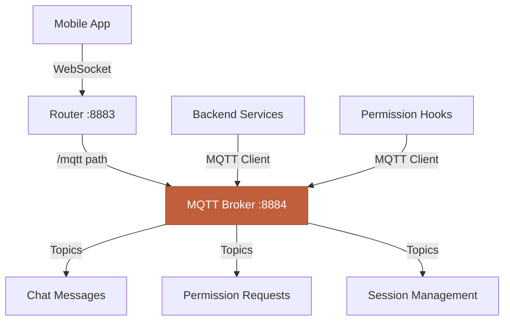
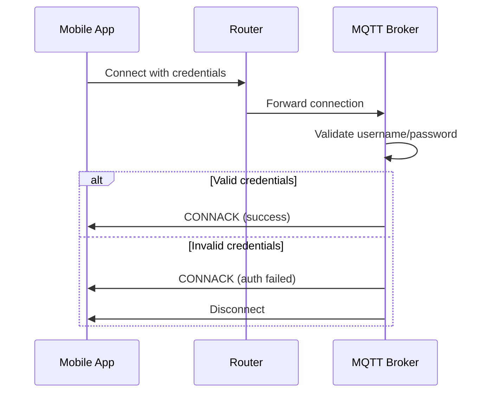

## Overview

CCC uses **MQTT** (Message Queuing Telemetry Transport) as the communication protocol between your mobile device and the backend. The backend runs an embedded **Aedes MQTT broker** that handles all message routing for chat, permissions, and terminal access.

This guide covers advanced MQTT configuration for performance tuning, custom deployments, and troubleshooting.

<Info>
**Default Setup**: CCC's MQTT broker is automatically configured and requires no manual setup for typical usage. Advanced configuration is optional.
</Info>

---

## MQTT Architecture

CCC uses MQTT over WebSockets for reliable, bidirectional communication.

### Components



### Ports

CCC uses two ports by default:

| Port | Service | Protocol | Purpose |
|------|---------|----------|---------|
| **8883** | Router | HTTP/WS | Entry point for mobile app |
| **8884** | MQTT Broker | WS | Embedded Aedes broker |

**Flow:**
1. Mobile app connects to router (8883) via WebSocket
2. Router forwards `/mqtt` path to broker (8884)
3. Broker handles pub/sub message routing
4. Backend services connect directly to broker

---

## Custom Ports

Change default ports to avoid conflicts or match your network setup.

### Using Environment Variables

Create `.env` file:

```bash
# Router port (mobile app connects here)
ROUTER_PORT=9000

# MQTT broker port (internal)
MQTT_BROKER_PORT=9001
```

Start backend:
```bash
ccc
```

### Using CLI Flags

```bash
ccc --router-port 9000 --mqtt-port 9001
```

<Warning>
**Port Conflicts**: If you see `EADDRINUSE` errors, another process is using that port. Check with:
```bash
# macOS/Linux
lsof -i :8883
lsof -i :8884

# Windows
netstat -ano | findstr :8883
```
</Warning>

### Mobile App Configuration

When using custom ports, update the mobile app connection URL:

**Default:**
```
ws://192.168.1.100:8883
```

**Custom port (9000):**
```
ws://192.168.1.100:9000
```

The mobile app automatically routes to the MQTT broker through the router—no need to specify the broker port (9001) separately.

---

## QoS Levels

MQTT supports three Quality of Service (QoS) levels for message delivery guarantees.

### QoS Level Comparison

| QoS | Name | Guarantee | Use Case | Overhead |
|-----|------|-----------|----------|----------|
| **0** | At most once | Fire and forget | Non-critical updates | Lowest |
| **1** | At least once | Acknowledged delivery | Important messages | Medium |
| **2** | Exactly once | Guaranteed single delivery | Critical transactions | Highest |

### CCC Default: QoS 1

CCC uses **QoS 1** by default for all topics:
- Chat messages
- Permission requests/responses
- Session updates
- Terminal output

**Why QoS 1?**
- Guarantees message delivery (important for chat)
- Prevents message loss on network hiccups
- Minimal overhead compared to QoS 2
- Handles duplicate messages gracefully

### Changing QoS Level

**Backend configuration:**

```bash
# .env file
MQTT_QOS=2  # Use QoS 2 for guaranteed exactly-once delivery
```

```bash
# CLI flag
ccc --mqtt-qos 2
```

**Mobile app**: No configuration needed—QoS is negotiated per subscription.

### When to Use QoS 0

**Scenario**: High-frequency, non-critical updates where occasional message loss is acceptable.

**Example**: Live typing indicators, cursor position, read receipts.

```typescript
// Custom backend service
client.publish('chat/typing', payload, { qos: 0 });
```

**Trade-off**: Lower latency and bandwidth at the cost of reliability.

### When to Use QoS 2

**Scenario**: Critical financial transactions, audit logs, or commands that must execute exactly once.

**Example**: Session deletion, project removal, billing events.

```bash
MQTT_QOS=2 ccc
```

**Trade-off**: Higher latency (4-way handshake) and bandwidth for guaranteed delivery.

---

## Client ID Customization

Every MQTT client needs a unique identifier. CCC auto-generates client IDs but allows customization.

### Default Client IDs

**Backend:**
```
claude-backend
```

**Mobile app:**
```
mobile-{device-id}-{random}
```

**Permission hooks:**
```
claude-hook-{random}
```

### Custom Backend Client ID

```bash
# .env file
MQTT_CLIENT_ID=my-custom-backend

# CLI flag
ccc --mqtt-client-id my-custom-backend
```

### Why Customize?

<AccordionGroup>
  <Accordion title="Multiple backends on same broker" icon="server">
    Running multiple backends? Unique IDs prevent connection conflicts:

    ```bash
    # Terminal 1
    MQTT_CLIENT_ID=backend-dev ccc

    # Terminal 2
    MQTT_CLIENT_ID=backend-staging ccc
    ```
  </Accordion>

  <Accordion title="Debugging and monitoring" icon="magnifying-glass">
    Meaningful IDs make logs clearer:

    ```
    [INFO] Client connected: backend-dev
    [INFO] Client connected: backend-staging
    ```

    vs.

    ```
    [INFO] Client connected: claude-backend
    [INFO] Client connected: claude-backend-2
    ```
  </Accordion>

  <Accordion title="Session persistence" icon="floppy-disk">
    Fixed client IDs enable persistent sessions (clean: false):

    When client reconnects with same ID, broker delivers queued messages from disconnection period.
  </Accordion>
</AccordionGroup>

<Warning>
**Duplicate Client IDs**: If two clients connect with the same ID, the broker disconnects the old client. Ensure uniqueness across all connecting clients.
</Warning>

---

## Keep-Alive Intervals

Keep-alive prevents idle connections from timing out.

### How Keep-Alive Works

MQTT clients send periodic PINGREQ packets to broker:
1. Client sends PINGREQ every N seconds
2. Broker responds with PINGRESP
3. If no PINGREQ received in 1.5x interval, broker disconnects client

### Default Values

| Component | Keep-Alive | Timeout |
|-----------|-----------|---------|
| Backend | 60 seconds | 90 seconds |
| Mobile app | 30 seconds | 45 seconds |
| Hooks | 60 seconds | 90 seconds |

### Mobile App Configuration

**Settings → Advanced → Keep-Alive Interval**

Recommended values:
- **WiFi**: 60 seconds (stable connection)
- **Mobile data**: 30 seconds (frequent reconnects)
- **Poor network**: 15-20 seconds (early detection of disconnects)

### Backend Keep-Alive

CCC backend keep-alive is not configurable (fixed at 60s) as it runs on stable localhost connections.

### Hook Keep-Alive

Permission hooks use short-lived connections (5 min max) so keep-alive is less critical. Default: 60s.

---

## Connection Timeouts

Configure how long to wait for connection establishment.

### Backend Timeout

```bash
# .env file
MQTT_CONNECT_TIMEOUT=30000  # 30 seconds (milliseconds)
```

Default: 10 seconds (10000ms)

**When to increase:**
- Slow network conditions
- High latency connections (>200ms)
- Debugging connection issues

**When to decrease:**
- Fast failure detection needed
- Local connections only
- Load balancer health checks

### Mobile App Timeout

**Settings → Advanced → Connection Timeout**

Default: 10 seconds

Recommended:
- **Local network**: 5-10 seconds
- **Remote (ngrok)**: 15-20 seconds
- **Poor connection**: 30 seconds

---

## Retained Messages

Retained messages are stored by the broker and delivered to new subscribers immediately.

### What Are Retained Messages?

When a message is published with `retain: true`:
1. Broker stores the message
2. When new client subscribes to topic, broker sends retained message
3. Only one retained message per topic (new ones overwrite old)

### CCC's Use of Retained Messages

**CCC does NOT use retained messages** for chat or permissions because:
- Stale messages could cause confusion
- Session state is managed separately
- Real-time communication doesn't benefit from retention

**Where retention is useful:**
- Last known status/state
- Configuration values
- Presence indicators ("online"/"offline")

### Enabling Retention (Custom Topics)

If you're building custom features on CCC's MQTT broker:

```typescript
// Publish with retention
client.publish('status/backend', 'online', {
  qos: 1,
  retain: true
});

// Clear retained message
client.publish('status/backend', null, {
  qos: 1,
  retain: true
});
```

---

## Clean Sessions

Clean sessions control whether broker stores subscriptions and queued messages across disconnects.

### Clean Session = True (Default)

**Behavior:**
- Broker discards session state on disconnect
- New connection starts fresh
- No message queuing during disconnection
- Subscriptions don't persist

**Pros:**
- Simple and predictable
- No state buildup
- Faster reconnects

**Cons:**
- Messages sent during disconnect are lost
- Must re-subscribe on every connect

### Clean Session = False

**Behavior:**
- Broker stores session state
- Queues QoS 1/2 messages during disconnect
- Subscriptions persist across reconnects
- Delivers queued messages on reconnect

**Pros:**
- No message loss during disconnects
- Automatic subscription restoration

**Cons:**
- Session state accumulates
- Requires unique client ID
- Potential memory buildup on broker

### CCC's Choice

**Mobile app**: `cleanSession: true` (default)
- Chat sessions are stored in database, not MQTT
- Reconnects fetch missed messages via API
- Prevents stale message buildup

**Backend**: `cleanSession: true`
- Backend rarely disconnects (localhost)
- State managed in memory, not broker
- Simplifies architecture

---

## Max Packet Size

MQTT has a maximum packet size limit to prevent memory exhaustion.

### Default Limits

| Component | Max Packet Size |
|-----------|-----------------|
| Aedes broker | 16 MB |
| CCC backend | 10 MB |
| Mobile app | 1 MB |

### Why Limits Exist

**Protection against:**
- Out-of-memory errors
- Malicious large payloads
- Bandwidth exhaustion
- Slow message processing

### What Happens if Exceeded?

**Mobile app sends 2 MB message:**
```
[ERROR] MQTT publish failed: packet size exceeds maximum (1048576 bytes)
```

**Solutions:**
1. **Split large messages** into chunks
2. **Use image compression** (CCC does this automatically)
3. **Upload large files separately** (not via MQTT)

### Adjusting Limits

**Not recommended** for typical CCC usage. If you have a legitimate need:

```bash
# Increase mobile app limit (requires app rebuild)
# In mobile app config:
maxPacketSize: 5242880  // 5 MB
```

<Warning>
**Memory Impact**: Larger packet sizes increase memory usage. A broker with 100 connected clients and 10 MB limit needs at least 1 GB RAM for receive buffers alone.
</Warning>

---

## Authentication Setup

Secure your MQTT broker with username/password authentication.

### Enabling Authentication

```bash
# .env file
MQTT_USERNAME=admin
MQTT_PASSWORD=your-secure-password-here

# Start backend
ccc
```

### Authentication Flow



### Mobile App Configuration

<Steps>
  <Step title="Add server">
    Tap **Add Server** in mobile app
  </Step>

  <Step title="Enable authentication">
    Toggle **Use Authentication**
  </Step>

  <Step title="Enter credentials">
    - **Username**: `admin`
    - **Password**: `your-secure-password-here`
  </Step>

  <Step title="Save and connect">
    Credentials are stored securely in device keychain
  </Step>
</Steps>

### When Authentication is Required

<AccordionGroup>
  <Accordion title="Using ngrok or public access" icon="globe">
    **Always enable authentication** when exposing backend via ngrok or public IP.

    Without auth, anyone with your URL can connect.
  </Accordion>

  <Accordion title="Shared networks" icon="wifi">
    On office WiFi, public WiFi, or dorm networks where others could discover your IP.
  </Accordion>

  <Accordion title="Multiple users" icon="users">
    Prevent unauthorized access if multiple people use the same network.
  </Accordion>
</AccordionGroup>

### When Authentication is Optional

<AccordionGroup>
  <Accordion title="Home network (trusted)" icon="house">
    If you trust everyone on your home network and don't use ngrok.
  </Accordion>

  <Accordion title="Localhost only" icon="laptop">
    Running backend and mobile app on same device (rare, testing only).
  </Accordion>
</AccordionGroup>

---

## Advanced Tuning

Fine-tune MQTT for specific scenarios.

### High-Frequency Updates

**Scenario**: Real-time terminal output (1000+ messages/second)

**Optimization:**
```bash
MQTT_QOS=0  # Reduce overhead
```

**Mobile app**: Increase buffer size for burst handling

### Low-Bandwidth Networks

**Scenario**: Mobile data with limited bandwidth

**Optimization:**
- Reduce keep-alive interval: 60s → 30s (faster disconnect detection)
- Use QoS 0 for non-critical messages
- Enable message compression (not built into MQTT, app-level)

### High-Latency Connections

**Scenario**: ngrok with 200+ ms latency

**Optimization:**
```bash
MQTT_CONNECT_TIMEOUT=20000  # 20 seconds
```

**Mobile app**: Increase timeout to 20-30 seconds

### Multi-Project Scenarios

**Scenario**: Running multiple CCC backends simultaneously

**Configuration:**
```bash
# Project 1
ROUTER_PORT=8883
MQTT_BROKER_PORT=8884
MQTT_CLIENT_ID=backend-project1

# Project 2
ROUTER_PORT=9883
MQTT_BROKER_PORT=9884
MQTT_CLIENT_ID=backend-project2
```

Each backend runs on separate ports with unique client IDs.

---

## Monitoring and Debugging

### Backend Logs

Enable debug logging:
```bash
ccc --debug
```

**MQTT-related log entries:**
```
[DEBUG] MQTT Broker listening on ws://localhost:8884
[DEBUG] MQTT Client connected: mobile-abc123
[DEBUG] MQTT Subscribe: chat/project-123/messages
[DEBUG] MQTT Publish: chat/project-123/messages (1234 bytes)
[DEBUG] MQTT Client disconnected: mobile-abc123
```

### Connection Statistics

Monitor active connections and message flow:

```bash
# Check broker stats (if exposed)
curl http://localhost:8883/mqtt/stats
```

**Expected output:**
```json
{
  "connectedClients": 3,
  "subscriptions": 12,
  "messagesReceived": 1543,
  "messagesPublished": 1789,
  "bytesReceived": 524288,
  "bytesPublished": 687104
}
```

### Mobile App Diagnostics

**Settings → Diagnostics → Connection Info**

Shows:
- Connection status
- Last ping time
- Messages sent/received
- Reconnection count
- Current QoS level

---

## Common Issues

<AccordionGroup>
  <Accordion title="Connection refused" icon="circle-xmark">
    **Error:**
    ```
    [ERROR] MQTT connection refused: Connection refused
    ```

    **Causes:**
    1. Backend not running
    2. Wrong port
    3. Firewall blocking connection
    4. IP address mismatch

    **Solutions:**
    ```bash
    # 1. Verify backend is running
    ccc --debug

    # 2. Check listening ports
    lsof -i :8883
    lsof -i :8884

    # 3. Test connection
    telnet localhost 8883

    # 4. Check firewall (macOS)
    sudo /usr/libexec/ApplicationFirewall/socketfilterfw --listapps
    ```
  </Accordion>

  <Accordion title="Authentication failed" icon="key">
    **Error:**
    ```
    [ERROR] MQTT CONNACK: Connection refused, bad username or password
    ```

    **Causes:**
    1. Username/password mismatch
    2. Credentials not set on backend
    3. Typo in credentials

    **Solutions:**
    - Verify `.env` file has `MQTT_USERNAME` and `MQTT_PASSWORD`
    - Check mobile app credentials match exactly (case-sensitive)
    - Try resetting credentials:
    ```bash
    # Backend .env
    MQTT_USERNAME=admin
    MQTT_PASSWORD=test123

    # Mobile app
    Username: admin
    Password: test123
    ```
  </Accordion>

  <Accordion title="Frequent disconnects" icon="plug-circle-xmark">
    **Symptom**: Connection drops every few minutes

    **Causes:**
    1. Keep-alive too long for network
    2. Firewall timing out idle connections
    3. NAT translation expiring
    4. Mobile device sleeping

    **Solutions:**
    - **Reduce keep-alive**: 60s → 30s → 15s
    - **Increase timeout**: 10s → 20s
    - **Mobile app**: Settings → Prevent sleep
    - **Router**: Disable connection tracking timeout
  </Accordion>

  <Accordion title="Messages not delivered" icon="envelope-open-text">
    **Symptom**: Chat messages sent but not received

    **Causes:**
    1. QoS 0 with packet loss
    2. Client ID collision (duplicate IDs)
    3. Subscription mismatch
    4. Topic name typo

    **Debug:**
    ```bash
    # Enable debug logs
    ccc --debug

    # Watch for:
    # - "MQTT Publish: chat/project-123/messages"
    # - "MQTT Subscribe: chat/project-123/messages"
    # Topic names must match exactly
    ```

    **Solutions:**
    - Switch to QoS 1: `MQTT_QOS=1 ccc`
    - Verify client IDs are unique
    - Check topic subscriptions in logs
  </Accordion>

  <Accordion title="High memory usage" icon="memory">
    **Symptom**: Backend consuming excessive RAM (>500 MB)

    **Causes:**
    1. Message queue buildup (persistent sessions)
    2. Retained messages accumulating
    3. Too many subscriptions
    4. Memory leak in custom code

    **Solutions:**
    - Use clean sessions: `cleanSession: true`
    - Clear retained messages
    - Restart backend periodically
    - Monitor with:
    ```bash
    # macOS/Linux
    ps aux | grep ccc

    # Check heap size
    node --max-old-space-size=512 dist/index.js
    ```
  </Accordion>
</AccordionGroup>

---

## MQTT Topics Reference

CCC uses structured topic hierarchy for message routing.

### Topic Format

```
{resource}/{projectId}/{action}
```

### Standard Topics

| Topic | Direction | Purpose | QoS |
|-------|-----------|---------|-----|
| `chat/{projectId}/messages` | Bidirectional | Chat messages | 1 |
| `chat/{projectId}/stream` | Backend → App | Claude streaming responses | 1 |
| `permissions/{projectId}/request` | Backend → App | Permission requests | 1 |
| `permissions/{projectId}/response` | App → Backend | Permission responses | 1 |
| `terminal/{sessionId}/data` | Bidirectional | Terminal I/O | 1 |
| `session/{projectId}/update` | Backend → App | Session state changes | 1 |

See [MQTT Topics Reference](/reference/mqtt-topics) for complete list.

---

## Next Steps

<CardGroup cols={2}>
  <Card title="Remote Access with ngrok" icon="globe" href="/advanced/remote-access">
    Set up secure remote access to your backend
  </Card>

  <Card title="Security Best Practices" icon="lock" href="/advanced/security">
    Comprehensive security guide for production usage
  </Card>

  <Card title="Custom Hooks" icon="webhook" href="/advanced/custom-hooks">
    Create custom permission hooks for advanced workflows
  </Card>

  <Card title="MQTT Topics" icon="sitemap" href="/reference/mqtt-topics">
    Complete MQTT topic reference and message formats
  </Card>
</CardGroup>
