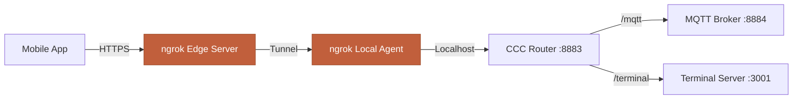

## Overview

CCC runs on your local machine by default, which means you can only connect to it from your mobile device when both are on the same network (or using a VPN). For remote access—connecting from anywhere in the world—you need to expose your backend to the internet.

**ngrok** provides secure tunneling to expose your local CCC backend without port forwarding, dynamic DNS, or cloud hosting. It creates an HTTPS URL that forwards to your local machine.

<Info>
**Use Case**: You're at home working on a project. You want to continue that conversation while commuting or at a coffee shop—from anywhere with internet access.
</Info>

---

## Why ngrok?

CCC uses ngrok instead of alternatives for several reasons:

### Advantages

<AccordionGroup>
  <Accordion title="No Router Configuration" icon="router">
    Unlike port forwarding, ngrok doesn't require you to:
    - Configure router firewall rules
    - Set up static local IPs
    - Manage port forwarding rules
    - Deal with dynamic DNS updates
  </Accordion>

  <Accordion title="Built-in HTTPS" icon="lock">
    ngrok automatically provides:
    - TLS/SSL encryption
    - Valid HTTPS certificates
    - Secure WebSocket support (wss://)
    - No certificate management needed
  </Accordion>

  <Accordion title="Dynamic IP Support" icon="arrows-rotate">
    Works even if your ISP changes your IP address:
    - No need for dynamic DNS services
    - Works with CGNAT (carrier-grade NAT)
    - Works on mobile hotspots
    - Works on restrictive networks
  </Accordion>

  <Accordion title="Simple Setup" icon="plug">
    Get started in minutes:
    - Single command-line tool
    - No server setup required
    - No cloud hosting costs
    - No infrastructure management
  </Accordion>
</AccordionGroup>

### Comparison Table

| Feature | ngrok | Port Forwarding | VPN | Cloud Hosting |
|---------|-------|-----------------|-----|---------------|
| Router access required | ✗ | ✓ | ✓ | ✗ |
| Static IP needed | ✗ | ✓ | ✗ | ✗ |
| HTTPS included | ✓ | ✗ | ✗ | Setup required |
| Setup time | < 5 min | 30+ min | 20+ min | Hours |
| Works on CGNAT | ✓ | ✗ | ✗ | ✓ |
| Cost | Free tier available | Free | Varies | $5-50/mo |

---

## Prerequisites

Before setting up ngrok with CCC:

<Steps>
  <Step title="Create ngrok account">
    Sign up for a free account at [ngrok.com](https://ngrok.com)

    Free tier includes:
    - 1 online agent
    - 1 active endpoint
    - 40 connections/minute
    - Random URLs (changes on restart)
  </Step>

  <Step title="Get authentication token">
    After signup, navigate to **Your Authtoken** in the dashboard

    Copy the token—it looks like:
    ```
    2ZxYN5G8mP9KqR7tL3vXw_4bH1jC6dF5sA8kE0nM
    ```
  </Step>

  <Step title="Install ngrok (optional)">
    CCC bundles ngrok automatically, but you can install separately:

    <CodeGroup>
    ```bash macOS
    brew install ngrok
    ```

    ```bash Linux
    curl -s https://ngrok-agent.s3.amazonaws.com/ngrok.asc | \
      sudo tee /etc/apt/trusted.gpg.d/ngrok.asc >/dev/null && \
      echo "deb https://ngrok-agent.s3.amazonaws.com buster main" | \
      sudo tee /etc/apt/sources.list.d/ngrok.list && \
      sudo apt update && sudo apt install ngrok
    ```

    ```bash Windows
    choco install ngrok
    ```
    </CodeGroup>
  </Step>
</Steps>

---

## Basic Setup (Free Tier)

The simplest way to enable remote access with ngrok.

### Using Environment Variables

Create a `.env` file in your working directory:

```bash
# .env
NGROK_AUTH_TOKEN=your-token-here
```

Start CCC with ngrok enabled:

```bash
ccc --ngrok
```

**Output:**
```
[INFO] Starting CCC Backend (v1.1.1)
[INFO] MQTT Broker: ws://localhost:8883
[INFO] Starting ngrok tunnel...
[INFO] ✓ ngrok tunnel started successfully
[INFO]
[INFO] ━━━━━━━━━━━━━━━━━━━━━━━━━━━━━━━━━━━━━━━━━
[INFO]
[INFO]   🌐 Remote Access URL:
[INFO]   https://abc123def456.ngrok-free.app
[INFO]
[INFO] ━━━━━━━━━━━━━━━━━━━━━━━━━━━━━━━━━━━━━━━━━
[INFO]
[INFO] Backend ready. Connect from mobile app.
```

### Using CLI Flag

Pass the token directly:

```bash
ccc --ngrok --ngrok-token your-token-here
```

<Warning>
**Security Note**: Don't commit `.env` files with tokens to git. Add `.env` to your `.gitignore`:
```bash
echo ".env" >> .gitignore
```
</Warning>

### Connecting from Mobile App

<Steps>
  <Step title="Open CCC mobile app">
    Launch the app on your phone
  </Step>

  <Step title="Add new server">
    Tap **Add Server** or **+** icon
  </Step>

  <Step title="Enter ngrok URL">
    Paste the full ngrok URL:
    ```
    https://abc123def456.ngrok-free.app
    ```

    **Important**: Use the full URL including `https://`
  </Step>

  <Step title="Connect">
    Tap **Connect**. You should see the green connection indicator.
  </Step>
</Steps>

---

## Static Domains (Paid Tier)

ngrok free tier generates random URLs that change every time you restart. For a consistent URL, upgrade to a paid plan.

### Paid Plans

| Plan | Price | Features |
|------|-------|----------|
| **Personal** | $8/mo | 1 static domain, 3 agents, 120 req/min |
| **Pro** | $20/mo | 3 static domains, unlimited agents |
| **Business** | $45/mo | 10 static domains, SSO, teams |

### Reserve a Domain

<Steps>
  <Step title="Upgrade your account">
    Go to ngrok dashboard → Billing → Upgrade
  </Step>

  <Step title="Reserve a domain">
    Dashboard → Cloud Edge → Domains → New Domain

    Choose your subdomain:
    ```
    my-ccc.ngrok-free.app
    my-project.ngrok-free.app
    company-ccc.ngrok-free.app
    ```
  </Step>

  <Step title="Configure CCC">
    Add domain to `.env`:
    ```bash
    NGROK_AUTH_TOKEN=your-token-here
    NGROK_DOMAIN=my-ccc.ngrok-free.app
    ```
  </Step>

  <Step title="Start with static domain">
    ```bash
    ccc --ngrok
    ```

    Your URL will always be:
    ```
    https://my-ccc.ngrok-free.app
    ```
  </Step>
</Steps>

### Benefits of Static Domains

- **Consistent URL**: Same URL every time you start CCC
- **Save in app**: Configure once in mobile app, works forever
- **Share with team**: Team members can use the same URL
- **Custom branding**: Use a memorable subdomain

---

## Authentication Requirements

When using ngrok (especially on free tier), ngrok shows an interstitial page before allowing connections. To bypass this, enable MQTT authentication.

### Why Authentication is Required

**Free tier ngrok URLs**:
- Are publicly accessible
- Show ngrok branding page
- May be blocked by some networks
- Require "Visit Site" button click

**MQTT authentication**:
- Secures your backend
- Prevents unauthorized access
- Provides credential-based access control
- Works seamlessly with mobile app

### Enabling Authentication

Set username and password in `.env`:

```bash
NGROK_AUTH_TOKEN=your-token-here
MQTT_USERNAME=admin
MQTT_PASSWORD=your-secure-password-here
```

Start CCC:
```bash
ccc --ngrok
```

### Configure Mobile App

<Steps>
  <Step title="Add server with authentication">
    When adding the ngrok URL, enable authentication
  </Step>

  <Step title="Enter credentials">
    - **Username**: `admin`
    - **Password**: `your-secure-password-here`
  </Step>

  <Step title="Save and connect">
    App stores credentials securely
  </Step>
</Steps>

<Tip>
**Generate Strong Passwords**:
```bash
# Generate a random password
openssl rand -base64 32
```
</Tip>

---

## Configuration via CLI

CCC supports ngrok configuration through multiple methods.

### CLI Flags

<ParamField path="--ngrok" type="boolean">
  Enable ngrok tunneling

  ```bash
  ccc --ngrok
  ```
</ParamField>

<ParamField path="--ngrok-token" type="string">
  ngrok authentication token (required if not in .env)

  ```bash
  ccc --ngrok --ngrok-token 2ZxYN5G8mP9KqR7tL3vXw_4bH1jC6dF5sA8kE0nM
  ```
</ParamField>

<ParamField path="--ngrok-domain" type="string">
  Static domain (paid plans only)

  ```bash
  ccc --ngrok --ngrok-domain my-ccc.ngrok-free.app
  ```
</ParamField>

### Environment Variables

<CodeGroup>
```bash .env file
NGROK_AUTH_TOKEN=your-token-here
NGROK_DOMAIN=my-ccc.ngrok-free.app
MQTT_USERNAME=admin
MQTT_PASSWORD=secure-password
```

```bash Shell export
export NGROK_AUTH_TOKEN=your-token-here
export NGROK_DOMAIN=my-ccc.ngrok-free.app
ccc --ngrok
```
</CodeGroup>

### Full Example

**Setup for remote access with authentication:**

```bash
# Create .env file
cat > .env << 'EOF'
# ngrok configuration
NGROK_AUTH_TOKEN=2ZxYN5G8mP9KqR7tL3vXw_4bH1jC6dF5sA8kE0nM
NGROK_DOMAIN=my-project.ngrok-free.app

# Security
MQTT_USERNAME=admin
MQTT_PASSWORD=$(openssl rand -base64 32)

# Optional: Custom ports
ROUTER_PORT=8883
MQTT_BROKER_PORT=8884
EOF

# Start CCC
ccc --ngrok
```

---

## Security Considerations

Running a publicly accessible backend requires security awareness.

### Best Practices

<AccordionGroup>
  <Accordion title="Always use authentication" icon="key">
    **Never run ngrok without MQTT authentication.**

    ```bash
    # Bad - no auth
    ccc --ngrok

    # Good - with auth
    MQTT_USERNAME=admin MQTT_PASSWORD=strong-pass ccc --ngrok
    ```

    Without auth, anyone with your ngrok URL can:
    - Connect to your backend
    - Send chat messages
    - Execute code on your machine (via Claude)
  </Accordion>

  <Accordion title="Use strong passwords" icon="lock">
    Generate cryptographically secure passwords:

    ```bash
    # Generate password
    openssl rand -base64 32

    # Example output:
    # P7xQmK3vN9sL4tR8wY2bH5jC6dF1gA0eM3nB7pX4q
    ```

    **Bad passwords**:
    - `admin123`
    - `password`
    - Your name or project name

    **Good passwords**:
    - 32+ random characters
    - Mix of upper, lower, numbers, symbols
    - Stored in password manager
  </Accordion>

  <Accordion title="Monitor ngrok dashboard" icon="chart-line">
    ngrok provides analytics:
    - Active connections
    - Request rates
    - Geographic distribution
    - Status codes

    **Red flags**:
    - Connections from unexpected countries
    - High request rates (> 100/min)
    - Many failed authentication attempts
    - Unusual access patterns

    Check dashboard at: [dashboard.ngrok.com](https://dashboard.ngrok.com)
  </Accordion>

  <Accordion title="Restrict by IP (paid plans)" icon="filter">
    Pro+ plans support IP restrictions:

    ```bash
    ngrok http 8883 --cidr-allow 1.2.3.4/32
    ```

    Or configure in ngrok dashboard:
    - Cloud Edge → IP Restrictions
    - Add your mobile carrier's IP ranges
    - Block all other IPs
  </Accordion>

  <Accordion title="Use permission modes" icon="shield-check">
    When using ngrok, prefer restrictive permission modes:

    ```bash
    # Default mode (ask for each tool)
    ccc --ngrok

    # NEVER use bypass-all with ngrok
    # ccc --ngrok --bypass-all  # ⚠️ DANGEROUS
    ```

    See [Permission System](/features/permission-system) for details.
  </Accordion>

  <Accordion title="Review Claude's actions" icon="magnifying-glass">
    Regularly check what Claude is doing:
    - Review session history
    - Check git diffs after sessions
    - Monitor file changes
    - Audit bash commands executed

    ```bash
    # Review changes after session
    git diff
    git log --oneline -10
    ```
  </Accordion>
</AccordionGroup>

### Risks and Mitigation

| Risk | Impact | Mitigation |
|------|--------|------------|
| **Unauthorized access** | Code execution on your machine | Enable MQTT authentication |
| **Data exfiltration** | Project files readable | Use strong passwords, monitor access |
| **Malicious commands** | System compromise | Use Default permission mode, never Bypass All |
| **DDoS/abuse** | Backend unavailable | Monitor ngrok analytics, use rate limits |
| **Credential leaks** | Account takeover | Use .env files, never commit tokens to git |

---

## Troubleshooting ngrok Issues

<AccordionGroup>
  <Accordion title="ngrok tunnel failed to start" icon="circle-exclamation">
    **Error:**
    ```
    [ERROR] ngrok tunnel failed: authentication failed
    ```

    **Causes:**
    1. Invalid or expired auth token
    2. Token not set in .env or CLI
    3. ngrok account not verified

    **Solutions:**
    ```bash
    # Verify token is set
    echo $NGROK_AUTH_TOKEN

    # Test ngrok directly
    ngrok http 8883 --authtoken your-token

    # Check ngrok account status
    # Visit https://dashboard.ngrok.com
    ```
  </Accordion>

  <Accordion title="Domain already in use" icon="clone">
    **Error:**
    ```
    [ERROR] ngrok tunnel failed: domain already in use
    ```

    **Cause**: Static domain is already used by another ngrok instance

    **Solutions:**
    1. Stop other running ngrok instances
    2. Check ngrok dashboard for active agents
    3. Wait 1-2 minutes for cleanup
    4. Kill all ngrok processes:
    ```bash
    # macOS/Linux
    pkill ngrok

    # Windows
    taskkill /f /im ngrok.exe
    ```
  </Accordion>

  <Accordion title="Connection timeout from mobile app" icon="clock">
    **Symptom**: Mobile app shows "Connection failed" or timeout

    **Causes:**
    1. ngrok tunnel not started successfully
    2. Firewall blocking localhost
    3. Wrong URL in mobile app
    4. MQTT auth mismatch

    **Debug steps:**
    ```bash
    # 1. Verify tunnel is active
    ccc --ngrok --debug
    # Look for: "ngrok tunnel started successfully"

    # 2. Test tunnel directly
    curl https://your-url.ngrok-free.app/health

    # 3. Check MQTT WebSocket
    wscat -c wss://your-url.ngrok-free.app/mqtt

    # 4. Verify credentials match
    # .env vs mobile app settings
    ```
  </Accordion>

  <Accordion title="ngrok interstitial page blocking connection" icon="hand">
    **Symptom**: ngrok shows "Visit Site" button before connecting

    **Cause**: Free tier ngrok requires click-through

    **Solutions:**
    1. **Enable MQTT authentication** (bypasses interstitial for authenticated requests)
    ```bash
    MQTT_USERNAME=admin MQTT_PASSWORD=pass ccc --ngrok
    ```

    2. **Upgrade to paid plan** (removes interstitial)

    3. **Use ngrok branded URL** in browser once, then mobile app works
  </Accordion>

  <Accordion title="Slow connection over ngrok" icon="turtle">
    **Symptom**: Messages take longer to send/receive

    **Causes:**
    1. ngrok adds ~50-100ms latency
    2. Geographic distance from ngrok edge server
    3. Mobile data connection slow

    **Mitigation:**
    - ngrok routes through nearest edge server automatically
    - Paid plans have more edge servers
    - Use WiFi instead of mobile data
    - Check your internet speed: [fast.com](https://fast.com)

    **Expected latency:**
    - Local network: 5-20ms
    - ngrok (same region): 50-150ms
    - ngrok (different region): 150-300ms
  </Accordion>

  <Accordion title="Too many connections error" icon="users-slash">
    **Error:**
    ```
    [ERROR] ngrok: ERR_NGROK_108 (rate limit exceeded)
    ```

    **Cause**: Free tier limit of 40 connections/minute exceeded

    **Solutions:**
    1. **Upgrade to paid plan** (120-1000 connections/min)
    2. **Reduce reconnection attempts** in mobile app
    3. **Check for connection loops** in logs
    4. **Wait for rate limit reset** (1 minute)
  </Accordion>
</AccordionGroup>

---

## Code Reference

CCC's ngrok integration is implemented in the backend.

### NgrokManager Class

**File**: `/home/naarang/projects/cc/backend/src/ngrok/manager.ts`

**Key methods:**

```typescript
class NgrokManager {
  // Start tunnel
  async start(): Promise<string>

  // Get tunnel URL
  getUrl(): string

  // Check if active
  isActive(): boolean

  // Stop tunnel
  async stop(): Promise<void>
}
```

**Example initialization:**

```typescript
import { NgrokManager } from './ngrok/manager';

const ngrokManager = new NgrokManager({
  authToken: process.env.NGROK_AUTH_TOKEN!,
  domain: process.env.NGROK_DOMAIN,
  port: 8883  // Router port
});

// Start tunnel
const publicUrl = await ngrokManager.start();
console.log(`Public URL: ${publicUrl}`);

// Later: stop tunnel
await ngrokManager.stop();
```

### Architecture



**Flow:**
1. Mobile app connects to ngrok public URL (HTTPS)
2. ngrok edge server forwards to local agent
3. Local agent tunnels to CCC router on localhost
4. Router forwards to MQTT or Terminal based on path

---

## Alternatives to ngrok

If ngrok doesn't fit your needs, consider these alternatives:

### Cloudflare Tunnel

**Pros:**
- Free forever (no limits)
- Built-in DDoS protection
- Zero Trust access controls
- Custom domains on free tier

**Cons:**
- More complex setup
- Requires Cloudflare account
- Not officially supported by CCC

**Setup:**
```bash
# Install cloudflared
brew install cloudflare/cloudflare/cloudflared

# Login
cloudflared tunnel login

# Create tunnel
cloudflared tunnel create ccc-backend

# Start tunnel
cloudflared tunnel --url localhost:8883
```

### Tailscale VPN

**Pros:**
- True peer-to-peer
- Zero configuration NAT traversal
- End-to-end encrypted
- Free for personal use

**Cons:**
- Requires Tailscale on all devices
- Mobile app setup more complex
- Not a direct HTTP tunnel

**Use case**: Connect mobile device to your home network via VPN, then use local connection.

### Self-Hosted VPS

**Pros:**
- Full control
- No third-party dependencies
- Custom domain
- Unlimited bandwidth

**Cons:**
- Requires server management
- Monthly hosting costs ($5-20)
- SSL certificate management
- SSH port forwarding setup

**Not recommended** unless you have specific requirements.

---

## Next Steps

<CardGroup cols={2}>
  <Card title="Security Best Practices" icon="lock" href="/advanced/security">
    Comprehensive security guide for production CCC usage
  </Card>

  <Card title="MQTT Configuration" icon="network-wired" href="/advanced/mqtt-configuration">
    Advanced MQTT broker settings and tuning
  </Card>

  <Card title="Server Profiles" icon="server" href="/features/server-profiles">
    Manage multiple server connections in mobile app
  </Card>

  <Card title="CLI Reference" icon="terminal" href="/reference/cli-commands">
    Complete command-line options and flags
  </Card>
</CardGroup>
