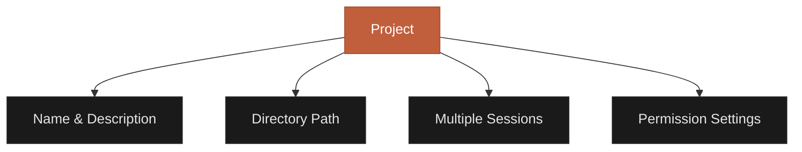
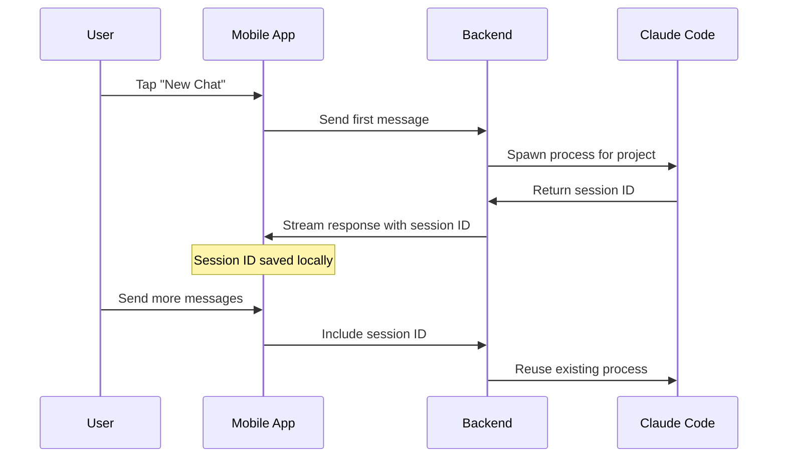
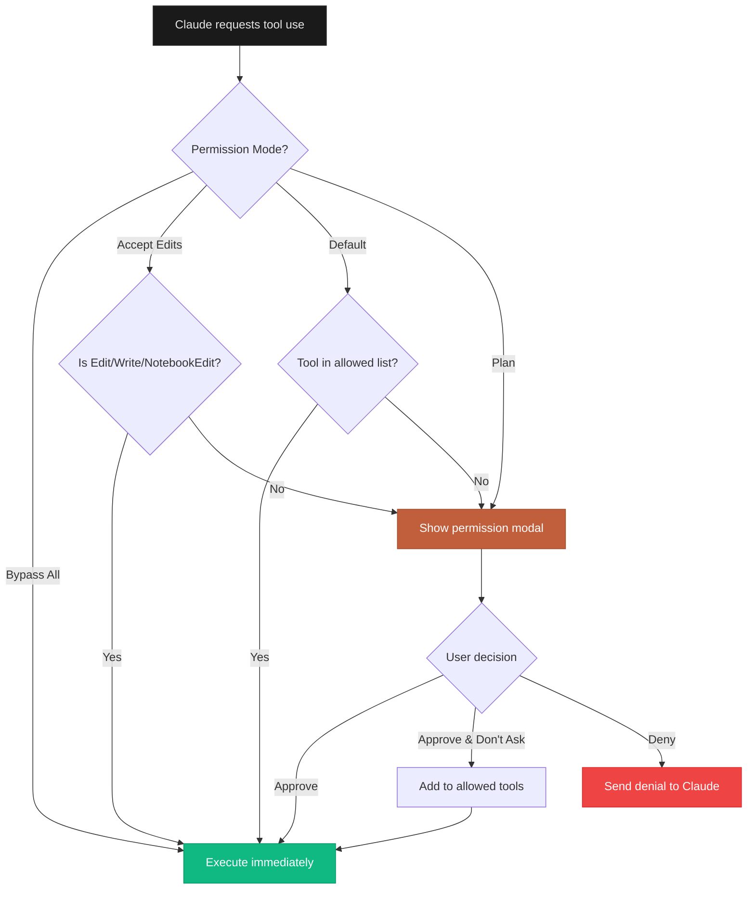
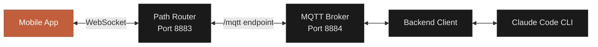
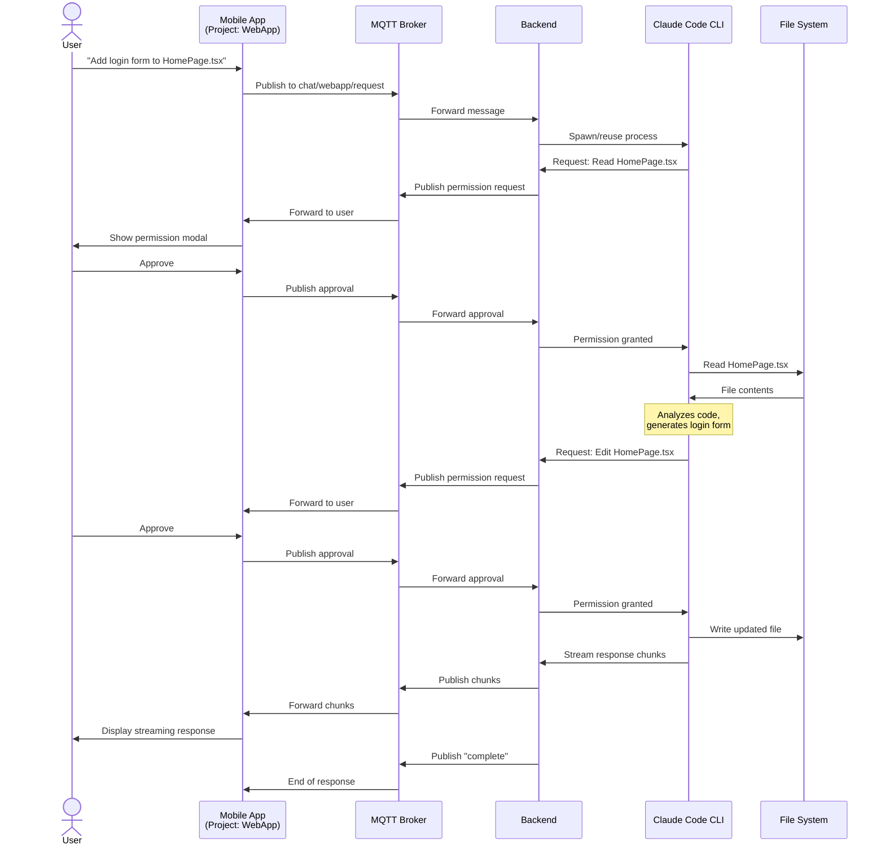

## Overview

CCC is built around four core concepts: **Projects**, **Sessions**, **Permissions**, and **MQTT Communication**. Understanding these concepts will help you use CCC effectively.

---

## Projects

A **project** represents a codebase or directory on your development machine that you want to work on with Claude.



### Project Structure

Each project consists of:
- **Name**: Human-readable identifier (e.g., "My Web App")
- **Description**: Optional details about the project
- **Directory Path**: Absolute path on your dev machine (e.g., `/Users/alice/projects/webapp`)
- **Sessions**: All conversations related to this project
- **Settings**: Permission mode, allowed tools, backend version

### When to Create Projects

Create separate projects for:
- Different repositories/applications
- Frontend vs backend of the same app
- Personal vs work projects
- Experimental vs production code

<Tip>
**Best Practice**: Use descriptive project names that clearly identify the codebase. Avoid generic names like "Project 1" or "Test".
</Tip>

### Project Storage

Projects are stored locally on your mobile device in AsyncStorage. The backend maintains a mapping between projects and their sessions in `.claude/sessions.json`.

---

## Sessions

A **session** is a single conversation with Claude within a project context. Sessions persist across devices and app restarts.

### Session Lifecycle



### Session Properties

- **Session ID**: Unique identifier (UUID format)
- **Project**: The project this session belongs to
- **Messages**: Full conversation history
- **Context**: Accumulated tokens from all messages
- **Created**: Timestamp of first message
- **Last Activity**: Timestamp of most recent message

### Session Files

Sessions are stored on your development machine at:
```
~/.claude/projects/{sanitized-project-path}/{session-id}.jsonl
```

Each line in the JSONL file represents a message or tool interaction.

<Info>
**Path Sanitization**: CCC converts `/` to `-` and `:` to `--` in paths. For example, `/Users/alice/projects/app` becomes `Users-alice-projects-app`.
</Info>

### Resuming Sessions

To resume a previous conversation:
1. Open the project in your mobile app
2. Tap the session icon or "Resume" button
3. Select a session from the list
4. The full conversation history loads
5. Continue chatting from where you left off

### Session Sync

The mobile app incrementally syncs messages from session files:
- First load: Fetches last 50 messages
- Scroll up: Loads previous messages (pagination)
- UUID-based deduplication prevents duplicates
- Real-time updates via MQTT for new messages

<Warning>
Sessions persist indefinitely. To free up disk space, manually delete old session files from `~/.claude/projects/`.
</Warning>

---

## Permissions

The **permission system** controls what tools Claude can use to modify your project. CCC supports four permission modes.

### Permission Modes

<Tabs>
  <Tab title="Default">
    **Recommended for most users**

    - Prompts for approval the **first time** Claude uses each tool
    - Shows tool name and parameters for review
    - Option to "Approve & Don't Ask Again" adds tool to allowed list
    - Balanced security and convenience

    **Use when**: Working with familiar code and you trust Claude's suggestions.
  </Tab>

  <Tab title="Accept Edits">
    **Fast workflow for file modifications**

    - Auto-approves file modification tools: `Edit`, `Write`, `NotebookEdit`
    - Still prompts for other tools: `Bash`, `Task`, etc.
    - Speeds up coding sessions with frequent file changes

    **Use when**: You're confident in Claude's code changes and want faster iterations.
  </Tab>

  <Tab title="Plan">
    **Analysis-only mode**

    - Claude can **read and analyze** code but cannot make changes
    - Prompts for approval on ALL tool uses
    - Safe for unfamiliar codebases or code review

    **Use when**: Reviewing unfamiliar code, auditing, or getting recommendations before applying changes.
  </Tab>

  <Tab title="Bypass All">
    **⚠️ Use with extreme caution**

    - Skips **all** permission prompts
    - Claude can execute any tool without approval
    - Fastest workflow but highest risk

    **Use when**: You have full trust in Claude's actions (e.g., sandbox environments, throwaway code).

    <Warning>
    Never use Bypass All mode with production code or sensitive data. You won't see what tools Claude uses until after execution.
    </Warning>
  </Tab>
</Tabs>

### Permission Flow



### Changing Permission Modes

**Mobile App**:
1. Go to Settings tab
2. Tap "Permission Mode"
3. Select your preferred mode
4. Confirmation dialog appears for Bypass All

**Backend CLI** (at startup):
```bash
# Default mode
ccc

# Accept Edits mode
ccc --accept-edits

# Plan mode
ccc --plan

# Bypass All mode (use with caution)
ccc --bypass-all
```

<Tip>
You can change permission modes at any time, even mid-conversation. The new mode takes effect immediately for the next tool Claude tries to use.
</Tip>

---

## MQTT Communication

CCC uses **MQTT over WebSocket** for real-time communication between your mobile app and backend.

### Why MQTT?

- **Real-time**: Streaming responses appear instantly
- **Lightweight**: Low bandwidth usage (important for mobile)
- **Bidirectional**: Mobile can request and backend can push
- **Reliable**: QoS levels ensure message delivery
- **Persistent**: Retained messages for configuration

### Architecture



### Connection Flow

1. **Backend starts** → Embedded MQTT broker listens on port 8884
2. **Path router starts** → Routes `/mqtt` to broker WebSocket
3. **Mobile app connects** → WebSocket to `ws://<ip>:8883/mqtt`
4. **Authentication** → Optional username/password validation
5. **Subscribe to topics** → App subscribes to response/config topics
6. **Ready** → Can send messages and receive responses

### Message Structure

All MQTT messages use JSON format:

```typescript
// Chat Request (mobile → backend)
{
  message: string
  sessionId?: string
  projectPath: string
  images?: Array<{data: string, mimeType: string}>
}

// Chat Response (backend → mobile)
{
  type: "chunk" | "complete" | "error"
  content: string
  sessionId?: string
  error?: string
}

// Permission Request (backend → mobile)
{
  toolName: string
  toolInput: object
  requestId: string
}

// Permission Response (mobile → backend)
{
  requestId: string
  approved: boolean
  reason?: string
}
```

### Quality of Service (QoS)

CCC uses QoS 1 ("at least once" delivery):
- Messages are acknowledged by the receiver
- Retransmission if acknowledgment not received
- Prevents message loss due to network issues

<Info>
You can configure QoS level via the `MQTT_QOS` environment variable in the backend (values: 0, 1, 2).
</Info>

---

## How It All Fits Together

### Complete Workflow Example



---

## Key Takeaways

<CardGroup cols={2}>
  <Card title="Projects organize your work" icon="folder">
    Each project maps to a directory and contains all related sessions
  </Card>
  <Card title="Sessions are conversations" icon="messages">
    Persistent chat history that syncs across devices
  </Card>
  <Card title="Permissions keep you safe" icon="shield">
    Four modes let you balance convenience and control
  </Card>
  <Card title="MQTT enables real-time" icon="bolt">
    WebSocket-based messaging for instant streaming responses
  </Card>
</CardGroup>

---

## Next Steps

Now that you understand the core concepts, explore specific features:

<CardGroup cols={2}>
  <Card title="Permission System" icon="shield" href="/features/permission-system">
    Deep dive into all four permission modes
  </Card>
  <Card title="Session Management" icon="clock" href="/features/session-management">
    Learn to manage and resume sessions effectively
  </Card>
  <Card title="MQTT Topics Reference" icon="plug" href="/reference/mqtt-topics">
    Complete list of all MQTT topics and message formats
  </Card>
  <Card title="Mobile App Guide" icon="mobile" href="/mobile/overview">
    Explore all mobile app features and screens
  </Card>
</CardGroup>
