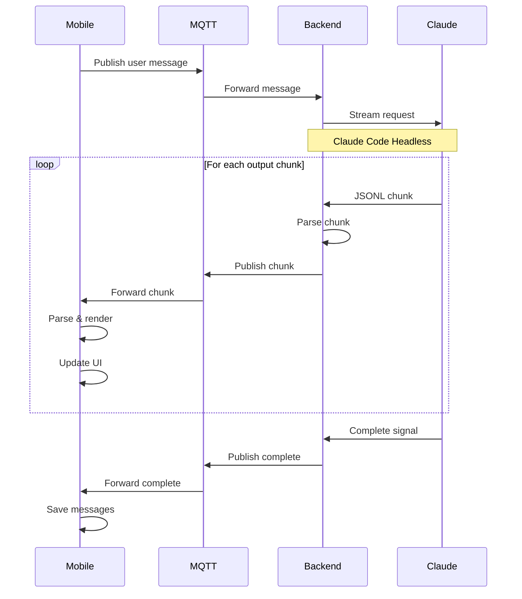

## Overview

CCC delivers Claude's responses in real-time using streaming over MQTT. Instead of waiting for the complete response, you see Claude's thoughts and actions as they happen—text appears word-by-word, tool uses show up as they execute, and you can track context usage throughout the conversation.

<Info>
Streaming uses MQTT for bi-directional communication between the backend and mobile app. Messages are sent as JSONL (newline-delimited JSON) chunks that are reassembled on the client.
</Info>

---

## How Streaming Works

CCC uses a multi-layer streaming architecture to deliver Claude's responses with minimal latency:



### JSONL Chunk Format

Claude Code Headless outputs messages as **JSON Lines** (JSONL)—one JSON object per line:

```json
{"type":"system","subtype":"init","session_id":"abc123","timestamp":1699000000}
{"type":"assistant","message":{"role":"assistant","content":[{"type":"text","text":"I'll help you with that."}]}}
{"type":"assistant","message":{"content":[{"type":"tool_use","id":"tool_1","name":"Read","input":{"file_path":"src/app.ts"}}]}}
{"type":"user","message":{"content":[{"type":"tool_result","tool_use_id":"tool_1","content":"export default function..."}]}}
{"type":"result","subtype":"success","message":{"usage":{"input_tokens":1234,"output_tokens":567}}}
```

**Key message types:**

| Type | Subtype | Purpose |
|------|---------|---------|
| `system` | `init` | Session initialization with session ID |
| `assistant` | - | Claude's responses (text, tool use, thinking) |
| `user` | - | Tool results returning to Claude |
| `result` | `success` | Completion with token usage |
| `result` | - | Error messages (when `is_error: true`) |

### Stream Parsing

The backend's `StreamParser` class handles JSONL parsing:

<CodeGroup>
```typescript Backend (stream-parser.ts)
export class StreamParser {
  private buffer: string = '';

  parseChunk(chunk: string): ClaudeStreamOutput[] {
    this.buffer += chunk;
    const results: ClaudeStreamOutput[] = [];

    while (true) {
      // Find complete JSON object
      const startIndex = this.buffer.indexOf('{');
      if (startIndex === -1) break;

      this.buffer = this.buffer.substring(startIndex);

      // Find end of JSON object
      let endIndex = -1;
      for (let i = 0; i < this.buffer.length; i++) {
        if (this.buffer[i] === '}') {
          if (i + 1 === this.buffer.length || this.buffer[i + 1] === '\n') {
            endIndex = i;
            break;
          }
        }
      }

      if (endIndex === -1) break;

      const jsonStr = this.buffer.substring(0, endIndex + 1);
      this.buffer = this.buffer.substring(endIndex + 1);

      try {
        const parsed = JSON.parse(jsonStr) as ClaudeStreamOutput;
        results.push(parsed);
      } catch (error) {
        console.warn('Failed to parse JSON:', error);
      }
    }

    return results;
  }
}
```

```typescript Mobile (chat/[id].tsx)
function handleMQTTResponse(response: any) {
  if (response.type === 'session') {
    // Store session ID for resumption
    setSessionId(response.sessionId);
    storage.setSessionId(projectId, response.sessionId);
  }
  else if (response.type === 'chunk') {
    // Parse and display streaming content
    const parsed = JSON.parse(response.content);
    const parseResult = parseClaudeResponse(
      response.content,
      projectId,
      todoWriteToolUseIds
    );

    // Update streaming messages in real-time
    setStreamingMessages(prev => [...prev, ...parseResult.messages]);
  }
  else if (response.type === 'complete') {
    // Save to permanent storage
    streamingMessages.forEach(msg => storage.createMessage(msg));
    setStreamingMessages([]);
  }
}
```
</CodeGroup>

### Chunk Reassembly

The mobile app receives chunks over MQTT and reassembles them into messages:

1. **Buffer incoming chunks** - Accumulate partial JSON objects
2. **Parse complete objects** - Extract text, tool use, thinking blocks
3. **Merge tool results** - Match `tool_use` with `tool_result` by `tool_use_id`
4. **Update UI reactively** - React state triggers re-renders
5. **Save on completion** - Persist to SQLite when stream ends

<Tip>
Tool use messages arrive in two parts: first the `tool_use` block (input), then the `tool_result` block (output). The app merges them by matching `tool_use_id`.
</Tip>

---

## Message Components

CCC renders different message types with specialized UI components:

### User Messages

Displays your messages with optional image attachments.

**Features:**
- Text content with 4000 character limit
- Image thumbnails (up to 5 images)
- Support for PNG, JPEG, GIF, WebP
- Images compressed to max 1568px × 1568px

```typescript
// Message structure
{
  role: 'user',
  content: 'Please analyze this screenshot',
  attachments: [
    {
      type: 'image',
      uri: 'file:///path/to/image.png',
      mimeType: 'image/png',
      filename: 'screenshot.png'
    }
  ]
}
```


---

### Assistant Messages

Claude's text responses rendered with **Markdown** support.

**Supported Markdown:**
- **Headings** (H1-H6)
- **Bold** and *italic* text
- `Inline code` with syntax highlighting
- Code blocks with language-specific highlighting
- Lists (ordered and unordered)
- Links and blockquotes
- Tables

**Rendering:** Uses `react-native-markdown-display` library for consistent styling across iOS and Android.

<CodeGroup>
```typescript Component (AssistantMessage.tsx)
export default function AssistantMessage({ message }: AssistantMessageProps) {
  const { theme } = useTheme();

  const markdownStyles = useMemo(() => StyleSheet.create({
    body: {
      fontSize: 14,
      fontFamily: fonts.regular,
      color: colors.text.primary,
      lineHeight: 20,
    },
    code_inline: {
      backgroundColor: colors.pampas,
      color: colors.crail,
      fontFamily: 'monospace',
      paddingHorizontal: 4,
      paddingVertical: 2,
      borderRadius: 4,
    },
    code_block: {
      backgroundColor: '#1e1e1e',
      color: '#d4d4d4',
      fontFamily: 'monospace',
      padding: spacing.sm,
      borderRadius: 8,
      marginVertical: spacing.xs,
    },
    // ... more styles
  }), [colors]);

  return (
    <View style={styles.bubble}>
      <Markdown style={markdownStyles}>
        {message.content}
      </Markdown>
    </View>
  );
}
```

```markdown Example Output
Here's how to add authentication:

1. Install dependencies:
   ```bash
   npm install next-auth
   ```

2. Create `pages/api/auth/[...nextauth].ts`

3. Wrap your app with `<SessionProvider>`

**Important:** Store secrets in `.env.local`, not in code!
```
</CodeGroup>


---

### Tool Use Cards

Interactive cards showing Claude's tool executions with inputs and outputs.

**Features:**
- Expand/collapse to show details
- Syntax highlighting for code
- Diff view for Edit tool (shows old vs new)
- Success/error visual indicators
- Icon per tool type (Terminal, FileText, Edit, Search)

<CodeGroup>
```typescript Component (ToolUseCard.tsx)
export default function ToolUseCard({ message }: ToolUseCardProps) {
  const [expanded, setExpanded] = useState(false);
  const Icon = getToolIcon(message.tool_name);

  return (
    <TouchableOpacity
      style={styles.card}
      onPress={() => setExpanded(!expanded)}
    >
      <View style={styles.header}>
        <View style={styles.iconContainer}>
          <Icon size={16} color={colors.crail} />
        </View>
        <Text style={styles.toolName}>{message.tool_name}</Text>
        {expanded ? <ChevronDown /> : <ChevronRight />}
      </View>

      {expanded && (
        <View style={styles.content}>
          {/* Input parameters */}
          <Text style={styles.inputLabel}>Input:</Text>
          {message.tool_name === 'Edit'
            ? renderEditDiff(message.tool_input)
            : <Text style={styles.codeText}>{message.content}</Text>
          }

          {/* Output results */}
          {message.tool_output && (
            <>
              <Text style={styles.inputLabel}>
                {message.is_error ? 'Error:' : 'Output:'}
              </Text>
              {renderOutput(message.tool_output, message.is_error)}
            </>
          )}
        </View>
      )}
    </TouchableOpacity>
  );
}
```

```json Example Tool Use - Read
{
  "type": "tool_use",
  "tool_name": "Read",
  "tool_input": {
    "file_path": "/home/user/project/src/app.ts"
  },
  "tool_output": "import express from 'express';\n\nconst app = express();\n...",
  "is_error": false
}
```

```json Example Tool Use - Edit (with diff)
{
  "type": "tool_use",
  "tool_name": "Edit",
  "tool_input": {
    "file_path": "/home/user/project/src/utils.ts",
    "old_string": "function add(a, b) {\n  return a + b;\n}",
    "new_string": "function add(a: number, b: number): number {\n  return a + b;\n}"
  },
  "tool_output": "Successfully edited file",
  "is_error": false
}
```
</CodeGroup>

**Tool Icons:**

| Tool | Icon | Purpose |
|------|------|---------|
| `Bash` | Terminal | Execute shell commands |
| `Read` | FileText | Read file contents |
| `Edit` / `Write` | Edit3 | Modify or create files |
| `Grep` / `Glob` | Search | Search for files or content |

**Visual States:**

<CardGroup cols={2}>
  <Card title="Success State" icon="check">
    - Green border and background tint
    - Checkmark icon
    - Output displayed in code block
  </Card>
  <Card title="Error State" icon="xmark">
    - Red border and background tint
    - X icon
    - Error message in red text
  </Card>
</CardGroup>


**Edit Diff Rendering:**

For `Edit` and `MultiEdit` tools, CCC shows a unified diff view:

- **Unchanged text** - Gray, normal weight
- **Removed text** - Red background, strikethrough
- **Added text** - Green background, bold

This makes it easy to see exactly what Claude changed in your files.

---

### Thinking Blocks

Claude's internal reasoning process, visible during extended thinking mode.

**Appearance:**
- Yellow/amber background (`#fef3c7` light, `#3a2d1f` dark)
- Italic text for readability
- "Thinking..." label
- Collapsible card

**When they appear:**
- Complex problem solving
- Planning multi-step operations
- Analyzing code architecture
- Debugging logic

```typescript Component (ThinkingMessage.tsx)
export default function ThinkingMessage({ message }: ThinkingMessageProps) {
  const { isDark } = useTheme();

  return (
    <View style={[
      styles.card,
      {
        backgroundColor: isDark ? '#3a2d1f' : '#fef3c7',
        borderColor: isDark ? '#92400e' : '#fbbf24',
      }
    ]}>
      <Text style={styles.label}>Thinking...</Text>
      <Text style={styles.content}>{message.content}</Text>
    </View>
  );
}
```

**Example thinking content:**
```text
Let me analyze the authentication flow. I need to:
1. Check the current session management implementation
2. Identify potential security vulnerabilities
3. Propose improvements for token refresh logic

First, I'll read the auth service to understand the current implementation.
```


<Info>
Thinking blocks are part of Claude's extended thinking capability. They give you insight into how Claude approaches complex problems.
</Info>

---

### System Messages

Internal messages for session management (not displayed in chat UI):

- **Session init** - Contains session ID for resumption
- **Usage tracking** - Token counts from each turn
- **Error messages** - When Claude encounters issues

These are parsed but not rendered as message bubbles.

---

## Context Usage Monitor

Track how much of the 200k token context window you've used.

**Location:** Chat header, circular progress indicator

**What it shows:**
- **Percentage** - Visual fill level + numeric (e.g., "43%")
- **Breakdown** (on tap) - Token categories:
  - Input tokens
  - Output tokens
  - Cache creation tokens
  - Cache read tokens

### Token Accumulation

Context usage accumulates across all messages in a session:

```typescript
// Update usage from result message
if (parsed.type === 'result' && parsed.message?.usage) {
  const u = parsed.message.usage;

  storage.updateContextUsage(
    projectId,
    u.input_tokens || 0,
    u.output_tokens || 0,
    u.cache_creation_input_tokens || 0,
    u.cache_read_input_tokens || 0
  );

  const totalUsed =
    inputTokens +
    outputTokens +
    cacheCreationTokens +
    cacheReadTokens;

  setContextUsage({ used: totalUsed, total: 200000 });
}
```

### When to Start a New Session

<Warning>
When context usage exceeds **80% (160k tokens)**, consider starting a new session. Claude's performance may degrade as the context fills up.
</Warning>

**How to start new session:**
1. Tap the session icon (message square) in chat header
2. Select "New Session" at the bottom
3. Context usage resets to 0%
4. Previous session remains accessible


### Cache Tokens

Claude uses **prompt caching** to reduce costs and latency for repeated content:

- **Cache creation tokens** - First time content is cached (charged at cache write rate)
- **Cache read tokens** - Subsequent reads from cache (90% discount)

Caching is automatic for:
- Tool definitions
- File contents from Read tool
- Long system prompts

<Tip>
Cache tokens significantly reduce API costs for iterative development. You're only charged full price the first time Claude reads a file—subsequent reads are 90% cheaper.
</Tip>

---

## Streaming Indicator

Animated "typing" dots appear while Claude is generating a response.

**Behavior:**
- Shows during chunk reception
- Appears below last message
- Auto-scrolls to keep indicator visible
- Disappears when stream completes

```typescript Component (ThinkingIndicator.tsx)
export default function ThinkingIndicator() {
  return (
    <View style={styles.container}>
      <View style={styles.dot} />
      <View style={[styles.dot, styles.dotDelay1]} />
      <View style={[styles.dot, styles.dotDelay2]} />
    </View>
  );
}

// Animated with CSS-like animations
const styles = StyleSheet.create({
  dot: {
    width: 8,
    height: 8,
    borderRadius: 4,
    backgroundColor: colors.crail,
    // Animation applied via Animated API
  },
});
```

---

## Error Handling

CCC gracefully handles various error conditions during streaming:

### Network Errors

**Symptoms:**
- Connection indicator turns red
- "Connection lost" toast appears
- Messages fail to send

**Handling:**
- MQTT auto-reconnects (exponential backoff)
- Backend health monitor detects disconnections
- Yellow banner: "Backend client disconnected"
- Queued messages retry after reconnection

```typescript
// Connection status callback
client.setConnectionCallback((status) => {
  if (status === 'disconnected') {
    showToast('Connection lost. Trying to reconnect...', 'error');
    backendHealth.stop();
  } else if (status === 'reconnecting') {
    showToast('Reconnecting to server...', 'warning');
  } else if (status === 'connected') {
    showToast('Connected successfully!', 'success');
    backendHealth.start(client);
  }
});
```

### Timeout Handling

**Timeouts:**
- **MQTT connection**: 30 seconds
- **Permission requests**: 5 minutes
- **Message send**: 2 minutes (default bash timeout)

**Recovery:**
- Automatic retry with exponential backoff
- User notified via toast message
- Option to manually retry or cancel

### Parsing Errors

**When it happens:**
- Malformed JSONL chunks
- Incomplete JSON objects
- Unexpected message format

**Handling:**
- Buffer incomplete chunks until complete
- Log parse errors (dev mode)
- Skip malformed messages
- Continue processing valid chunks

```typescript
try {
  const parsed = JSON.parse(jsonStr) as ClaudeStreamOutput;
  results.push(parsed);
} catch (error) {
  logger.warn('Failed to parse JSON object', {
    jsonPreview: jsonStr.substring(0, 100),
    error: error.message,
  });
  // Continue processing next chunk
}
```

### Stream Interruption

**User-initiated stop:**

```typescript
async function handleStop() {
  setIsThinking(false);

  // Send cancel request to backend
  await mqttClient.cancelRequest();

  // Clear streaming messages
  setStreamingMessages([]);
  setTodos([]);

  showToast('Message processing stopped', 'info');
}
```

**Server-initiated error:**

```typescript
if (response.type === 'error') {
  console.error('[ERROR]:', response.error);
  showToast(response.error || 'An error occurred', 'error');

  // Clean up streaming state
  setStreamingMessages([]);
  setIsThinking(false);
}
```

---

## Code Examples

### Complete Message Flow

<CodeGroup>
```typescript Mobile - Send Message
async function handleSend() {
  const userMessage = inputText.trim();

  // Create and save user message immediately
  const newMessage = await storage.createMessage({
    project_id: project.id,
    role: 'user',
    content: userMessage,
    attachments: selectedImages.map(img => ({
      type: 'image',
      uri: img.uri,
      mimeType: getMimeTypeFromUri(img.uri),
    })),
  });

  // Show optimistically in UI
  setMessages(prev => [...prev, newMessage]);
  setIsThinking(true);

  // Process images in background
  const attachments = await Promise.all(
    selectedImages.map(asset => assetToAttachment(asset))
  );

  // Publish to MQTT
  await mqttClient.publish({
    message: userMessage,
    projectPath: project.directory_path,
    sessionId: sessionId || undefined,
    permissionMode: permissionMode,
    attachments,
  });
}
```

```typescript Mobile - Handle Streaming Chunks
function handleMQTTResponse(response: any) {
  if (response.type === 'chunk') {
    try {
      const parseResult = parseClaudeResponse(
        response.content,
        projectId,
        todoWriteToolUseIds
      );

      // Update todos if any
      if (parseResult.todos.length > 0) {
        setTodos(parseResult.todos);
      }

      // Merge messages (handles tool_use + tool_result)
      setStreamingMessages(prev => {
        let updated = [...prev];

        for (const newMsg of parseResult.messages) {
          if (newMsg.type === 'tool_use' && newMsg.tool_use_id) {
            if (newMsg.tool_output !== undefined) {
              // This is a tool result - merge with existing tool_use
              const existingIndex = updated.findIndex(
                m => m.type === 'tool_use' && m.tool_use_id === newMsg.tool_use_id
              );

              if (existingIndex !== -1) {
                updated[existingIndex] = {
                  ...updated[existingIndex],
                  tool_output: newMsg.tool_output,
                  is_error: newMsg.is_error,
                };
              } else {
                updated.push(newMsg);
              }
            } else {
              // This is a tool_use - add as new
              updated.push(newMsg);
            }
          } else {
            // Regular message (text, thinking)
            updated.push(newMsg);
          }
        }

        return updated;
      });
    } catch (e) {
      console.error('Failed to parse chunk:', e);
    }
  }
}
```

```typescript Mobile - Complete and Save
else if (response.type === 'complete') {
  // Move streaming messages to permanent storage
  setStreamingMessages(currentStreaming => {
    // Update UI immediately
    setMessages(prev => [...prev, ...currentStreaming]);

    // Save to SQLite asynchronously
    currentStreaming.forEach(async (msg) => {
      await storage.createMessage({
        project_id: msg.project_id,
        role: msg.role,
        content: msg.content,
        type: msg.type,
        tool_name: msg.tool_name,
        tool_input: msg.tool_input,
        tool_output: msg.tool_output,
        tool_use_id: msg.tool_use_id,
        is_error: msg.is_error,
      });
    });

    return []; // Clear streaming messages
  });

  setIsThinking(false);
}
```
</CodeGroup>

### TypeScript Interfaces

<CodeGroup>
```typescript Backend Types (types/index.ts)
export interface ClaudeStreamOutput {
  type: 'system' | 'assistant' | 'user' | 'result';
  subtype?: 'init' | 'success';
  session_id?: string;
  message?: {
    id?: string;
    type?: string;
    role?: string;
    model?: string;
    content?: Array<{
      type: string;
      text?: string;
      thinking?: string;
      id?: string;
      name?: string;
      input?: any;
      tool_use_id?: string;
    }>;
    stop_reason?: string | null;
    usage?: {
      input_tokens: number;
      output_tokens: number;
      cache_creation_input_tokens: number;
      cache_read_input_tokens: number;
    };
  };
  uuid?: string;
  is_error?: boolean;
  result?: string;
}

export interface ChatResponse {
  type: 'session' | 'chunk' | 'complete' | 'error';
  content?: string; // JSONL string
  sessionId?: string;
  error?: string;
}
```

```typescript Mobile Types (lib/storage.ts)
export interface Message {
  id: string;
  project_id: string;
  role: 'user' | 'assistant' | 'tool';
  content: string;
  type?: 'text' | 'thinking' | 'tool_use';
  tool_name?: string;
  tool_input?: any;
  tool_output?: string;
  tool_use_id?: string;
  is_error?: boolean;
  attachments?: Attachment[];
  uuid?: string; // For session sync
  created_at: string;
}

export interface Attachment {
  type: 'image';
  uri: string; // file:// URI for display
  mimeType: string;
  filename?: string;
}

export interface Todo {
  content: string; // Imperative form: "Run tests"
  status: 'pending' | 'in_progress' | 'completed';
  activeForm: string; // Present continuous: "Running tests"
}
```
</CodeGroup>

---

## Tips & Best Practices

<AccordionGroup>
  <Accordion title="Monitor context usage regularly" icon="chart-line">
    Keep an eye on the context indicator. When it reaches 80%, start a new session to maintain optimal performance. Long sessions can lead to:
    - Slower response times
    - Higher API costs
    - Potential context overflow errors
  </Accordion>

  <Accordion title="Expand tool use cards to verify actions" icon="magnifying-glass">
    Before approving tool uses in Default mode, expand the card to review input parameters. This is especially important for:
    - `Edit` - Check the old_string and new_string
    - `Bash` - Verify the command is safe
    - `Write` - Ensure file path is correct
  </Accordion>

  <Accordion title="Use thinking blocks for debugging" icon="lightbulb">
    Thinking blocks reveal Claude's problem-solving approach. If Claude's solution seems off-track, the thinking block often shows where the logic diverged. You can provide feedback based on the reasoning shown.
  </Accordion>

  <Accordion title="Clear context strategically" icon="trash">
    Don't clear chat just for cleanup. Only clear when:
    - Context usage is high (>80%)
    - Switching to a different task/feature
    - Claude's responses become less relevant
    - You want to start with a fresh slate

    Clearing loses the conversation context that helps Claude understand your codebase.
  </Accordion>

  <Accordion title="Leverage cache tokens" icon="database">
    Claude automatically caches tool definitions and large file contents. For iterative work:
    - Keep sessions open for related changes
    - Repeatedly reading the same file is 90% cheaper after first read
    - Tool definitions are cached across the session
  </Accordion>

  <Accordion title="Handle network interruptions gracefully" icon="wifi">
    If connection drops during streaming:
    - Wait for auto-reconnect (exponential backoff)
    - Don't spam the send button
    - Check the connection indicator (green = connected)
    - Session state persists—you can resume after reconnection
  </Accordion>

  <Accordion title="Review markdown formatting" icon="markdown">
    Claude's responses use Markdown. For best readability:
    - Code snippets appear in monospace with syntax highlighting
    - Use dark mode for code-heavy conversations
    - Long responses with tables/lists render better in portrait orientation
  </Accordion>
</AccordionGroup>

---

## Next Steps

<CardGroup cols={2}>
  <Card title="Session Management" icon="clock" href="/features/session-management">
    Learn how sessions persist and sync across conversations
  </Card>
  <Card title="Permission System" icon="shield" href="/features/permission-system">
    Control what tools Claude can use with permission modes
  </Card>
  <Card title="Image Support" icon="image" href="/features/image-support">
    Send screenshots and images for Claude to analyze
  </Card>
  <Card title="Message Parser" icon="code" href="/reference/message-parser">
    Deep dive into JSONL parsing and message types
  </Card>
</CardGroup>
