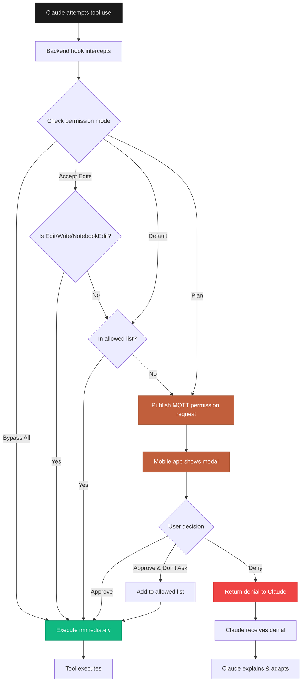

## Overview

CCC's permission system gives you granular control over what tools Claude Code can use to interact with your project. Choose from four permission modes that balance convenience and security based on your trust level and workflow needs.

<Info>
Permissions are enforced by intercepting Claude's tool requests before execution. Your approval is required unless you've explicitly allowed a tool or enabled Bypass All mode.
</Info>

---

## Permission Modes

<Tabs>
  <Tab title="Default">
    ### Default Mode (Recommended)

    The balanced approach for most users.

    **How it works:**
    - First time Claude uses a tool → permission modal appears
    - You review tool name and parameters
    - Choose: Approve once, Approve & Don't Ask Again, or Deny
    - Tools added to "allowed list" skip future prompts

    **Best for:**
    - Regular development workflow
    - Familiar codebases
    - Moderate trust in Claude's suggestions

    ```bash
    # Start backend in Default mode
    ccc
    ```

    
    

    **Example Flow:**
    ```mermaid
    sequenceDiagram
        participant Claude
        participant Backend
        participant Mobile
        participant User

        Claude->>Backend: Request: Read package.json
        Backend->>Mobile: Permission request
        Mobile->>User: Show modal
        User->>Mobile: "Approve & Don't Ask Again"
        Mobile->>Backend: Approved + Add to allowed list
        Backend->>Claude: Permission granted
        Note over Backend: Read added to allowed tools
        Claude->>Backend: Request: Read tsconfig.json
        Note over Backend: Read is in allowed list
        Backend->>Claude: Auto-approved (no prompt)
    ```
  </Tab>

  <Tab title="Accept Edits">
    ### Accept Edits Mode

    Auto-approves file modifications for faster iterations.

    **How it works:**
    - **Auto-approved**: `Edit`, `Write`, `MultiEdit`, `NotebookEdit`
    - **Still prompts**: `Bash`, `Task`, `Grep`, `Glob`, and others
    - File changes happen immediately without approval
    - Command execution still requires permission

    **Best for:**
    - Active coding sessions
    - Confident in Claude's code changes
    - Frequent file modifications
    - Reviewing changes in git diff afterward

    ```bash
    # Start backend in Accept Edits mode
    ccc --accept-edits
    ```

    **Switch in mobile app:**
    1. Go to Settings tab
    2. Tap "Permission Mode"
    3. Select "Accept Edits"
    4. Confirmation appears

    <Tip>
    Accept Edits mode is great for rapid prototyping. You can always review changes with `git diff` and revert if needed.
    </Tip>

    **Auto-Approved Tools:**
    - `Edit` - Modify existing file contents
    - `Write` - Create new files or overwrite existing
    - `MultiEdit` - Batch edit multiple files
    - `NotebookEdit` - Edit Jupyter notebook cells

    **Still Requires Approval:**
    - `Bash` - Execute shell commands
    - `Task` - Launch sub-agents
    - `Read`, `Grep`, `Glob` - File system access (unless added to allowed list)
  </Tab>

  <Tab title="Plan">
    ### Plan Mode (Analysis Only)

    Claude can read and analyze but cannot make changes.

    **How it works:**
    - Claude proposes changes without executing them
    - All tool uses require approval (even Read)
    - Safe for code review and exploration
    - Get recommendations before committing to changes

    **Best for:**
    - Unfamiliar codebases
    - Code review sessions
    - Understanding existing code
    - Getting recommendations without modifications
    - Pair programming / rubber ducking

    ```bash
    # Start backend in Plan mode
    ccc --plan
    ```

    **Mobile app:** Settings → Permission Mode → Plan

    
    

    **Example Prompts for Plan Mode:**
    ```text
    "Review my authentication implementation and suggest improvements"
    "What would you change in this API design?"
    "Explain how this React component works and where I can optimize it"
    "Propose a refactoring plan for the UserService class"
    ```

    <Warning>
    In Plan mode, Claude cannot apply fixes or create files. Switch to Default or Accept Edits mode to execute the proposed changes.
    </Warning>
  </Tab>

  <Tab title="Bypass All">
    ### Bypass All Mode ⚠️

    **Use with extreme caution.** Skips all permission prompts.

    **How it works:**
    - Claude can use **any tool** without approval
    - No permission modals appear
    - Fastest workflow but highest risk
    - Requires confirmation to enable

    **Best for:**
    - Sandbox/test environments only
    - Throwaway code
    - Full trust scenarios
    - Demo/prototype projects

    ```bash
    # Start backend in Bypass All mode (requires confirmation)
    ccc --bypass-all
    ```

    **Mobile app:** Settings → Permission Mode → Bypass All → Confirm

    
    

    <Warning>
    **Never use Bypass All mode with:**
    - Production code
    - Sensitive data or credentials
    - Shared repositories
    - Customer projects
    - Any code you're not prepared to lose or revert
    </Warning>

    **Risk Mitigation:**
    - Use version control (git) religiously
    - Commit before enabling Bypass All
    - Work in feature branches
    - Review all changes with `git diff` after session
    - Keep backups
  </Tab>
</Tabs>

---

## Changing Permission Modes

### From Mobile App

<Steps>
  <Step title="Open Settings">
    Tap the **Settings** tab at the bottom of the screen
  </Step>

  <Step title="Select Permission Mode">
    Tap **"Permission Mode"** in the settings list
  </Step>

  <Step title="Choose Mode">
    Select one of the four modes:
    - Default
    - Accept Edits
    - Plan
    - Bypass All (requires confirmation)
  </Step>

  <Step title="Confirm">
    For Bypass All, confirm you understand the risks
  </Step>
</Steps>

The new mode takes effect **immediately** for the next tool Claude tries to use.


### From Backend CLI

Pass the permission mode flag when starting CCC:

<CodeGroup>
```bash Default
ccc
# No flag needed (default mode)
```

```bash Accept Edits
ccc --accept-edits
```

```bash Plan
ccc --plan
```

```bash Bypass All
ccc --bypass-all
# You'll be prompted to confirm
```
</CodeGroup>

<Info>
The mobile app's permission mode setting overrides the backend CLI flag. If you change modes in the app, that becomes the active mode regardless of how the backend was started.
</Info>

---

## Allowed Tools List

In **Default mode**, tools you've approved with "Don't Ask Again" are stored in the allowed tools list.

### Viewing Allowed Tools

**Mobile app:** Settings → Allowed Tools (shows current list)

**Backend file:** `.claude/session-config.json`

```json
{
  "permissionMode": "default",
  "allowedTools": [
    "Read",
    "Grep",
    "Glob",
    "Edit"
  ],
  "backendVersion": "1.1.1"
}
```

### Managing Allowed Tools

**Remove a tool:**
1. Settings → Allowed Tools
2. Tap the tool to remove
3. Confirm removal
4. Future uses will require approval again

**Clear all:**
1. Settings → Allowed Tools
2. Tap "Clear All"
3. Confirm
4. All tools will require approval again

<Tip>
If Claude seems to be doing things without asking and you're in Default mode, check your Allowed Tools list. You may have approved tools earlier that are now auto-approved.
</Tip>

---

## Permission Flow Internals

Understanding how permissions work under the hood:



### Hook System

CCC uses Claude Code's **PreToolUse hooks** to intercept tool requests:

**Hook file location:** `.claude/hooks/permissions_hook.js`

```javascript
// Simplified hook logic
module.exports = async function preToolUse(params) {
  const { toolName, toolInput, sessionId } = params;

  // Read current permission mode
  const config = readSessionConfig();

  // Check mode
  if (config.permissionMode === 'bypassAll') {
    return { approved: true };
  }

  if (config.permissionMode === 'acceptEdits') {
    if (['Edit', 'Write', 'NotebookEdit'].includes(toolName)) {
      return { approved: true };
    }
  }

  if (config.permissionMode === 'default') {
    if (config.allowedTools.includes(toolName)) {
      return { approved: true };
    }
  }

  // Request permission from mobile app via MQTT
  const response = await requestPermission(toolName, toolInput);

  if (response.approved && response.addToAllowed) {
    addToAllowedList(toolName);
  }

  return response;
};
```

### MQTT Permission Topics

**Request** (backend → mobile):
```
Topic: chat/{projectId}/permissions
Payload:
{
  "toolName": "Edit",
  "toolInput": {
    "file_path": "/path/to/file.ts",
    "old_string": "...",
    "new_string": "..."
  },
  "requestId": "uuid-1234-5678"
}
```

**Response** (mobile → backend):
```
Topic: chat/{projectId}/permissions
Payload:
{
  "requestId": "uuid-1234-5678",
  "approved": true,
  "addToAllowed": true,
  "reason": null
}
```

**Timeout:** 5 minutes (300 seconds). If no response, request is denied.

---

## Security Best Practices

<AccordionGroup>
  <Accordion title="Start with Default mode" icon="shield-check">
    Unless you have a specific reason, use **Default mode**. It provides the best balance of security and convenience.
  </Accordion>

  <Accordion title="Use Plan mode for unfamiliar code" icon="magnifying-glass">
    When working with a new codebase, inherited code, or open source projects, start with **Plan mode** to understand the code before allowing modifications.
  </Accordion>

  <Accordion title="Regularly review allowed tools" icon="list-check">
    Check Settings → Allowed Tools monthly. Remove tools you rarely use or that seem risky (like `Bash` or `Task`).
  </Accordion>

  <Accordion title="Never use Bypass All in production" icon="triangle-exclamation">
    Only enable **Bypass All** in isolated test environments or for throwaway code. Always have version control as a safety net.
  </Accordion>

  <Accordion title="Review git diff after sessions" icon="code-compare">
    After any coding session, review changes with `git diff` before committing. This catches unexpected modifications.

    ```bash
    # Review all changes
    git diff

    # Review specific file
    git diff path/to/file.ts

    # Revert if needed
    git checkout path/to/file.ts
    ```
  </Accordion>

  <Accordion title="Be cautious with Bash approvals" icon="terminal">
    The `Bash` tool can execute any shell command. Review command parameters carefully before approving. Consider adding only safe commands to the allowed list.
  </Accordion>
</AccordionGroup>

---

## Common Scenarios

### Scenario 1: Rapid Feature Development

**Goal**: Build a new feature quickly with frequent file changes

**Recommended mode**: **Accept Edits**

**Workflow**:
1. Start in Accept Edits mode
2. Claude can modify files freely
3. Still prompts for bash commands
4. Review `git diff` frequently
5. Commit working increments

```bash
ccc --accept-edits
```

---

### Scenario 2: Code Review

**Goal**: Get Claude's analysis and suggestions for existing code

**Recommended mode**: **Plan**

**Workflow**:
1. Start in Plan mode
2. Ask "Review my authentication implementation"
3. Claude reads and analyzes (may prompt for Read approval)
4. Claude suggests improvements without changing files
5. Switch to Default mode to apply suggested changes

```bash
ccc --plan
```

---

### Scenario 3: Debugging Production Issue

**Goal**: Investigate a bug in production code safely

**Recommended mode**: **Default** or **Plan**

**Workflow**:
1. Create a feature branch
2. Start CCC in Default or Plan mode
3. Ask Claude to help identify the issue
4. Review each tool use carefully
5. Approve Read/Grep for investigation
6. Deny or carefully review Edit requests
7. Test fix thoroughly before merging

---

### Scenario 4: Learning a New Framework

**Goal**: Explore example code and learn patterns

**Recommended mode**: **Plan**

**Workflow**:
1. Clone example repository
2. Start in Plan mode
3. Ask "Explain how this Next.js app is structured"
4. Claude reads and explains code
5. Ask "Where would I add a new API endpoint?"
6. Claude shows examples without modifying files

---

## Troubleshooting

<AccordionGroup>
  <Accordion title="Permission modal not appearing" icon="circle-question">
    **Possible causes:**
    1. You're in Bypass All mode (check Settings → Permission Mode)
    2. Tool is in your allowed list (check Settings → Allowed Tools)
    3. You're in Accept Edits mode and Claude is using Edit/Write

    **Solution**: Switch to Default mode and clear allowed tools to reset behavior.
  </Accordion>

  <Accordion title="Too many permission prompts" icon="bell">
    **Cause**: You're in Default mode and haven't added tools to allowed list

    **Solutions**:
    - Use "Approve & Don't Ask Again" for trusted tools
    - Switch to Accept Edits mode for file operations
    - Review and add commonly used tools to allowed list
  </Accordion>

  <Accordion title="Permission request timeout" icon="clock">
    **Cause**: Mobile app didn't respond within 5 minutes

    **Solution**:
    - Check mobile app connection (green indicator)
    - Ensure app is in foreground
    - Check backend logs for MQTT issues
    - Retry the request
  </Accordion>

  <Accordion title="Changes applied without approval" icon="triangle-exclamation">
    **Possible causes:**
    1. You're in Bypass All mode
    2. You're in Accept Edits mode (auto-approves file edits)
    3. Tool was previously added to allowed list

    **Solution**:
    - Check current mode in Settings
    - Review Allowed Tools list
    - Switch to Plan mode for more control
  </Accordion>
</AccordionGroup>

---

## Next Steps

<CardGroup cols={2}>
  <Card title="Session Management" icon="clock" href="/features/session-management">
    Learn how sessions persist and sync across devices
  </Card>
  <Card title="Security Best Practices" icon="lock" href="/advanced/security">
    Comprehensive security guide for CCC usage
  </Card>
  <Card title="Custom Hooks" icon="code" href="/advanced/custom-hooks">
    Create custom permission hooks for advanced use cases
  </Card>
  <Card title="CLI Reference" icon="terminal" href="/reference/cli-commands">
    Complete command-line options and flags
  </Card>
</CardGroup>
