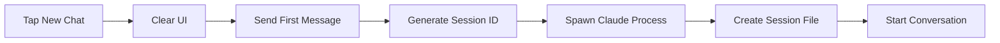
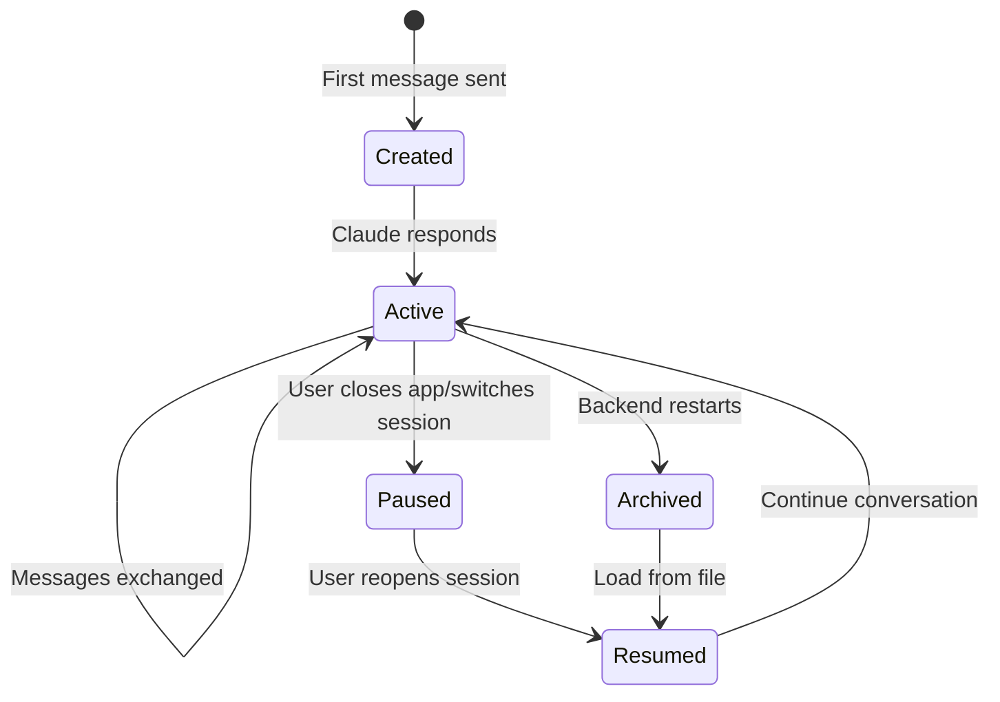

## Overview

Sessions are conversations with Claude that persist across devices and survive backend restarts. Each session is stored locally as a JSONL (JSON Lines) file in your `~/.claude/projects` directory, containing the complete conversation history including messages, tool calls, and results.

<Info>
Sessions are tied to specific project paths. Each project can have multiple sessions, allowing you to maintain separate conversation threads for different features or tasks.
</Info>

**Key Features:**
- Persistent conversation history stored locally
- Resume previous conversations seamlessly
- Switch between multiple sessions per project
- Incremental loading for fast session restoration
- Cross-device sync (via shared session files)
- No cloud storage - complete data ownership

---

## Creating Sessions

### Starting a New Session

Tap the "New Chat" button in the chat header to start a fresh conversation.

**What happens:**
1. Current conversation clears from the UI
2. Chat input becomes active for your first message
3. Backend waits for first user message
4. When you send first message, backend generates unique session ID
5. Claude process spawns and begins conversation
6. Messages are appended to new session file

```bash
# Session file created at:
~/.claude/projects/{sanitized-project-path}/{session-id}.jsonl
```

<Tip>
The "New Chat" button only clears the UI. The actual session file is created when you send your first message, not when you tap the button.
</Tip>

**Example Flow:**


---

## Session Lifecycle

Sessions progress through several states during their lifetime:



### Session ID Generation

Session IDs are UUID v4 strings generated by Claude Code CLI when the first message is sent:

```typescript
// Example session ID
"a7f3c8d1-4e2b-4a9c-8f1d-9b2e4c6d8a1f"
```

### Storage Location

Session files are stored in a sanitized directory structure:

```bash
~/.claude/projects/
  ├── Users-alice-app/
  │   ├── a7f3c8d1-4e2b-4a9c-8f1d-9b2e4c6d8a1f.jsonl
  │   └── b8g4d9e2-5f3c-5b0d-9g2e-0c3f5d7e9b2g.jsonl
  └── home-bob-projects-website/
      └── c9h5e0f3-6g4d-6c1e-0h3f-1d4g6e8f0c3h.jsonl
```

**Path Sanitization Rules:**
- Forward slashes (`/`) → single dash (`-`)
- Backslashes (`\`) → single dash (`-`)
- Colons followed by slashes (`:/` or `:\`) → double dash (`--`)
- Remaining colons (`:`) → double dash (`--`)

**Examples:**
| Original Path | Sanitized Path |
|--------------|----------------|
| `/Users/alice/app` | `Users-alice-app` |
| `/home/bob/projects/website` | `home-bob-projects-website` |
| `C:\Users\alice\app` | `C--Users-alice-app` |
| `/var/www:backup/site` | `-var-www--backup-site` |

---

## Resuming Sessions

### Resume Latest Session

The "Resume" button automatically loads the most recent session for the current project.

**How it works:**
1. Backend scans project's session directory
2. Sorts sessions by last modification time
3. Returns latest session ID
4. Mobile app requests session messages
5. Backend loads last 50 messages initially
6. Messages appear in chat UI
7. Scroll up to load more messages (incremental loading)

**Example MQTT Request:**
```typescript
// Request latest session
Topic: sessions/latest/request
Payload: {
  projectPath: "/Users/alice/app",
  clientId: "mobile-device-uuid",
  timestamp: 1699123456789
}

// Response
Topic: sessions/latest/{clientId}/response
Payload: {
  sessionId: "a7f3c8d1-4e2b-4a9c-8f1d-9b2e4c6d8a1f",
  title: "Add authentication system",
  lastActivity: "2025-11-02T10:30:45.123Z",
  messageCount: 42,
  timestamp: 1699123456790
}
```

<Info>
The Resume button only appears if at least one session exists for the current project. If no sessions exist, only the New Chat button is visible.
</Info>

### Incremental Message Loading

Sessions load messages in batches for optimal performance:

**Initial Load:**
- Last 50 messages loaded first
- Displays most recent conversation context
- Fast restoration even for long sessions

**Load More:**
- Scroll to top of chat → trigger next batch
- Loads previous 50 messages
- Continues until all messages loaded
- "Load More" indicator shows remaining messages

```typescript
// Request session messages
Topic: sessions/messages/request
Payload: {
  projectPath: "/Users/alice/app",
  sessionId: "a7f3c8d1-4e2b-4a9c-8f1d-9b2e4c6d8a1f",
  lastKnownUuid: "msg-uuid-123",  // Optional: for incremental loading
  clientId: "mobile-device-uuid",
  timestamp: 1699123456789
}

// Response
Topic: sessions/messages/{clientId}/response
Payload: {
  messages: [ /* array of SessionMessage objects */ ],
  hasMore: true,  // More messages available
  timestamp: 1699123456790
}
```

---

## Switching Sessions

### Session Picker Modal

Tap the session icon (message bubble) in the chat header to view all available sessions.

**Session List Display:**
- Sessions sorted by last activity (newest first)
- Each session shows:
  - Title (extracted from conversation)
  - Message count
  - Last activity timestamp (relative time)
  - Active indicator for current session

**Selecting a Session:**
1. Tap session icon in header
2. Session picker modal appears
3. Review available sessions
4. Tap desired session
5. Current chat clears
6. Selected session loads
7. Context switches to new session
8. Continue conversation


**Session Metadata Display:**
```typescript
interface Session {
  id: string;                    // UUID
  title: string;                 // "Add dark mode toggle"
  lastActivity: string;          // ISO timestamp
  messageCount: number;          // 42
}

// Relative time formatting
"Just now"      // < 1 minute ago
"5m ago"        // < 60 minutes ago
"3h ago"        // < 24 hours ago
"2d ago"        // < 7 days ago
"Oct 28"        // >= 7 days ago
"Oct 28, 2024"  // Different year
```

---

## Session Files

### JSONL Format

Each session file contains one JSON object per line (newline-delimited JSON).

**Entry Types:**
1. **User messages** - Your questions and instructions
2. **Assistant messages** - Claude's text responses
3. **Tool use** - Claude calling tools (Read, Edit, Bash, etc.)
4. **Tool results** - Output from executed tools
5. **Summary** - Session title/summary metadata

**Example Session File:**
```jsonl
{"uuid":"msg-001","parentUuid":null,"timestamp":"2025-11-02T10:15:32.123Z","type":"user","message":{"role":"user","content":"Add a dark mode toggle to the settings page"},"sessionId":"a7f3c8d1-4e2b-4a9c-8f1d-9b2e4c6d8a1f","version":"1.0.0","gitBranch":"main","cwd":"/Users/alice/app"}
{"uuid":"msg-002","parentUuid":"msg-001","timestamp":"2025-11-02T10:15:35.456Z","type":"assistant","message":{"role":"assistant","content":[{"type":"text","text":"I'll help you add a dark mode toggle to the settings page. Let me first examine the current settings structure."},{"type":"tool_use","id":"tool-001","name":"Read","input":{"file_path":"/Users/alice/app/src/pages/Settings.tsx"}}]},"sessionId":"a7f3c8d1-4e2b-4a9c-8f1d-9b2e4c6d8a1f"}
{"uuid":"msg-003","parentUuid":"msg-002","timestamp":"2025-11-02T10:15:36.789Z","type":"user","toolUseResult":{"content":"import React from 'react';\n\nexport default function Settings() {\n  return <div>Settings Page</div>;\n}","isError":false},"sessionId":"a7f3c8d1-4e2b-4a9c-8f1d-9b2e4c6d8a1f"}
{"uuid":"msg-004","parentUuid":"msg-003","timestamp":"2025-11-02T10:15:40.012Z","type":"assistant","message":{"role":"assistant","content":[{"type":"text","text":"I'll add a dark mode toggle with a theme context provider."},{"type":"tool_use","id":"tool-002","name":"Edit","input":{"file_path":"/Users/alice/app/src/pages/Settings.tsx","old_string":"export default function Settings() {\n  return <div>Settings Page</div>;\n}","new_string":"import { useTheme } from '../contexts/ThemeContext';\n\nexport default function Settings() {\n  const { theme, toggleTheme } = useTheme();\n\n  return (\n    <div>\n      <h1>Settings</h1>\n      <label>\n        <input type=\"checkbox\" checked={theme === 'dark'} onChange={toggleTheme} />\n        Dark Mode\n      </label>\n    </div>\n  );\n}"}}]},"sessionId":"a7f3c8d1-4e2b-4a9c-8f1d-9b2e4c6d8a1f"}
{"uuid":"msg-005","parentUuid":"msg-004","timestamp":"2025-11-02T10:15:41.234Z","type":"user","toolUseResult":{"content":"File edited successfully","isError":false},"sessionId":"a7f3c8d1-4e2b-4a9c-8f1d-9b2e4c6d8a1f"}
{"type":"summary","summary":"Add dark mode toggle to settings page","timestamp":"2025-11-02T10:15:45.678Z","sessionId":"a7f3c8d1-4e2b-4a9c-8f1d-9b2e4c6d8a1f"}
```

### File Structure Details

**Common Fields:**
- `uuid` - Unique message identifier (used for deduplication)
- `parentUuid` - UUID of previous message (conversation threading)
- `timestamp` - ISO 8601 timestamp
- `type` - Message type: `user`, `assistant`, `summary`
- `sessionId` - Session UUID
- `version` - Backend version
- `gitBranch` - Current git branch (if in git repo)
- `cwd` - Current working directory

**User Message Fields:**
- `message.role` - Always `"user"`
- `message.content` - String or array of content blocks

**Assistant Message Fields:**
- `message.role` - Always `"assistant"`
- `message.content` - Array of content blocks (text, tool_use)

**Tool Use Block:**
```typescript
{
  "type": "tool_use",
  "id": "tool-001",          // Tool use identifier
  "name": "Read",            // Tool name
  "input": {                 // Tool-specific parameters
    "file_path": "/path/to/file.txt"
  }
}
```

**Tool Result Entry:**
```typescript
{
  "uuid": "msg-003",
  "parentUuid": "msg-002",
  "type": "user",           // Tool results are "user" type
  "toolUseResult": {
    "content": "File contents...",
    "isError": false
  }
}
```

**Summary Entry:**
```typescript
{
  "type": "summary",
  "summary": "Add authentication system",  // Session title
  "timestamp": "2025-11-02T10:30:45.678Z",
  "sessionId": "a7f3c8d1-4e2b-4a9c-8f1d-9b2e4c6d8a1f"
}
```

---

## Session Metadata

### Session Information

Each session has associated metadata extracted from the session file:

```typescript
interface SessionMetadata {
  sessionId: string;        // UUID v4
  title: string;           // Extracted or generated title
  lastActivity: string;    // ISO timestamp (from file mtime)
  messageCount: number;    // Total lines in JSONL file
}
```

### Title Extraction

Session titles are determined using priority rules:

**Priority 1: Summary Entry**
- Latest entry with `type: 'summary'` and `summary` field
- Updated during conversation as Claude generates summaries
- Most accurate representation of session topic

**Priority 2: First User Message**
- First entry with `role: 'user'` and valid content
- Excludes "Warmup" messages (internal system messages)
- Trimmed to 100 characters maximum

**Priority 3: Fallback**
- "Untitled Session" if no valid title found

**Example Title Extraction:**
```typescript
// Priority 1: Summary found
{ type: 'summary', summary: 'Add authentication system' }
→ Title: "Add authentication system"

// Priority 2: No summary, use first user message
{ type: 'user', message: { role: 'user', content: 'Create a login page with email and password fields' } }
→ Title: "Create a login page with email and password fields"

// Priority 3: No valid content
→ Title: "Untitled Session"
```

### Last Activity Timestamp

Determined by file modification time (`mtime`), which updates when:
- New message appended to session file
- Claude sends response
- Tool executes and result written
- Summary entry added

```bash
# Check session last modified time
stat -f "%Sm" ~/.claude/projects/Users-alice-app/a7f3c8d1.jsonl
# Output: Nov  2 10:30:45 2025
```

---

## Message Sync

### Backend Message Reading

The backend reads session files using a streaming parser to handle large files efficiently.

**Reading Process:**
1. Open session file for reading
2. Create readline interface (line-by-line streaming)
3. Parse each line as JSON
4. Extract message fields
5. Build SessionMessage objects
6. Return to MQTT client

**Incremental Loading with UUID:**
```typescript
// Load messages after specific UUID
async getSessionMessages(
  projectPath: string,
  sessionId: string,
  lastKnownUuid?: string
): Promise<{ messages: SessionMessage[]; hasMore: boolean }>

// Usage examples
// 1. Load all messages
getSessionMessages("/Users/alice/app", "a7f3c8d1-...")
→ Returns all messages from start

// 2. Load messages after UUID (incremental)
getSessionMessages("/Users/alice/app", "a7f3c8d1-...", "msg-050")
→ Returns messages after msg-050
```

### MQTT Communication

Sessions use MQTT topics for request/response communication:

**List Sessions:**
```typescript
// Request
Topic: sessions/list/request
Payload: {
  projectPath: "/Users/alice/app",
  clientId: "mobile-device-uuid",
  timestamp: 1699123456789
}

// Response
Topic: sessions/list/{clientId}/response
Payload: {
  sessions: [
    {
      sessionId: "a7f3c8d1-4e2b-4a9c-8f1d-9b2e4c6d8a1f",
      title: "Add authentication system",
      lastActivity: "2025-11-02T10:30:45.123Z",
      messageCount: 42
    },
    // ... more sessions
  ],
  projectPath: "/Users/alice/app",
  timestamp: 1699123456790
}
```

**Get Latest Session:**
```typescript
// Request
Topic: sessions/latest/request
Payload: {
  projectPath: "/Users/alice/app",
  clientId: "mobile-device-uuid",
  timestamp: 1699123456789
}

// Response
Topic: sessions/latest/{clientId}/response
Payload: {
  sessionId: "a7f3c8d1-4e2b-4a9c-8f1d-9b2e4c6d8a1f",
  title: "Add authentication system",
  lastActivity: "2025-11-02T10:30:45.123Z",
  messageCount: 42,
  timestamp: 1699123456790
}
```

**Get Session Messages:**
```typescript
// Request
Topic: sessions/messages/request
Payload: {
  projectPath: "/Users/alice/app",
  sessionId: "a7f3c8d1-4e2b-4a9c-8f1d-9b2e4c6d8a1f",
  lastKnownUuid: "msg-050",  // Optional
  clientId: "mobile-device-uuid",
  timestamp: 1699123456789
}

// Response
Topic: sessions/messages/{clientId}/response
Payload: {
  messages: [
    {
      uuid: "msg-051",
      parentUuid: "msg-050",
      timestamp: "2025-11-02T10:25:30.123Z",
      type: "user",
      role: "user",
      content: "Can you add input validation?",
      metadata: {
        sessionId: "a7f3c8d1-4e2b-4a9c-8f1d-9b2e4c6d8a1f",
        version: "1.1.1",
        gitBranch: "main",
        cwd: "/Users/alice/app"
      }
    },
    // ... more messages
  ],
  hasMore: true,
  timestamp: 1699123456790
}
```

### UUID-Based Deduplication

Messages use UUIDs to prevent duplicates during sync:

**How It Works:**
1. Each message has unique `uuid` field
2. Mobile app tracks last received `uuid`
3. When requesting more messages, sends `lastKnownUuid`
4. Backend skips messages until it finds `lastKnownUuid`
5. Returns all messages after that UUID
6. Mobile app adds only new messages to UI

**Benefits:**
- Prevents duplicate messages in UI
- Handles network interruptions gracefully
- Supports incremental loading efficiently
- Works across app restarts

---

## Session Persistence

### Surviving Backend Restarts

Sessions persist across backend restarts because they're stored as files:

**What Happens on Restart:**
1. Backend process stops
2. Session files remain in `~/.claude/projects`
3. Backend starts again
4. Mobile app reconnects via MQTT
5. App requests session list
6. Backend reads session files from disk
7. Sessions available immediately

<Info>
No session data is lost during backend restarts. The conversation can continue exactly where it left off.
</Info>

### Cross-Device Sync

If session files are in a shared location (e.g., network drive, cloud sync), sessions automatically sync across devices:

**Requirements:**
- `~/.claude/projects` in shared/synced directory
- Multiple devices running CCC backend
- Same project path on all devices

**How It Works:**
1. Device A creates session, writes to shared directory
2. File sync service (Dropbox, iCloud, etc.) syncs file
3. Device B backend reads same directory
4. Device B sees session in list
5. Device B can resume and continue conversation
6. Changes on either device sync via file system

<Warning>
Concurrent editing (both devices active simultaneously) can cause conflicts. Best practice: Use one device at a time per session.
</Warning>

### No Cloud Storage

All session data stays on your local machine(s):

**What's Stored Locally:**
- Complete conversation history
- Tool calls and results
- Session metadata
- No external API calls for storage
- No third-party cloud services

**Privacy Benefits:**
- Complete data ownership
- No upload to external servers
- Sensitive code stays local
- GDPR/compliance friendly
- Air-gapped environments supported

### Unlimited Retention

Sessions are never automatically deleted:

**Retention Policy:**
- Sessions persist indefinitely
- No automatic cleanup
- No expiration dates
- Only manual deletion removes sessions

**Disk Space:**
- Average session: 50-500 KB
- Large session (1000 messages): 5-10 MB
- Typical project: 10-20 sessions = 5-10 MB

```bash
# Check session directory size
du -sh ~/.claude/projects/*
# Output:
# 8.2M    Users-alice-app
# 3.4M    home-bob-website
```

---

## Managing Sessions

### Viewing All Sessions

**Via Mobile App:**
1. Tap session icon in chat header
2. Session picker modal shows all sessions
3. Sessions sorted by last activity
4. Shows title, message count, last activity

**Via File System:**
```bash
# List all sessions for a project
ls -lh ~/.claude/projects/Users-alice-app/

# Output:
# -rw-r--r--  1 alice  staff   234K Nov  2 10:30 a7f3c8d1-4e2b-4a9c-8f1d-9b2e4c6d8a1f.jsonl
# -rw-r--r--  1 alice  staff   156K Nov  1 14:22 b8g4d9e2-5f3c-5b0d-9g2e-0c3f5d7e9b2g.jsonl
# -rw-r--r--  1 alice  staff    89K Oct 30 09:15 c9h5e0f3-6g4d-6c1e-0h3f-1d4g6e8f0c3h.jsonl

# Count sessions
ls ~/.claude/projects/Users-alice-app/*.jsonl | wc -l
# Output: 3
```

### Deleting Old Sessions

Currently, session deletion is only available via file system (UI support planned):

```bash
# Delete specific session
rm ~/.claude/projects/Users-alice-app/a7f3c8d1-4e2b-4a9c-8f1d-9b2e4c6d8a1f.jsonl

# Delete all sessions for a project
rm ~/.claude/projects/Users-alice-app/*.jsonl

# Delete sessions older than 30 days
find ~/.claude/projects/Users-alice-app -name "*.jsonl" -mtime +30 -delete
```

<Warning>
Session deletion is permanent. There is no undo or recovery. Make backups before deleting if you need to preserve history.
</Warning>

### Clearing Current Conversation

Tap "New Chat" to start fresh. This:
- Clears UI only (doesn't delete session file)
- Existing session remains on disk
- New messages create new session
- Previous session available in picker

**Difference from Deletion:**
| Action | UI Clears | File Deleted | Recoverable |
|--------|-----------|--------------|-------------|
| New Chat | Yes | No | Yes (via Resume) |
| Delete Session | No | Yes | No |

### Exporting Sessions

Session files are standard JSONL, easily exportable:

```bash
# Copy session to another location
cp ~/.claude/projects/Users-alice-app/a7f3c8d1-*.jsonl ~/backups/

# Convert to readable JSON (pretty-print)
cat ~/.claude/projects/Users-alice-app/a7f3c8d1-*.jsonl | jq . > session-export.json

# Extract just user messages
cat ~/.claude/projects/Users-alice-app/a7f3c8d1-*.jsonl | \
  jq 'select(.type == "user") | .message.content' > user-messages.txt

# Count messages by type
cat ~/.claude/projects/Users-alice-app/a7f3c8d1-*.jsonl | \
  jq -s 'group_by(.type) | map({type: .[0].type, count: length})'
# Output:
# [
#   {"type": "user", "count": 42},
#   {"type": "assistant", "count": 41},
#   {"type": "summary", "count": 1}
# ]
```

---

## Code Examples

### TypeScript Session Interface

```typescript
// Mobile app session interface
interface Session {
  id: string;              // Session UUID
  title: string;          // Session title
  lastActivity: string;   // ISO timestamp
  messageCount: number;   // Total messages
}

// Backend session metadata
interface SessionMetadata {
  sessionId: string;
  title: string;
  lastActivity: string;
  messageCount: number;
}

// Backend session list response
interface SessionListResponse {
  sessions: SessionMetadata[];
  projectPath: string;
}

// Session message structure
interface SessionMessage {
  uuid: string;
  parentUuid: string | null;
  timestamp: string;
  type: 'user' | 'assistant' | 'summary' | 'tool';
  role?: 'user' | 'assistant';
  content: string | any[];
  toolName?: string;
  toolInput?: any;
  toolUseId?: string;
  toolOutput?: string;
  isError?: boolean;
  metadata?: {
    sessionId?: string;
    version?: string;
    gitBranch?: string;
    cwd?: string;
    requestId?: string;
    isSidechain?: boolean;
  };
}
```

### MQTT Request/Response Examples

**List All Sessions:**
```typescript
import { MQTTClient } from '@/lib/mqtt';

async function listSessions(projectPath: string): Promise<Session[]> {
  const clientId = 'mobile-device-uuid';
  const topic = `sessions/list/${clientId}/response`;

  // Subscribe to response
  const promise = new Promise<Session[]>((resolve) => {
    mqttClient.subscribe(topic, (receivedTopic, payload) => {
      if (receivedTopic === topic) {
        const response = JSON.parse(payload.toString());
        resolve(response.sessions);
      }
    });
  });

  // Send request
  mqttClient.publish('sessions/list/request', JSON.stringify({
    projectPath,
    clientId,
    timestamp: Date.now(),
  }));

  return promise;
}
```

**Get Latest Session:**
```typescript
async function getLatestSession(projectPath: string): Promise<Session | null> {
  const clientId = 'mobile-device-uuid';
  const topic = `sessions/latest/${clientId}/response`;

  const promise = new Promise<Session | null>((resolve) => {
    mqttClient.subscribe(topic, (receivedTopic, payload) => {
      if (receivedTopic === topic) {
        const response = JSON.parse(payload.toString());
        if (response.sessionId) {
          resolve({
            id: response.sessionId,
            title: response.title,
            lastActivity: response.lastActivity,
            messageCount: response.messageCount,
          });
        } else {
          resolve(null);
        }
      }
    });
  });

  mqttClient.publish('sessions/latest/request', JSON.stringify({
    projectPath,
    clientId,
    timestamp: Date.now(),
  }));

  return promise;
}
```

**Load Session Messages:**
```typescript
async function loadSessionMessages(
  projectPath: string,
  sessionId: string,
  lastKnownUuid?: string
): Promise<SessionMessage[]> {
  const clientId = 'mobile-device-uuid';
  const topic = `sessions/messages/${clientId}/response`;

  const promise = new Promise<SessionMessage[]>((resolve) => {
    mqttClient.subscribe(topic, (receivedTopic, payload) => {
      if (receivedTopic === topic) {
        const response = JSON.parse(payload.toString());
        resolve(response.messages);
      }
    });
  });

  mqttClient.publish('sessions/messages/request', JSON.stringify({
    projectPath,
    sessionId,
    lastKnownUuid,
    clientId,
    timestamp: Date.now(),
  }));

  return promise;
}
```

### Parsing Session Files

```typescript
import * as fs from 'fs';
import * as readline from 'readline';

// Parse session file line by line
async function parseSessionFile(filePath: string): Promise<any[]> {
  const entries: any[] = [];

  const fileStream = fs.createReadStream(filePath);
  const rl = readline.createInterface({
    input: fileStream,
    crlfDelay: Infinity
  });

  for await (const line of rl) {
    if (line.trim()) {
      try {
        const entry = JSON.parse(line);
        entries.push(entry);
      } catch (error) {
        console.error('Failed to parse line:', error);
      }
    }
  }

  return entries;
}

// Extract user messages only
async function extractUserMessages(filePath: string): Promise<string[]> {
  const entries = await parseSessionFile(filePath);

  return entries
    .filter(entry => entry.type === 'user' && entry.message?.content)
    .map(entry => {
      const content = entry.message.content;
      if (typeof content === 'string') {
        return content;
      } else if (Array.isArray(content)) {
        const textBlock = content.find(block => block.type === 'text');
        return textBlock?.text || '';
      }
      return '';
    })
    .filter(text => text.length > 0);
}

// Count messages by type
async function countMessagesByType(filePath: string): Promise<Record<string, number>> {
  const entries = await parseSessionFile(filePath);
  const counts: Record<string, number> = {};

  for (const entry of entries) {
    const type = entry.type || 'unknown';
    counts[type] = (counts[type] || 0) + 1;
  }

  return counts;
}
```

---

## Tips & Best Practices

### Organizing Sessions

**When to start a new session:**
- Beginning a new feature or task
- Switching contexts (frontend → backend)
- After completing a milestone
- When conversation becomes too long (> 200 messages)
- Starting unrelated work in same project

**When to continue existing session:**
- Following up on previous discussion
- Iterating on recent changes
- Debugging issues from earlier in session
- Related work in same context

<Tip>
Use descriptive first messages to generate good session titles. Instead of "Hey", try "Add user authentication with JWT tokens".
</Tip>

### Session Naming

Session titles are auto-generated, but you can influence them:

**Good First Messages (Generate Clear Titles):**
- "Add dark mode toggle to settings page"
- "Fix memory leak in image processing component"
- "Refactor database queries to use prepared statements"
- "Create API endpoint for user profile updates"

**Poor First Messages (Generate Vague Titles):**
- "Hi"
- "Can you help?"
- "Looking at this code"
- "Question about my app"

### Performance Tips

**For Large Sessions (> 500 messages):**
- Initial load may take 2-3 seconds
- Use incremental loading (scroll up to load more)
- Consider starting new session for new work
- Export/archive old sessions if performance degrades

**For Many Sessions (> 50 per project):**
- Session list loads all sessions at once
- May take longer to display
- Consider deleting old/unused sessions
- Archive important sessions to separate directory

### Backup Strategy

Session files are valuable conversation history:

```bash
# Daily backup script
#!/bin/bash
BACKUP_DIR="$HOME/backups/claude-sessions"
DATE=$(date +%Y-%m-%d)

# Create backup directory
mkdir -p "$BACKUP_DIR/$DATE"

# Copy all session files
cp -r ~/.claude/projects/* "$BACKUP_DIR/$DATE/"

# Compress
tar -czf "$BACKUP_DIR/sessions-$DATE.tar.gz" -C "$BACKUP_DIR" "$DATE"
rm -rf "$BACKUP_DIR/$DATE"

echo "Backup complete: $BACKUP_DIR/sessions-$DATE.tar.gz"
```

**Backup Tools:**
- Git (for version control of sessions)
- rsync (for incremental backups)
- Time Machine / Backblaze (system backups)
- Dropbox / iCloud (cloud sync)

---

## Troubleshooting

### Session Not Appearing

**Symptoms:**
- Created session doesn't show in picker
- Resume button doesn't appear
- Session list is empty

**Solutions:**

1. **Verify session file exists:**
   ```bash
   ls -lh ~/.claude/projects/*/
   ```

2. **Check file permissions:**
   ```bash
   # Session files should be readable
   ls -l ~/.claude/projects/*/*.jsonl
   # Should show: -rw-r--r--
   ```

3. **Verify project path sanitization:**
   ```typescript
   // Convert your project path
   const projectPath = "/Users/alice/app";
   const sanitized = projectPath
     .replace(/[\\/]+$/, '')
     .replace(/:[\\/]+/g, '--')
     .replace(/:/g, '--')
     .replace(/[\\/]+/g, '-');
   console.log(sanitized);  // "Users-alice-app"
   ```

4. **Check for valid UUID filename:**
   ```bash
   # Valid session files are UUID.jsonl
   # Invalid: my-session.jsonl, agent-abc.jsonl
   # Valid: a7f3c8d1-4e2b-4a9c-8f1d-9b2e4c6d8a1f.jsonl
   ```

### Messages Not Loading

**Symptoms:**
- Session loads but shows no messages
- "Load More" doesn't work
- Messages appear blank

**Solutions:**

1. **Check JSONL file format:**
   ```bash
   # Each line should be valid JSON
   cat ~/.claude/projects/*/session-id.jsonl | jq . > /dev/null
   # If error: file has invalid JSON
   ```

2. **Verify UUID field exists:**
   ```bash
   # Every line needs uuid field
   cat ~/.claude/projects/*/session-id.jsonl | jq -r '.uuid' | head
   ```

3. **Check backend logs:**
   ```bash
   # Backend should show message parsing
   # Look for: "Parsed session file" or errors
   ```

4. **Test incremental loading:**
   ```typescript
   // Load without lastKnownUuid (should return all messages)
   const messages = await loadSessionMessages(projectPath, sessionId);
   console.log(`Loaded ${messages.length} messages`);
   ```

### Session Title Shows "Untitled Session"

**Causes:**
- No summary entry in session file
- First user message is empty or "Warmup"
- Session file corrupted

**Solutions:**

1. **Check for summary entry:**
   ```bash
   # Look for summary type
   cat ~/.claude/projects/*/session-id.jsonl | jq 'select(.type == "summary")'
   ```

2. **Check first user message:**
   ```bash
   # Find first user message
   cat ~/.claude/projects/*/session-id.jsonl | jq 'select(.type == "user")' | head -n 1
   ```

3. **Manually add summary:**
   ```bash
   # Append summary entry to session file
   echo '{"type":"summary","summary":"My Session Title","timestamp":"2025-11-02T10:00:00.000Z","sessionId":"session-uuid"}' >> ~/.claude/projects/*/session-id.jsonl
   ```

### Backend Restart Lost Active Session

**Symptoms:**
- Backend restarted
- Chat screen shows old messages
- Can't send new messages

**Solutions:**

1. **Resume session explicitly:**
   - Tap session icon
   - Select the session you were using
   - Continue conversation

2. **Or start new session:**
   - Tap "New Chat"
   - Send first message
   - New session created

<Info>
Backend restarts don't delete session files, but do clear in-memory session state. Explicitly resuming the session re-establishes the connection.
</Info>

### Duplicate Messages in UI

**Causes:**
- UUID deduplication not working
- Mobile app bug
- Network retry sent same message twice

**Solutions:**

1. **Clear chat and reload:**
   - Tap session icon
   - Select same session again
   - Messages reload with proper deduplication

2. **Check UUID uniqueness:**
   ```bash
   # Count unique UUIDs vs total lines
   TOTAL=$(cat ~/.claude/projects/*/session-id.jsonl | wc -l)
   UNIQUE=$(cat ~/.claude/projects/*/session-id.jsonl | jq -r '.uuid' | sort -u | wc -l)
   echo "Total: $TOTAL, Unique: $UNIQUE"
   # If different: duplicates exist in file
   ```

3. **Remove duplicates from file:**
   ```bash
   # Keep first occurrence of each UUID
   cat ~/.claude/projects/*/session-id.jsonl | \
     jq -s 'unique_by(.uuid) | .[]' | \
     jq -c > temp.jsonl
   mv temp.jsonl ~/.claude/projects/*/session-id.jsonl
   ```

### Cross-Device Sync Issues

**Symptoms:**
- Session on Device A not appearing on Device B
- Changes on one device not reflected on other
- Conflict messages from sync service

**Solutions:**

1. **Verify shared directory:**
   ```bash
   # Both devices should use same path
   # Device A: ~/.claude/projects → ~/Dropbox/claude-projects
   # Device B: ~/.claude/projects → ~/Dropbox/claude-projects
   ```

2. **Check sync status:**
   - Ensure sync service (Dropbox/iCloud) is running
   - Verify files are fully synced (no pending uploads)
   - Check for conflict files (file.jsonl.conflict)

3. **Resolve conflicts manually:**
   ```bash
   # List conflict files
   find ~/.claude/projects -name "*.conflict"

   # Compare conflicted files
   diff session-id.jsonl session-id.jsonl.conflict

   # Choose one version or merge manually
   ```

4. **Avoid concurrent editing:**
   - Use one device at a time per session
   - Close app on Device A before using Device B
   - Wait for sync to complete between devices

---

## Image Placeholders

### Session Picker Modal


### Session List with Metadata


### New Chat vs Resume Buttons


### Session Switching Flow


---

## Related Documentation

- [Permission System](/features/permission-system) - Control tool usage per session
- [Chat Interface](/mobile/chat-interface) - Learn about chat UI features
- [MQTT Communication](/architecture/mqtt) - Understand messaging protocol
- [Project Structure](/getting-started/project-structure) - Session file locations

---

## Summary

Sessions are the foundation of persistent conversations in CCC:

- Stored locally as JSONL files in `~/.claude/projects`
- Each project can have unlimited sessions
- Resume previous conversations seamlessly
- Switch between sessions instantly
- Cross-device sync via shared directories
- No cloud storage or data upload
- Incremental loading for fast performance
- UUID-based deduplication prevents duplicates
- Session titles auto-generated from content

Start new sessions for major context switches, and resume existing sessions to continue where you left off.
