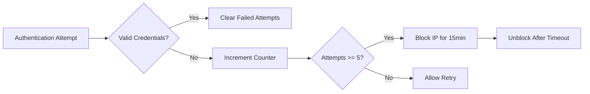
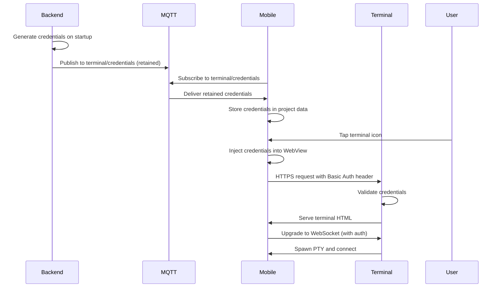
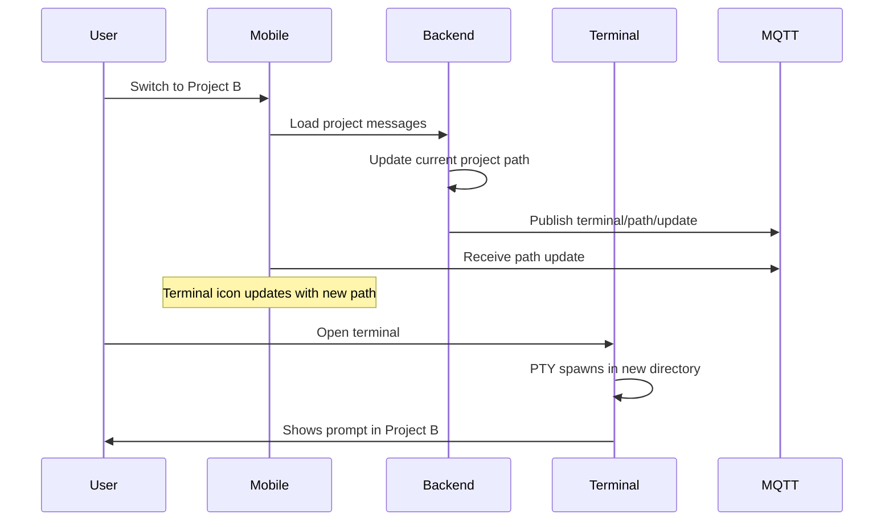
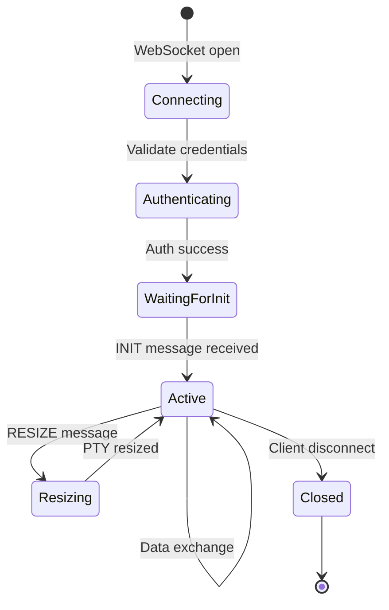

## Overview

Access your development machine's terminal directly from your mobile device. Claude Code Chat (CCC) provides a secure, web-based terminal that lets you run commands, check logs, install dependencies, and debug processes from anywhere.

<Info>
The terminal feature is only available when CCC backend is running with terminal server enabled (default port 3001). The terminal automatically starts in your current project directory and follows project switches.
</Info>

**Key Features:**
- Full PTY (pseudo-terminal) support with bash/PowerShell
- Auto-generated secure credentials (32-char username, 480-char password)
- Custom mobile toolbar with special keys and favorite commands
- Dynamic working directory that follows project switching
- 256 color support and scrollback buffer
- Rate limiting and session limits for security

---

## Security Features

### Auto-Generated Credentials

Terminal credentials are automatically generated when the backend starts, ensuring maximum security:

```typescript
// Credentials format
{
  username: "32-character random string",  // e.g., "a7f3c8d1e2b4a9c8f1d9b2e4c6d8"
  password: "480-character random string"  // High-entropy password
}
```

**Credential Generation:**
- Username: 32 characters from `crypto.randomBytes(24)`
- Password: 480 characters from `crypto.randomBytes(360)`
- URL-safe Base64 encoding (no `+`, `/`, or `=`)
- Combined size: 512 characters (within 2048 byte Basic Auth limit)
- New credentials on every backend restart

<Warning>
Terminal credentials are generated fresh each time CCC starts. If you restart the backend, you'll need to refresh the terminal in your mobile app to receive the new credentials.
</Warning>

### Rate Limiting

Failed authentication attempts are tracked and rate-limited:

| Security Measure | Limit | Duration |
|-----------------|-------|----------|
| **Max Failed Attempts** | 5 attempts | Per IP address |
| **IP Block Duration** | 15 minutes | After 5 failures |
| **Auto Unblock** | Automatic | After 15 minutes |

**Example Flow:**


### Session Limits

Concurrent terminal sessions are limited to prevent resource exhaustion:

```typescript
// Maximum concurrent terminals
MAX_CONCURRENT_SESSIONS = 5

// Session tracking
activeSessions: Map<sessionId, ptyProcess>
```

**Session Lifecycle:**
1. WebSocket connection established
2. PTY spawned with proper dimensions
3. Session added to active map
4. On disconnect: PTY killed, session removed
5. New sessions rejected if limit reached

### Localhost Binding

The terminal server binds exclusively to localhost for security:

```typescript
// Terminal server binds to localhost only
server.listen(terminalPort, 'localhost', () => {
  logger.info(`✓ Terminal server started on localhost:${terminalPort}`);
});
```

<Tip>
The terminal is never exposed directly to the internet. Access is only possible through the CCC path router, which requires authentication and forwards requests to the localhost-bound terminal server.
</Tip>

**Security Layers:**
1. **Localhost binding** - Not accessible from network
2. **Path router** - Proxies requests with authentication
3. **Basic Auth** - Username/password required
4. **Rate limiting** - Blocks brute force attempts
5. **Session limits** - Prevents resource exhaustion

---

## Accessing the Terminal

### Terminal Icon in Chat Header

The terminal icon appears in the chat header only when terminal access is configured:

**Prerequisites:**
1. CCC backend running with terminal server (default port 3001)
2. Terminal credentials generated and broadcast via MQTT
3. Project has active terminal configuration stored

**What the icon indicates:**
- Terminal server is running and reachable
- Credentials are available for authentication
- Terminal path is configured for current project

<Info>
If you don't see the terminal icon, ensure the CCC backend is running and check that terminal credentials have been broadcast. Try switching to another project and back, or restart the app.
</Info>

### Authentication Flow

Terminal authentication happens automatically behind the scenes:



**MQTT Topic (Retained Message):**
```typescript
// Topic
terminal/credentials

// Payload
{
  username: "a7f3c8d1e2b4a9c8f1d9b2e4c6d8a1f",
  password: "x8k2m9p3q7w1e5r6t0y2u4i8o9p1a3s5d7f9...", // 480 chars
  path: "/terminal",
  timestamp: 1699123456789
}
```

<Note>
MQTT retained messages ensure that credentials are delivered even if the mobile app connects after the backend has started. The latest credentials are always available.
</Note>

### Opening the Terminal

**Step-by-Step:**

1. **Tap Terminal Icon**
   - Icon appears in chat header (top-right)
   - Only visible when terminal is configured

2. **WebView Opens**
   - Full-screen terminal WebView
   - Shows "Connecting..." loading state
   - Project name displayed in header

3. **Auto-Authentication**
   - Credentials injected via JavaScript before page load
   - Basic Auth header added to HTTP request
   - WebSocket upgraded with auth query parameter

4. **Terminal Ready**
   - xterm.js terminal emulator loads
   - PTY spawns with correct shell (bash/PowerShell)
   - Welcome message: `✓ Connected to CCC Terminal`
   - Terminal starts in project directory

```typescript
// JavaScript injection (iOS/Android WebView)
const injectedJSBeforeLoad = `
  (function() {
    // Store auth token securely in memory (not in URL)
    window.__TERMINAL_AUTH__ = '${btoa(`${username}:${password}`)}';
  })();
  true; // Required for injectedJavaScript
`;
```

---

## xterm.js Terminal Emulator

The terminal uses xterm.js 5.5.0, a full-featured terminal emulator for the web.

### Terminal Configuration

```typescript
// xterm.js initialization
const term = new Terminal({
  cursorBlink: true,
  cursorStyle: 'block',
  fontSize: 13,
  lineHeight: 1.2,
  letterSpacing: 0,
  fontFamily: "'Courier New', Courier, monospace",
  theme: {
    background: '#1A1A19',      // CCC dark background
    foreground: '#F0F0F0',      // Light text
    cursor: '#DA7756',          // CCC brand color
    selectionBackground: 'rgba(218, 119, 86, 0.3)',
    // 16 color palette + bright variants
  },
  scrollback: 1000,             // Lines in history
  convertEol: false,            // Preserve line endings
  allowProposedApi: true,       // Enable experimental features
  cols: 80,
  rows: 24,
});
```

### Shell Selection

The backend automatically selects the appropriate shell based on your OS:

| Platform | Shell | Color Support | PTY Module |
|----------|-------|---------------|------------|
| **Linux** | bash | xterm-256color | node-pty |
| **macOS** | bash | xterm-256color | node-pty |
| **Windows** | powershell.exe | xterm-256color | node-pty |

**PTY Spawn:**
```typescript
// Backend spawns PTY with proper environment
const ptyProcess = pty.spawn(shell, [], {
  name: 'xterm-256color',      // Terminal type
  cwd: projectPath,            // Start in project directory
  env: process.env,            // Inherit environment variables
  cols: cols,                  // Terminal width
  rows: rows,                  // Terminal height
});
```

### Terminal Features

**Supported Features:**
- Full PTY emulation (not just command execution)
- 256 color ANSI support
- Unicode/UTF-8 text rendering
- Mouse reporting (limited on mobile)
- Scrollback buffer (1000 lines)
- Copy/paste (via custom toolbar)
- Cursor styles and blinking
- Terminal resize on orientation change

**Mobile Optimizations:**
- Touch scrolling with momentum
- Custom scrollbar styling
- Fit-to-screen on orientation change
- Keyboard height adjustment
- Tap to focus terminal

```css
/* Mobile-optimized scrolling */
.xterm-viewport {
  overflow-y: scroll !important;
  -webkit-overflow-scrolling: touch;
  scrollbar-width: thin;
  scrollbar-color: rgba(218, 119, 86, 0.5) transparent;
}
```

---

## Custom Mobile Toolbar

The terminal includes a custom toolbar designed for mobile usage, providing easy access to special keys, common commands, and your favorite shortcuts.

### Toolbar Tabs

The toolbar has three tabs to organize functionality:

| Tab | Purpose | Contents |
|-----|---------|----------|
| **Keys** | Special characters | Esc, Tab, Ctrl, Shift, Arrow keys, Function keys |
| **Commands** | Common commands | Pre-defined terminal commands |
| **Favorites** | Custom shortcuts | User-saved commands per project |

### Special Keys Tab

**Modifier Keys:**
- **CTRL** - Toggle button (orange when active)
- **SHIFT** - Toggle button (orange when active)
- Tap modifier, then tap letter key for combination
- Modifiers auto-deactivate after use

**Common Combinations:**
```typescript
// Example: CTRL+C (interrupt)
1. Tap CTRL button (turns orange)
2. Tap C button
3. Sends: String.fromCharCode(3) // ASCII 3 = CTRL+C

// Example: CTRL+SHIFT+V (paste from clipboard)
1. Tap CTRL button
2. Tap SHIFT button
3. Tap V button
4. Reads clipboard and pastes text
```

**Available Special Keys:**

| Key | Label | Value | Purpose |
|-----|-------|-------|---------|
| **Escape** | Esc | `\x1b` | Cancel operation, exit mode |
| **Tab** | Tab | `\t` | Auto-complete, indent |
| **Enter** | Enter | `\r` | Execute command |
| **Backspace** | ⌫ | `\x7f` | Delete character |
| **Arrow Up** | ↑ | `\x1b[A` | History/navigate up |
| **Arrow Down** | ↓ | `\x1b[B` | History/navigate down |
| **Arrow Left** | ← | `\x1b[D` | Move cursor left |
| **Arrow Right** | → | `\x1b[C` | Move cursor right |

**Function Keys (F1-F12):**
```typescript
// Tap "F" button to show/hide function keys
F1  → \x1bOP    F7  → \x1b[18~
F2  → \x1bOQ    F8  → \x1b[19~
F3  → \x1bOR    F9  → \x1b[20~
F4  → \x1bOS    F10 → \x1b[21~
F5  → \x1b[15~  F11 → \x1b[23~
F6  → \x1b[17~  F12 → \x1b[24~
```

### Commands Tab

Pre-defined common commands that can be inserted with a single tap:

```typescript
// Common commands available in toolbar
export const COMMON_COMMANDS = [
  { label: 'ls', command: 'ls\r' },                    // List files
  { label: 'pwd', command: 'pwd\r' },                  // Print working directory
  { label: 'clear', command: 'clear\r' },              // Clear screen
  { label: 'git status', command: 'git status\r' },    // Git status
  { label: 'git log', command: 'git log --oneline\r' },// Git log
  { label: 'npm install', command: 'npm install\r' },  // Install dependencies
  { label: 'npm start', command: 'npm start\r' },      // Start dev server
  { label: 'npm test', command: 'npm test\r' },        // Run tests
];
```

<Tip>
Commands ending with `\r` (carriage return) are auto-executed when tapped. Commands without `\r` are typed but not executed, allowing you to edit before running.
</Tip>

### Favorites Tab

Create custom command shortcuts tailored to your project:

**Features:**
- Per-project favorite commands
- Custom labels for easy identification
- Optional auto-execute (press Enter automatically)
- Long-press to remove favorite
- Stored in async storage on device

**Adding a Favorite:**

1. Tap the **+ button** in Favorites tab
2. Enter a **label** (e.g., "Start Server")
3. Enter the **command** (e.g., "npm run dev")
4. Toggle **Auto-execute** if you want Enter pressed automatically
5. Tap **Add Favorite**

```typescript
// Favorite command data structure
interface FavoriteCommand {
  id: string;              // UUID
  projectId: string;       // Associated project
  label: string;           // Display name
  command: string;         // Terminal command
  autoExecute: boolean;    // Auto-press Enter
  createdAt: number;       // Timestamp
}

// Storage key pattern
terminal_favorites_{projectId}
```

**Example Favorites:**

| Label | Command | Auto-Execute |
|-------|---------|--------------|
| Git Status | `git status` | Yes |
| Build Prod | `npm run build` | Yes |
| Run Tests | `npm test -- --watch` | Yes |
| Docker Up | `docker-compose up -d` | Yes |
| Logs | `tail -f logs/app.log` | No (so you can edit filename) |
| SSH Dev | `ssh user@dev-server` | No (may need password) |

**Removing Favorites:**
- Long-press any favorite button
- Confirmation dialog appears
- Tap "Remove" to delete
- Removed from storage immediately

---

## Dynamic Working Directory

The terminal automatically updates its working directory when you switch projects in CCC.

### How It Works



### MQTT Path Updates

**Topic:**
```typescript
terminal/path/update
```

**Payload:**
```typescript
{
  path: "/Users/alice/projects/website",
  timestamp: 1699123456789
}
```

**Behavior:**
- Backend publishes path update when project changes
- Mobile app receives update and stores new path
- Existing terminal sessions remain in old directory
- New terminal sessions start in new directory
- Terminal icon reflects current project in header

<Info>
Changing projects does not affect already-open terminal sessions. The path change only applies to new terminals you open. This allows you to keep terminals running in different project directories simultaneously.
</Info>

### Terminal Path Storage

Terminal path is stored alongside credentials in project data:

```typescript
// Mobile app storage
interface Project {
  id: string;
  name: string;
  path: string;
  // Terminal configuration
  terminal_path: string;     // e.g., "/terminal"
  terminal_username: string; // Auto-generated credential
  terminal_password: string; // Auto-generated credential
  // ...other fields
}
```

**Initialization:**
1. User opens chat for a project
2. Mobile app subscribes to `terminal/credentials`
3. Backend publishes credentials (retained message)
4. Mobile app stores credentials with project
5. Terminal icon appears in chat header

<Warning>
Terminal credentials must be received before the terminal icon appears. If you don't see the icon, try switching to another project and back, or ensure the CCC backend is running.
</Warning>

---

## Configuration

### Default Ports

CCC uses three internal ports for different services:

| Service | Default Port | Purpose | CLI Flag |
|---------|--------------|---------|----------|
| **MQTT Broker** | 8884 | Message broker | `--mqtt-port` |
| **Path Router** | 8883 | HTTP/WebSocket proxy | `--router-port` |
| **Terminal Server** | 3001 | Terminal access | `--terminal-port` |

### Custom Terminal Port

Change the terminal port using the `--terminal-port` flag:

```bash
# Use custom terminal port
ccc --terminal-port 9001

# With other options
ccc --debug --terminal-port 9001 --router-port 8080
```

**Port Requirements:**
- Must be available (not in use)
- Must be above 1024 (non-privileged)
- Binds to localhost only (not exposed externally)

### Path Router Integration

The path router forwards terminal requests to the terminal server:

```typescript
// Path router configuration
const routes = [
  {
    path: '/terminal',
    target: `http://localhost:${terminalPort}`,
    description: 'Terminal WebSocket and HTTP',
  },
  // ...other routes
];
```

**Request Flow:**
```
Mobile App → https://router:8883/terminal
              ↓
         [Path Router]
              ↓ (localhost proxy)
         Terminal Server → http://localhost:3001
              ↓
         [PTY Process]
```

<Tip>
The path router handles SSL termination, authentication forwarding, and WebSocket upgrades. This design keeps the terminal server simple and focused on PTY management.
</Tip>

### Environment Variables

Configure terminal settings via environment variables:

```bash
# .env file
TERMINAL_PORT=3001
ROUTER_PORT=8883

# Or set in shell
export TERMINAL_PORT=9001
ccc
```

---

## Use Cases

### Running Build Commands

Compile your code, bundle assets, or generate production builds:

```bash
# Frontend builds
npm run build
yarn build
pnpm build

# Backend builds
go build
cargo build --release
mvn package

# Docker builds
docker build -t myapp:latest .
docker-compose build
```

<Tip>
Add build commands to your Favorites for one-tap access. Enable auto-execute so the build starts immediately.
</Tip>

### Checking Git Status

Monitor repository state, review changes, and manage branches:

```bash
# Status and diff
git status
git diff
git log --oneline -10

# Branch management
git branch
git checkout -b feature/new-feature
git merge main

# Remote operations
git fetch
git pull origin main
git push origin feature/new-feature
```

**Favorite Commands:**
- `git status` - Check current state
- `git log --oneline --graph --all` - Visual commit history
- `git diff --cached` - Review staged changes

### Viewing Logs

Monitor application logs, system logs, or build output:

```bash
# Tail logs
tail -f logs/app.log
tail -f /var/log/nginx/error.log

# Follow systemd logs
journalctl -u myapp -f

# Docker logs
docker logs -f container_name
docker-compose logs -f service_name

# Node.js logs with PM2
pm2 logs
pm2 logs app_name --lines 100
```

<Note>
Use `Ctrl+C` (via toolbar) to stop tailing logs. The terminal will return to the prompt without exiting your session.
</Note>

### Restarting Services

Restart development servers, databases, or system services:

```bash
# Development servers
npm start
npm run dev
yarn dev

# PM2 process manager
pm2 restart app_name
pm2 reload all

# Systemd services
sudo systemctl restart nginx
sudo systemctl status postgresql

# Docker containers
docker restart container_name
docker-compose restart
docker-compose up -d --force-recreate
```

### Installing Dependencies

Add new packages, update existing ones, or install from lock files:

```bash
# Node.js
npm install
npm install package-name
npm install --save-dev jest
npm update

# Python
pip install -r requirements.txt
pip install package-name
pip list --outdated

# Ruby
bundle install
bundle update gem-name

# Go
go get github.com/user/package
go mod download
go mod tidy
```

### Debugging Processes

Inspect running processes, check ports, monitor resources:

```bash
# Process inspection
ps aux | grep node
top
htop

# Port usage
lsof -i :3000
netstat -tulpn | grep 8080

# Disk usage
df -h
du -sh *

# System resources
free -h
vmstat 1

# Network debugging
curl -I http://localhost:3000
ping google.com
traceroute example.com
```

<Warning>
Be cautious when running commands with `sudo` in the terminal. The terminal has the same permissions as the CCC backend process, which typically runs as your user account.
</Warning>

---

## Technical Details

### node-pty for PTY Emulation

CCC uses `node-pty` to create real pseudo-terminals:

**Why PTY instead of `child_process.spawn()`?**
- Full terminal emulation (not just stdout/stderr)
- Supports interactive programs (vim, top, ssh)
- Proper signal handling (CTRL+C, CTRL+Z)
- Terminal size management (rows/cols)
- Job control and background processes

```typescript
// PTY spawn with node-pty
import * as pty from 'node-pty';

const ptyProcess = pty.spawn(shell, [], {
  name: 'xterm-256color',  // TERM environment variable
  cwd: projectPath,        // Working directory
  env: process.env,        // Environment variables
  cols: 80,                // Terminal width
  rows: 24,                // Terminal height
});

// PTY data → WebSocket
ptyProcess.on('data', (data: string) => {
  websocket.send(data);
});

// WebSocket → PTY
websocket.on('message', (data: string) => {
  ptyProcess.write(data);
});
```

### WebSocket Communication

Real-time bidirectional communication between terminal and backend:

**Protocol:**
```
Client → Server: wss://router:8883/terminal?auth=<base64-credentials>
```

**Message Types:**

1. **User Input** (Client → Server)
   ```typescript
   // Regular keypress
   "a"

   // Special key
   "\x1b[A"  // Arrow up

   // Control character
   "\x03"    // CTRL+C
   ```

2. **PTY Output** (Server → Client)
   ```typescript
   // Text output
   "Hello, World!\r\n"

   // ANSI escape codes
   "\x1b[32mSuccess\x1b[0m"  // Green "Success"

   // Cursor movement
   "\x1b[2J\x1b[H"  // Clear screen, home cursor
   ```

3. **Resize/Init Events** (Client → Server)
   ```typescript
   // Initial dimensions (spawns PTY)
   "INIT:{"cols":80,"rows":24}"

   // Resize terminal
   "RESIZE:{"cols":100,"rows":30}"
   ```

**Connection Lifecycle:**


### xterm.js 5.5.0 Frontend

The terminal UI is powered by xterm.js with the FitAddon:

**Dependencies:**
```json
{
  "@xterm/xterm": "^5.5.0",
  "@xterm/addon-fit": "^0.10.0"
}
```

**Initialization:**
```typescript
// Create terminal instance
const term = new Terminal(config);

// Load fit addon
const fitAddon = new FitAddon();
term.loadAddon(fitAddon);

// Mount to DOM
term.open(document.getElementById('terminal'));

// Fit to container
fitAddon.fit();

// Handle resize
window.addEventListener('resize', () => {
  fitAddon.fit();
  // Send new dimensions to backend
  sendResize({ cols: term.cols, rows: term.rows });
});
```

**Mobile Adaptations:**
```typescript
// Touch scrolling
.xterm-viewport {
  -webkit-overflow-scrolling: touch;
}

// Orientation change
window.addEventListener('orientationchange', () => {
  setTimeout(() => fitAddon.fit(), 200);
});

// Visibility change (app resume)
document.addEventListener('visibilitychange', () => {
  if (!document.hidden) {
    setTimeout(() => fitAddon.fit(), 200);
  }
});
```

### Session Persistence

Terminal sessions persist until the browser/WebView closes:

**Session Management:**
```typescript
// Active sessions tracked by backend
activeSessions: Map<sessionId, ptyProcess> = new Map();

// Session lifecycle
onCreate:    activeSessions.set(sessionId, ptyProcess)
onData:      ptyProcess.write(data)
onDisconnect: ptyProcess.kill(); activeSessions.delete(sessionId)
```

**Session Data:**
- Terminal scrollback buffer (1000 lines)
- Current working directory
- Environment variables
- Shell history (in shell's memory)

<Note>
Terminal sessions are ephemeral and not persisted to disk. When you close the terminal or the app, the session is lost. For persistent history, rely on your shell's history files (`.bash_history`, `.zsh_history`).
</Note>

---

## Troubleshooting

### Can't Connect to Terminal

**Symptoms:**
- Terminal icon missing from chat header
- "Connecting..." message never resolves
- WebView shows blank screen or error

**Diagnosis:**

1. **Check if backend is running:**
   ```bash
   # Look for "Terminal server started" message
   ccc --debug
   # Should see: ✓ Terminal server started on localhost:3001
   ```

2. **Verify credentials broadcast:**
   ```bash
   # Check MQTT logs for terminal credentials
   # Should see published to: terminal/credentials
   ```

3. **Check mobile app logs:**
   ```javascript
   // Look for:
   // "Terminal credentials received"
   // "Terminal path: /terminal"
   ```

**Solutions:**

<AccordionGroup>
  <Accordion title="Backend not running">
    Start the CCC backend:
    ```bash
    ccc --debug
    ```

    Wait for the terminal server to start, then reopen the chat in your mobile app.
  </Accordion>

  <Accordion title="Credentials not received">
    1. Close and reopen the mobile app
    2. Ensure the app can connect to MQTT broker
    3. Check that firewall isn't blocking port 8883
    4. Try switching to another project and back
  </Accordion>

  <Accordion title="Port conflict">
    If port 3001 is in use, specify a different port:
    ```bash
    ccc --terminal-port 9001
    ```

    The backend will broadcast the new port to the mobile app automatically.
  </Accordion>

  <Accordion title="Path router not forwarding">
    Check path router logs for errors:
    ```bash
    ccc --debug
    # Look for "/terminal → http://localhost:3001"
    ```

    Ensure router-port and terminal-port don't conflict.
  </Accordion>
</AccordionGroup>

### Authentication Failed

**Symptoms:**
- "401 Unauthorized" error
- Terminal prompts for login credentials
- Connection rejected immediately

**Diagnosis:**

1. **Check if credentials are stale:**
   - Did you restart the backend recently?
   - New credentials are generated on every restart

2. **Verify credential storage:**
   ```typescript
   // Mobile app should have these stored:
   project.terminal_username
   project.terminal_password
   ```

3. **Check for rate limiting:**
   - Look for "IP blocked" in backend logs
   - Wait 15 minutes for automatic unblock

**Solutions:**

<AccordionGroup>
  <Accordion title="Stale credentials after backend restart">
    1. Close the terminal WebView
    2. Go back to chat screen
    3. Wait 5 seconds for new credentials
    4. Terminal icon should update
    5. Try opening terminal again
  </Accordion>

  <Accordion title="IP rate limited">
    If you've exceeded 5 failed authentication attempts:

    1. Wait 15 minutes for automatic unblock
    2. Or restart the CCC backend (resets rate limits)
    3. Credentials will regenerate, clearing the block
  </Accordion>

  <Accordion title="Credentials not injected in WebView">
    iOS/Android WebView security issue:

    1. Force close the app completely
    2. Reopen and navigate to chat
    3. Ensure terminal credentials are received
    4. Try opening terminal again

    If still failing, check mobile app logs for injection errors.
  </Accordion>
</AccordionGroup>

### Terminal Not Appearing in Chat

**Symptoms:**
- No terminal icon in chat header
- Icon was there before but disappeared
- Icon appears for some projects but not others

**Diagnosis:**

1. **Check terminal configuration for project:**
   ```typescript
   // Should be set when credentials received:
   project.terminal_path
   project.terminal_username
   project.terminal_password
   ```

2. **Verify MQTT connection:**
   - Check if other features work (messaging, sessions)
   - Terminal credentials broadcast via MQTT

**Solutions:**

<AccordionGroup>
  <Accordion title="Terminal not configured for project">
    Open the chat for the project first:

    1. Navigate to chat screen for the project
    2. Wait for MQTT credentials message
    3. Terminal icon should appear within 5 seconds
    4. If not, try switching to another project and back
  </Accordion>

  <Accordion title="MQTT connection lost">
    Reconnect to MQTT broker:

    1. Check that backend is running
    2. Verify network connectivity
    3. Try closing and reopening the app
    4. Check mobile app logs for MQTT connection status
  </Accordion>

  <Accordion title="Terminal server disabled">
    Ensure terminal server is enabled:

    ```bash
    # Terminal starts automatically with CCC
    ccc --debug

    # Should see in logs:
    # ✓ Terminal server started on localhost:3001
    ```

    If you see an error about port in use, change the port:
    ```bash
    ccc --terminal-port 9001
    ```
  </Accordion>
</AccordionGroup>

### Keyboard Not Working

**Symptoms:**
- On-screen keyboard doesn't send input
- Toolbar keys work but keyboard doesn't
- Text appears but isn't sent to terminal

**Diagnosis:**

1. **Check terminal focus:**
   - Terminal must be focused to receive input
   - Tap inside the terminal area

2. **Verify WebSocket connection:**
   - Open browser dev tools (if possible)
   - Check for "WebSocket connection closed" errors

**Solutions:**

<AccordionGroup>
  <Accordion title="Terminal not focused">
    Tap inside the terminal area to focus:

    1. Tap anywhere in the black terminal area
    2. On-screen keyboard should appear
    3. Try typing again

    If keyboard still doesn't appear, use the toolbar for input.
  </Accordion>

  <Accordion title="WebView keyboard handling issue">
    iOS/Android-specific issue:

    1. Use the custom toolbar for special keys
    2. For text input, use toolbar "Commands" tab
    3. Add frequently used commands to Favorites
    4. Some Android versions have WebView keyboard issues
  </Accordion>

  <Accordion title="Keyboard hidden by toolbar">
    Adjust layout:

    - Rotate device to landscape
    - Terminal resizes automatically
    - Toolbar moves to accommodate keyboard
    - More screen space for terminal output
  </Accordion>
</AccordionGroup>

### Terminal Disconnects

**Symptoms:**
- "Connection closed" message in terminal
- Terminal stops responding mid-session
- WebSocket closes unexpectedly

**Diagnosis:**

1. **Check for session limit:**
   ```typescript
   // Max 5 concurrent terminals
   MAX_CONCURRENT_SESSIONS = 5
   ```

   Close unused terminals to free slots.

2. **Check for PTY crash:**
   ```bash
   # Backend logs will show:
   # "PTY exited", code: <exit_code>
   ```

3. **Check network connection:**
   - Mobile device network stability
   - Backend server reachability

**Solutions:**

<AccordionGroup>
  <Accordion title="Too many sessions">
    Close unused terminal sessions:

    1. Go back through open terminal WebViews
    2. Close terminals you're not using
    3. Try opening a new terminal
    4. Should connect successfully
  </Accordion>

  <Accordion title="PTY process exited">
    The shell process terminated:

    - Did you type `exit` or `logout`?
    - Did a command crash the shell?
    - Check backend logs for exit code

    Solution: Close terminal and open a new one.
  </Accordion>

  <Accordion title="Network interruption">
    Mobile network dropped:

    1. Check WiFi/cellular connection
    2. Ensure backend is still running
    3. Close terminal and reconnect
    4. Terminal will spawn fresh session
  </Accordion>

  <Accordion title="Backend restarted">
    If you restarted CCC backend:

    1. All terminals disconnect (PTYs are killed)
    2. New credentials generated
    3. Close terminal WebView
    4. Terminal icon will update with new credentials
    5. Open terminal again (fresh session)
  </Accordion>
</AccordionGroup>

---

## Tips for Mobile Terminal Usage

### Optimize for Touch Input

**Use Toolbar Extensively:**
- Add frequently used commands to Favorites
- Enable auto-execute for non-interactive commands
- Use special key buttons instead of typing ANSI codes

**Landscape Mode:**
- Rotate device for wider terminal
- More characters per line
- Better for viewing logs and tables

**Copy/Paste:**
- Use `CTRL+SHIFT+V` from toolbar to paste clipboard
- Long-press terminal output to copy text (browser feature)
- Add paste-heavy commands to Favorites with templating

### Favorite Command Examples

**Git Workflow:**
```
Label: Commit All
Command: git add . && git commit -m ""
Auto-execute: No
(So you can edit commit message)

Label: Push
Command: git push origin main\r
Auto-execute: Yes

Label: Pull
Command: git pull --rebase\r
Auto-execute: Yes
```

**Development Server:**
```
Label: Start Dev
Command: npm run dev\r
Auto-execute: Yes

Label: Stop Server
Command: \x03
(Sends CTRL+C to stop server)
Auto-execute: Yes

Label: Restart
Command: \x03 && npm run dev\r
Auto-execute: Yes
```

**Docker:**
```
Label: Docker Up
Command: docker-compose up -d\r
Auto-execute: Yes

Label: Docker Logs
Command: docker-compose logs -f
Auto-execute: No
(So you can add service name)

Label: Docker Down
Command: docker-compose down\r
Auto-execute: Yes
```

### Dealing with Long Output

**Use Pagination:**
```bash
# Instead of: cat large-file.log
# Use: less large-file.log
# Or: tail -n 100 large-file.log

# Instead of: git log
# Use: git log --oneline -20

# Instead of: docker logs container
# Use: docker logs --tail 50 container
```

**Redirect to Files:**
```bash
# Save output for later review
npm run build > build.log 2>&1

# Then view selectively
tail -n 50 build.log
grep -i error build.log
```

**Use Clear Liberally:**
```bash
# Clear screen before commands
clear && npm test

# Add "clear" to Favorites for quick access
```

### Security Best Practices

<Warning>
The terminal runs with the same permissions as the CCC backend process. Be careful with commands that modify system files or install software.
</Warning>

**Do:**
- Use terminal for project-specific tasks
- Keep sessions short and focused
- Close terminals when done to free resources
- Use strong WiFi/cellular encryption

**Don't:**
- Don't share terminal screenshots with visible credentials
- Don't run `sudo` commands unless necessary
- Don't expose the CCC backend publicly without ngrok
- Don't store sensitive data in terminal scrollback

---

## Next Steps

<CardGroup cols={2}>
  <Card
    title="Session Management"
    icon="clock-rotate-left"
    href="/features/session-management"
  >
    Learn how sessions persist and sync across devices
  </Card>
  <Card
    title="Permission System"
    icon="shield-check"
    href="/features/permission-system"
  >
    Understand how CCC handles command execution permissions
  </Card>
  <Card
    title="Installation"
    icon="download"
    href="/installation"
  >
    Set up CCC backend with terminal access
  </Card>
  <Card
    title="Core Concepts"
    icon="book"
    href="/core-concepts"
  >
    Understand CCC architecture and design
  </Card>
</CardGroup>

---

## Image Placeholders

The following images should be added to enhance this documentation:

1. **Terminal WebView in Mobile App**
   - Screenshot of terminal open in mobile app
   - Show full-screen terminal with xterm.js
   - Display welcome message and active shell prompt

2. **Custom Toolbar with Special Keys**
   - Close-up of toolbar with three tabs visible
   - Show Keys tab with CTRL, SHIFT, special keys
   - Demonstrate modifier keys in active state (orange)

3. **Terminal Showing Command Execution**
   - Terminal running `npm install` with output
   - Show colored output and ANSI formatting
   - Display scrollback with previous commands

4. **Terminal Icon in Chat Header**
   - Chat screen with terminal icon highlighted
   - Show icon placement in top-right corner
   - Indicate when icon appears vs. when it doesn't

<Info>
To capture these screenshots, use the CCC mobile app on a device and take screenshots during actual terminal usage. Ensure no sensitive information is visible in the terminal output.
</Info>
