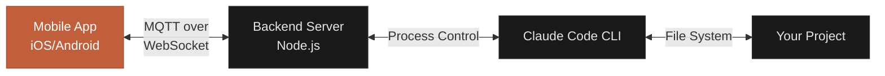

## What is CCC?

CCC (Claude Code Chat) is a mobile bridge that enables you to control [Claude Code](https://claude.com/claude-code) from your Android or iOS device. Chat with Claude, manage coding sessions, approve tool permissions, and access your development terminal—all from your phone or tablet.


<Info>
**Prerequisites:** You need an active Claude Pro or Max subscription and Claude Code installed on your development machine.
</Info>

## How It Works

CCC consists of two components that work together:



### Backend Server

A lightweight Node.js CLI tool (`@naarang/ccc`) that runs on your development machine and:
- Creates an MQTT bridge between your mobile device and Claude Code
- Manages Claude Code process lifecycle and session persistence
- Intercepts tool permission requests for mobile approval
- Provides secure web-based terminal access
- Supports optional remote access via ngrok

### Mobile App

A native iOS/Android app built with React Native that provides:
- Real-time chat interface with streaming responses
- Session management (create, resume, switch conversations)
- Permission control system with 4 modes
- Multi-project support
- Terminal emulator
- Image attachment support
- Context usage monitoring

## Key Features

<CardGroup cols={2}>
  <Card title="Permission System" icon="shield-check" href="/features/permission-system">
    Control what tools Claude can use with 4 permission modes
  </Card>
  <Card title="Session Management" icon="clock-rotate-left" href="/features/session-management">
    Resume conversations across devices and persist chat history
  </Card>
  <Card title="Terminal Access" icon="terminal" href="/features/terminal-access">
    Full bash/powershell terminal access from your mobile device
  </Card>
  <Card title="Image Attachments" icon="image" href="/features/image-attachments">
    Send screenshots and images to Claude (up to 30MB total)
  </Card>
  <Card title="Multi-Project" icon="folder-tree" href="/features/multi-project">
    Manage multiple projects with separate sessions
  </Card>
  <Card title="Remote Access" icon="globe" href="/advanced/remote-access">
    Connect from anywhere using ngrok tunneling
  </Card>
</CardGroup>

## Use Cases

### On-the-Go Coding

Ask Claude to implement features, fix bugs, or review code while you're away from your desk.

```bash
# You: "Add user authentication to the API endpoints"
# Claude: *analyzes code, implements JWT auth, updates tests*
```

### Code Review from Mobile

Review Claude's proposed changes on your phone before they're applied to your project.

```bash
# Claude requests permission to modify 5 files
# You review the changes on your phone → approve or deny
```

### Remote Terminal Access

Execute commands, check logs, or restart services from your terminal—no SSH or VPN required.

```bash
$ npm run build
$ git status
$ docker-compose logs
```

### Collaborative Debugging

Share your session with Claude while discussing issues with your team on Slack/Discord.

<Tip>
Use **Plan Mode** when you want Claude to analyze code and propose solutions without making any changes until you approve.
</Tip>

## Why CCC?

<AccordionGroup>
  <Accordion title="Work from anywhere" icon="location-dot">
    Don't be tied to your desk. Continue coding sessions from your phone while commuting, traveling, or during breaks.
  </Accordion>

  <Accordion title="Persistent sessions" icon="floppy-disk">
    Sessions sync across devices. Start a conversation on desktop, continue on mobile, resume later—nothing is lost.
  </Accordion>

  <Accordion title="Secure by default" icon="lock">
    Granular permission control, optional authentication, auto-generated terminal credentials, and localhost-only binding.
  </Accordion>

</AccordionGroup>

## What's Next?

<CardGroup cols={2}>
  <Card title="Installation" icon="download" href="/installation">
    Install the backend and mobile app (5 minutes)
  </Card>
  <Card title="Quickstart" icon="rocket" href="/quickstart">
    Get your first chat running in under 10 minutes
  </Card>
  <Card title="Core Concepts" icon="book" href="/core-concepts">
    Understand sessions, projects, and permissions
  </Card>
  <Card title="Mobile App Guide" icon="mobile" href="/mobile/overview">
    Learn the mobile app interface and features
  </Card>
</CardGroup>

<Warning>
CCC is designed for personal development use. It executes commands and file operations on your machine based on Claude's responses. Always review permissions carefully, especially in production environments.
</Warning>

## Community & Support

<CardGroup cols={3}>
  <Card title="Discord" icon="discord" href="https://discord.gg/9EjE8t4YCF">
    Join our community and get help
  </Card>
  <Card title="App Store" icon="apple" href="https://apps.apple.com/app/id6753870766">
    Download for iOS
  </Card>
  <Card title="Google Play" icon="google-play" href="https://play.google.com/store/apps/details?id=com.naarang.ccc">
    Download for Android
  </Card>
</CardGroup>
