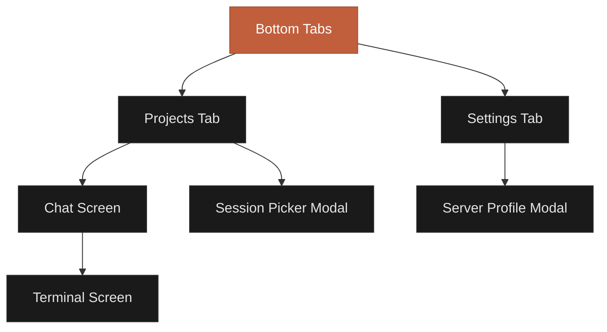

## Navigation Structure

The CCC mobile app uses a combination of tab navigation, stack navigation, and modal screens to provide an intuitive experience.



## Bottom Tab Bar

The primary navigation uses a bottom tab bar with two tabs:


<Tabs>
  <Tab title="Projects">
    **Icon:** Hop (home) icon
    **Label:** Projects
    **Color:** Orange when active, gray when inactive

    This is your home screen where you:
    - View all projects
    - See active sessions
    - Create new projects
    - Resume conversations
  </Tab>
  <Tab title="Settings">
    **Icon:** Gear icon
    **Label:** Settings
    **Color:** Orange when active, gray when inactive

    Configuration hub where you:
    - Manage server profiles
    - Change appearance
    - View app info
    - Clear cache
  </Tab>
</Tabs>

<Tip>
**Quick Switch:** Tap any tab icon twice to scroll to the top of that screen.
</Tip>

## Projects Tab

The home screen displays your project list with rich information.

### Project Cards

Each project card shows:

- **Project icon** - Folder icon with accent color background
- **Project name** - Bold, large text
- **Description** - Optional subtitle (if provided)
- **Directory path** - Full path to project on server
- **Last updated** - Date project was last modified
- **Action buttons** - New chat and Resume session


### Project Actions

<Steps>
  <Step title="Tap card body">
    Opens chat with the last active session (or new session if none)
  </Step>
  <Step title="Tap 'New' button">
    Starts a fresh conversation (clears session)
  </Step>
  <Step title="Tap 'Resume' button">
    Continues the last active session
  </Step>
  <Step title="Tap info icon">
    Opens session picker to choose from all available sessions
  </Step>
  <Step title="Tap menu (three dots)">
    Opens dropdown with Refresh, Edit, and Delete options
  </Step>
</Steps>

### Pull to Refresh

Pull down on the project list to:
- Refresh session data from server
- Update last activity times
- Fetch new sessions


### Creating Projects

Tap the **+** button in the header to create a new project:

<Steps>
  <Step title="Enter project name">
    Required field. Use a descriptive name like "My Web App"
  </Step>
  <Step title="Enter description (optional)">
    Brief description of the project
  </Step>
  <Step title="Enter directory path">
    Absolute path to project on your server (e.g., `/home/user/projects/myapp`)
  </Step>
  <Step title="Tap Create">
    Project is created and appears in your list
  </Step>
</Steps>

<Note>
The app detects your server's OS (Windows, macOS, Linux, WSL) and suggests the correct path format with an example.
</Note>

### Project Menu

Long-press or tap the three-dot menu on a project card for these options:

<AccordionGroup>
  <Accordion title="Refresh Sessions" icon="refresh">
    Fetches the latest session metadata from the server for this project only.
  </Accordion>

  <Accordion title="Edit Project" icon="pencil">
    Opens the project form pre-filled with current values. Modify name, description, or directory path.
  </Accordion>

  <Accordion title="Delete Project" icon="trash">
    **Destructive action.** Deletes the project and all associated local messages. Session files on the server are not deleted.

    Requires confirmation before deletion.
  </Accordion>
</AccordionGroup>

### Empty State

If you have no projects, you'll see:

- Large folder icon
- "No Projects Yet" heading
- Description text
- **Create Project** button


## Chat Screen

The main interaction screen where you converse with Claude.

### Header

The chat header contains:

- **Back button** - Arrow icon to return to Projects
- **Project name** - Current project (bold)
- **Project description** - Subtitle (if available)
- **Session picker** - Message square icon to view/switch sessions
- **Connection indicator** - Colored dot showing MQTT status


### Toolbar

Below the message list, a toolbar provides:

<CardGroup cols={4}>
  <Card title="Clear" icon="trash">
    Delete all messages and start new session
  </Card>
  <Card title="Permission Mode" icon="shield">
    Dropdown to select permission mode
  </Card>
  <Card title="Terminal" icon="terminal">
    Opens terminal screen (if enabled)
  </Card>
  <Card title="Context Usage" icon="chart-pie">
    Pie chart showing token usage (tap for details)
  </Card>
</CardGroup>

### Input Area

At the bottom:

- **Image button** - Plus icon to attach photos
- **Text input** - Multi-line input (up to 4000 chars)
- **Send button** - Orange send icon (or red stop square when processing)

### Image Picker Popup

Tap the image button to show a popup with two options:

<Tabs>
  <Tab title="Choose from library">
    Opens your photo library to select existing images. Supports multi-select.
  </Tab>
  <Tab title="Take photo">
    Opens camera to capture a new photo. Single photo per capture.
  </Tab>
</Tabs>

Selected images appear as thumbnails above the input with **X** buttons to remove them.


### Message List

Messages are displayed in a scrollable list:

- **User messages** - Right-aligned, gray background
- **Assistant messages** - Left-aligned, white background
- **Tool use cards** - Expandable cards with tool name, input, and output
- **Thinking blocks** - Claude's reasoning (collapsible)

Scroll behavior:
- **Auto-scrolls** to bottom when new messages arrive (if you're near bottom)
- **Manual scroll up** disables auto-scroll
- **Scroll to bottom** or wait 5 seconds to re-enable auto-scroll

### Load More Messages

If the chat has more than 50 messages, a **Load 50 More Messages** button appears at the top. Tap it to load older messages incrementally.

### Permission Modal

When Claude requests permission, a full-screen modal appears:


<Steps>
  <Step title="Review tool details">
    Tool name, description, and parameters are shown
  </Step>
  <Step title="Choose action">
    - **Approve** - Allow this once
    - **Approve and don't ask again** - Allow this tool always (or switch to Accept Edits for file tools)
    - **Deny** - Reject with optional reason
  </Step>
  <Step title="Wait for Claude">
    After approval, Claude continues execution
  </Step>
</Steps>

<Warning>
"Don't ask again" behavior differs by tool:
- **File tools** (Edit, Write, etc): Switches to Accept Edits mode
- **Other tools** (Read, Bash, etc): Adds tool to allowed list
</Warning>

### Session Picker Modal

Tap the message square icon in the header to open the session picker:


Features:
- **Session list** - All sessions with titles, message counts, and timestamps
- **Current session** - Highlighted with orange border
- **New Session button** - Blue button at top to start fresh
- **Tap to switch** - Select any session to switch (loads messages)
- **Swipe to dismiss** - Pull down or tap outside to close

<Tip>
Sessions are sorted by last activity (most recent first). The current session is marked with a colored border.
</Tip>

## Terminal Screen

Access your server's terminal directly from the app (requires initialization from chat).

### Header

- **Back button** - Return to chat
- **Terminal label** - With BETA badge
- **Project name** - Current project

### Terminal View

A full-screen WebView displaying:
- Terminal emulator (xterm.js)
- Command line interface
- Real-time output
- Scroll history


### Keyboard Toolbar

At the bottom (above system keyboard):

<CardGroup cols={5}>
  <Card title="Ctrl" icon="keyboard">
    Control key modifier
  </Card>
  <Card title="Tab" icon="keyboard">
    Tab completion
  </Card>
  <Card title="Esc" icon="keyboard">
    Escape key
  </Card>
  <Card title="Arrows" icon="arrows-up-down">
    Up/Down/Left/Right navigation
  </Card>
  <Card title="Snippets" icon="code">
    Quick command menu
  </Card>
</CardGroup>

Tap the **≡** icon on the right to open command snippets:
- Common commands (ls, git status, npm run, etc.)
- Recently used commands (stored per project)
- Tap any snippet to execute instantly

<Note>
Terminal keyboard adapts to device keyboard height. The toolbar stays above the keyboard when typing.
</Note>

## Settings Tab

Configure the app and manage server connections.

### Appearance Section

Choose theme mode:

<Tabs>
  <Tab title="Light">
    Bright theme for daytime use
  </Tab>
  <Tab title="Dark">
    Dark theme for night or low-light environments
  </Tab>
  <Tab title="System">
    Follows device theme automatically
  </Tab>
</Tabs>


### Server Profiles Section

Manage server connections:

- **Profile list** - All saved profiles with names and URLs
- **Active profile** - Checkmark indicator
- **Add button** - Plus icon to create new profile
- **Edit button** - Pencil icon on each profile
- **Delete button** - Trash icon on each profile

<Steps>
  <Step title="Tap a profile">
    Activates that profile (connects to that server)
  </Step>
  <Step title="Tap edit button">
    Opens profile form pre-filled with current values
  </Step>
  <Step title="Tap delete button">
    Requires confirmation, then deletes profile (cannot delete active profile)
  </Step>
  <Step title="Tap + button">
    Opens blank profile form to create new connection
  </Step>
</Steps>

### Server Profile Form

When creating or editing a profile:


Fields:
- **Profile Name** * - Required, descriptive name
- **Server URL** * - Required, domain and port (no protocol)
- **MQTT Username** - Optional, for authenticated servers
- **MQTT Password** - Optional, with show/hide eye icon
- **Use SSL/TLS** - Toggle for https/wss connections

<Info>
**URL Format:** Enter just the domain and port, like `192.168.1.100:3000` or `myserver.ngrok.io`. Do NOT include `http://` or `https://`.
</Info>

### Empty State

If no profiles exist:
- Server icon
- "No Server Profiles" heading
- Description text
- Prompts you to add a profile

## Gestures & Interactions

### Common Gestures

<AccordionGroup>
  <Accordion title="Tap" icon="hand-pointer">
    **Single tap:** Select, open, or activate
    - Tap project card to open chat
    - Tap message to see timestamp
    - Tap tool card to expand/collapse
  </Accordion>

  <Accordion title="Long Press" icon="hand">
    **Hold for 1 second:** Show context menu
    - Long-press message to copy text
    - Long-press project (or tap menu) for options
  </Accordion>

  <Accordion title="Swipe" icon="hand-back-fist">
    **Swipe gestures:**
    - Swipe left on iOS to go back
    - Swipe down on modals to dismiss
    - Swipe on permission modal to close
  </Accordion>

  <Accordion title="Pull" icon="arrow-down">
    **Pull down:** Refresh content
    - Pull projects list to refresh sessions
    - Pull chat to load more messages
  </Accordion>

  <Accordion title="Scroll" icon="arrows-up-down">
    **Vertical scroll:** Navigate content
    - Scroll chat to view history
    - Scroll settings to see all options
  </Accordion>
</AccordionGroup>

### iOS-Specific Gestures

- **Swipe from left edge:** Navigate back (works in chat, terminal, settings)
- **Swipe down from top:** Dismiss modal screens
- **Double-tap status bar:** Scroll to top of current screen

### Android-Specific Gestures

- **Back button:** Navigate back or close modals
- **Double-tap recent apps:** Quick switch to last app
- **Swipe up from bottom:** Home gesture (gesture navigation mode)

## Deep Linking

The app supports deep links for quick access:

```
ccc://chat/:projectId
ccc://terminal/:projectId
ccc://settings
```

These can be used with iOS Shortcuts or Android Tasker for automation.

<Tip>
**iOS Shortcut Example:** Create a shortcut that opens CCC to a specific project when you arrive at work (location-based automation).
</Tip>

## Navigation Tips

<AccordionGroup>
  <Accordion title="Quick project access" icon="bolt">
    Swipe right from the left edge (iOS) or use back button (Android) in chat to quickly return to projects list.
  </Accordion>

  <Accordion title="Switch sessions fast" icon="arrows-rotate">
    Tap the session picker icon (message square) in chat header to instantly view all sessions. No need to go back to projects.
  </Accordion>

  <Accordion title="Context monitoring" icon="chart-simple">
    Keep an eye on the context usage indicator (bottom right toolbar). Tap it to see detailed token breakdown.
  </Accordion>

  <Accordion title="Batch operations" icon="list-check">
    On projects screen, use the menu (three dots) to refresh, edit, or delete without opening the project.
  </Accordion>

  <Accordion title="Image workflow" icon="image">
    Attach images BEFORE typing your message. The input expands and shows thumbnails above your text.
  </Accordion>
</AccordionGroup>

## Troubleshooting Navigation

<AccordionGroup>
  <Accordion title="Can't go back" icon="arrow-left">
    - **iOS:** Swipe from left edge, or tap back arrow
    - **Android:** Use system back button or back arrow
    - **Modals:** Swipe down or tap outside to dismiss
  </Accordion>

  <Accordion title="Tab bar disappeared" icon="bars">
    Tab bar auto-hides when keyboard is visible or in full-screen modals. Dismiss keyboard or modal to restore.
  </Accordion>

  <Accordion title="Project card won't open" icon="folder-open">
    1. Check connection indicator (green dot)
    2. Ensure server profile is active
    3. Try pull to refresh
    4. Restart app if frozen
  </Accordion>

  <Accordion title="Terminal not accessible" icon="terminal">
    Terminal requires initialization from chat first. Open chat, send a message, then terminal icon appears in toolbar.
  </Accordion>
</AccordionGroup>

## Next Steps

<CardGroup cols={2}>
  <Card title="Chat Features" icon="messages" href="/mobile/chat-features">
    Master the chat interface, tool cards, and attachments
  </Card>
  <Card title="Settings" icon="gear" href="/mobile/settings">
    Configure server profiles, permissions, and preferences
  </Card>
  <Card title="Terminal Guide" icon="terminal" href="/features/terminal-access">
    Learn how to use the embedded terminal emulator
  </Card>
  <Card title="Permission System" icon="shield" href="/features/permission-system">
    Understand the four permission modes
  </Card>
</CardGroup>
