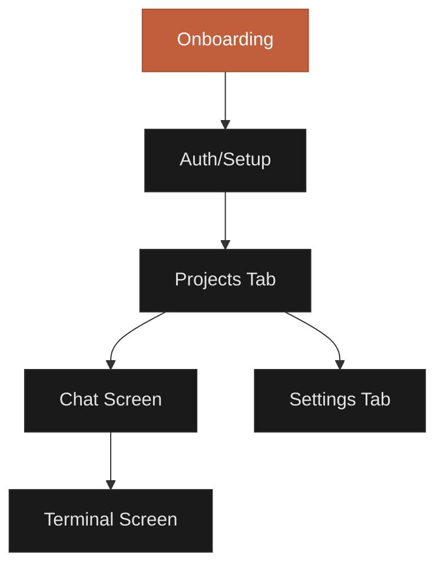

## What is the CCC Mobile App?

The CCC mobile app is a native iOS and Android application that provides a full-featured mobile interface for controlling Claude Code. It delivers a responsive, real-time experience for coding on the go.


<Info>
**Current Version:** 1.1.1
**Minimum Requirements:** iOS 13+ or Android 6+
**Size:** ~50MB
**Backend Required:** Yes, must connect to CCC backend server
</Info>

## Platform Support

<CardGroup cols={2}>
  <Card title="iOS 13+" icon="apple">
    Available on App Store. Supports iPhone and iPad.
  </Card>
  <Card title="Android 6+" icon="android">
    Available on Google Play. Supports phones and tablets.
  </Card>
</CardGroup>

### Tested Devices

<Tabs>
  <Tab title="iOS">
    - iPhone 15 Pro (iOS 18)
    - iPhone 14 (iOS 17)
    - iPhone SE 3rd Gen (iOS 16)
    - iPad Pro 11" (iOS 17)
    - iPad Air (iOS 16)
  </Tab>
  <Tab title="Android">
    - Google Pixel 8 (Android 14)
    - Samsung Galaxy S23 (Android 14)
    - OnePlus 11 (Android 13)
    - Samsung Galaxy Tab S9 (Android 13)
    - Xiaomi 13 (Android 13)
  </Tab>
</Tabs>

## App Structure

### Tab Navigation

The app uses a bottom tab bar for primary navigation:

<Tabs>
  <Tab title="Projects">
    **Projects Tab** - Home screen
    - View all projects
    - Create new projects
    - Resume active sessions
    - Start new conversations
    - Pull to refresh session data
  </Tab>
  <Tab title="Settings">
    **Settings Tab** - Configuration
    - Server profiles (add, edit, switch)
    - Appearance settings (light/dark/system)
    - App information and version
    - Clear cache and logout
  </Tab>
</Tabs>

### Screen Hierarchy



## Key Features

### Real-Time Chat

Stream Claude's responses in real-time with visual indicators for thinking, tool use, and completion.

- **Streaming messages** - See Claude's responses as they're generated
- **Tool use cards** - Expand/collapse to view tool inputs and outputs
- **Markdown rendering** - Code blocks, tables, lists, and formatting
- **Syntax highlighting** - Color-coded code snippets
- **Context monitoring** - Track token usage with visual pie chart


### Permission Management

Control what Claude can do with a flexible permission system:

<AccordionGroup>
  <Accordion title="Default Mode" icon="shield-check">
    Prompts for approval on first use of each tool. Subsequent uses are auto-approved.
  </Accordion>

  <Accordion title="Accept Edits Mode" icon="check">
    Auto-approves all file edit operations (Edit, Write, NotebookEdit, MultiEdit). Other tools still require approval.
  </Accordion>

  <Accordion title="Plan Mode" icon="eye">
    Analysis-only mode. Claude can read files but cannot make changes. Exit plan mode when ready to implement.
  </Accordion>

  <Accordion title="Bypass All Mode" icon="shield-off">
    **Dangerous!** Skips all permission prompts. Only use in safe environments.
  </Accordion>
</AccordionGroup>

### Session Management

Resume conversations across devices or start fresh:

- **Active session indicator** - See last activity time
- **Session picker** - View all available sessions with message counts
- **New session** - Start a clean conversation
- **Session sync** - Auto-fetch messages from server

### Image Attachments

Send images to Claude for analysis:

- **Camera capture** - Take photos directly in-app
- **Photo library** - Choose existing images
- **Multi-image** - Attach multiple images per message (30MB total limit)
- **Auto-compression** - Images optimized for upload
- **Preview** - Review before sending

<Warning>
Image attachments require camera and photo library permissions. Grant these when prompted on first use.
</Warning>

### Terminal Access (Beta)

Full terminal emulator embedded in the app:

- **WebView terminal** - Runs in embedded browser
- **Keyboard toolbar** - Special keys (Ctrl, Tab, Esc, arrows)
- **Command snippets** - Quick access to common commands
- **Auto-auth** - Credentials injected securely

<Note>
Terminal access requires the backend to be initialized. Open the chat screen first to generate terminal credentials.
</Note>

## Connection Status

The app displays a real-time connection indicator in the chat header:

<Steps>
  <Step title="Green dot">
    **Connected** - MQTT connection active, backend healthy
  </Step>
  <Step title="Yellow dot">
    **Reconnecting** - Connection lost, attempting to reconnect
  </Step>
  <Step title="Red dot">
    **Disconnected** - No connection to server
  </Step>
</Steps>

If the backend client is disconnected (Claude Code not running), a yellow banner appears:

```
⚠️ Backend client disconnected - messages won't be processed
```

## Onboarding Flow

New users see a 3-slide introduction:

<Tabs>
  <Tab title="Slide 1">
    **Chat with Claude Code**
    Connect directly to Claude Code running on your server. Manage your projects from anywhere.
  </Tab>
  <Tab title="Slide 2">
    **Real-time Collaboration**
    Send prompts, receive responses, and track all your conversations in one place.
  </Tab>
  <Tab title="Slide 3">
    **Secure & Private**
    Your API keys and project data stay secure. Connect to your own Claude instance.
  </Tab>
</Tabs>

After onboarding, users configure their first server profile to connect.

## App Permissions

The app requests these permissions on first use:

| Permission | Platform | Required | Purpose |
|-----------|----------|----------|---------|
| Camera | iOS, Android | Optional | Take photos for image attachments |
| Photo Library | iOS, Android | Optional | Choose images for attachments |
| Media Images | Android | Optional | Access media files |
| Storage | Android | Optional | Save images (Android 12 and below) |
| Internet | Android | Required | Connect to backend server |

<Info>
All permissions except Internet are optional. You can still use the app without granting camera or photo access—you just won't be able to send images.
</Info>

## Performance & Optimization

### Message Pagination

To handle large chat histories efficiently:

- **Initial load:** Latest 50 messages
- **Load more:** Tap "Load 50 More Messages" at the top
- **Incremental loading:** Prevents memory issues with 1000+ message sessions

### Image Compression

Images are automatically optimized before upload:

- **Format:** JPEG with 80% quality
- **Max dimensions:** 2048x2048px
- **Validation:** Checks size, format, and total payload
- **Multiple images:** Combined size cannot exceed 30MB

### Auto-Scroll Behavior

Chat auto-scrolls to latest messages with smart detection:

- **Auto-scroll:** When new messages arrive and you're at the bottom
- **Manual scroll:** Scrolling up disables auto-scroll
- **Resume auto-scroll:** Scroll to bottom or wait 5 seconds of inactivity

## Theme Support

Choose from three appearance modes:

<CardGroup cols={3}>
  <Card title="Light Mode" icon="sun">
    Bright theme for daytime use
  </Card>
  <Card title="Dark Mode" icon="moon">
    Dark theme for night or low-light
  </Card>
  <Card title="System" icon="circle-half-stroke">
    Follows device theme automatically
  </Card>
</CardGroup>

Theme changes apply instantly without restarting the app.

## Updates & Versioning

The app supports two types of updates:

### Over-the-Air (OTA) Updates

Minor updates (bug fixes, UI tweaks) are delivered instantly:

- **Automatic:** Downloaded in background when available
- **No restart required:** Updates apply on next app launch
- **Rollback support:** If update fails, previous version restores

### App Store Updates

Major updates (new features, breaking changes) require store update:

- **Manual:** User downloads from App Store or Google Play
- **Update prompt:** App notifies when critical update is available
- **Version check:** Backend checks compatibility on connect

<Tip>
The app checks for updates when you open the Projects screen. Pull to refresh to check again.
</Tip>

## Troubleshooting

<AccordionGroup>
  <Accordion title="Can't connect to server" icon="wifi">
    1. Check server URL is correct in Settings
    2. Ensure backend is running (`ccc --status`)
    3. Verify SSL setting matches backend (http vs https)
    4. Check firewall allows port 1883 (MQTT) and HTTP port
  </Accordion>

  <Accordion title="Images won't upload" icon="image">
    1. Grant camera/photo library permissions in device settings
    2. Check image size (max 30MB total per message)
    3. Ensure image format is supported (JPEG, PNG, WebP)
    4. Try compressing large images before sending
  </Accordion>

  <Accordion title="Terminal not loading" icon="terminal">
    1. Open chat screen first to initialize terminal
    2. Check backend has terminal enabled (`ccc --config`)
    3. Ensure project directory path is correct
    4. Try refreshing terminal credentials (re-enter chat)
  </Accordion>

  <Accordion title="Messages not appearing" icon="message-xmark">
    1. Check connection status indicator (green dot)
    2. Pull to refresh on Projects screen
    3. Try switching sessions and back
    4. Clear app cache in Settings
  </Accordion>
</AccordionGroup>

## Next Steps

<CardGroup cols={2}>
  <Card title="Installation" icon="download" href="/mobile/installation">
    Download and install the app from App Store or Google Play
  </Card>
  <Card title="Navigation Guide" icon="compass" href="/mobile/navigation">
    Learn how to navigate between screens and use gestures
  </Card>
  <Card title="Chat Features" icon="messages" href="/mobile/chat-features">
    Master the chat interface, attachments, and tool cards
  </Card>
  <Card title="Settings" icon="gear" href="/mobile/settings">
    Configure server profiles, permissions, and preferences
  </Card>
</CardGroup>

<Warning>
The app stores sensitive data (server URLs, MQTT credentials) in secure device storage. Do not install the app on rooted/jailbroken devices in production environments.
</Warning>
